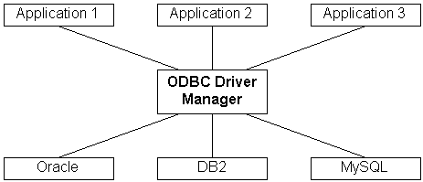
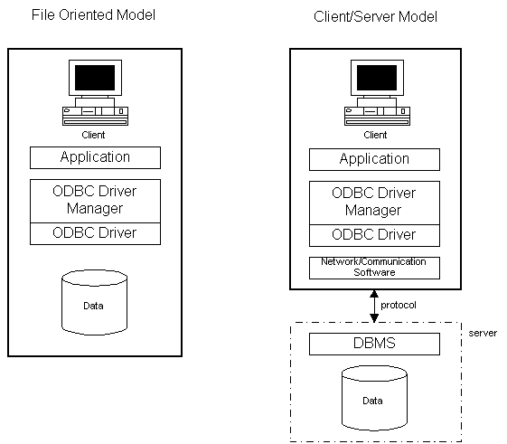
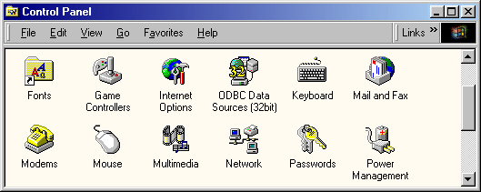
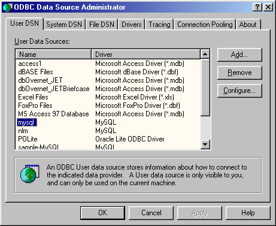
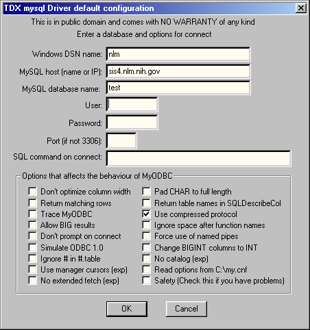

:title: An ODBC Interface for the Unicon Programming Language
:author: Federico Balbi and Clinton L. Jeffery
:trnumber: 1b
:date: 2002-06-28
:abstract: The implementation of an ODBC interface for the Unicon language
   allows programmers to interface their applications to local and remote
   database management systems with a high level of interoperability and
   SQL language support.
:docclass: report

1. Introduction
===============

The Unicon ODBC interface consists of a data type and a set of new
functions to enable Unicon programs to access database management
systems (DBMS). The standard language to retrieve and manipulate data in
a DBMS is the structured query language SQL.

1.1 Overview
------------

ODBC is a programming interface (API) to access local and remote
database management systems. ODBC is a de facto industry standard and
works on many different operating systems and programming languages. It
shields programmers from the complexity of different databases and the
communications software used to access the data. ODBC defines an object
called a "data source" that is referenced by name and maps its name to
the exact location of data (network software, server name, database name
and user information if needed).

1.2 ODBC Architecture
---------------------

ODBC allows multiple applications to access to multiple data sources
using an architecture (Figure 1) that consists of several layers:

-  A Driver Manager to add, configure and remove different DBMS drivers.
-  A set of drivers that implement the ODBC API for a particular DBMS.
-  Networking software to allow network access to the database.
-  The DBMS.

| 

| *Figure 1: ODBC Architecture*

Applications call ODBC functions. The Driver Manager decides which
driver is needed and loads it into memory. After this the Driver Manager
routes ODBC calls to the driver.

The minimum capability required from a driver is to be able to connect
to a server, send SQL statements and retrieve the results. What is
important is that the Driver Manager hides all the details related to
the server so the application does not need to know if the data is on a
local file, a network file server or a remote host.

1.3 Client/Server Model
-----------------------

ODBC was designed to work with the client/server model (Figure 2) in
order to satisfy the following requirements:

-  A standard application programming interface.
-  Access to the particular features of any DBMS.
-  Performance comparable to DBMS native API.

| 

| *Figure 2: Client/Server Model*

1.4 ODBC Installation
---------------------

After deciding which DBMS an application is going to use it is necessary
to install its related ODBC driver to let the application establish a
connection with the DBMS.

For our ODBC tests we decided to use MySQL. MySQL is a free SQL server
downloadable at `www.mysql.org <http://www.mysql.org/>`__ and available
for most popular platforms. We tested both Linux and Sun/Solaris
version. MySQL comes with MyODBC, the ODBC driver for the server, and it
can be downloaded at the same web site. There are driver versions both
for Unix and Windows.

MyODBC comes with a standard Windows setup.exe program. At one point
during setup you have to physically click on MyODBC within a list-box to
install successfully, but otherwise installation is uneventful. If
installation is successful, when you are finished you will be able to
see your MySQL data source(s) from the ODBC Data Sources control within
the Windows Control Panel (Figure 3).

| 

| *Figure 3: The Control Panel windows*

| 

| *Figure 4: The Driver Manager*

This control comprises the main interface of the ODBC Driver Manager
(Figure 4). The ODBC Driver Manager lists the ODBC drivers installed for
different DBMSes. We can add new drivers, remove or configure existing
ones within this control. The MyODBC setup program automatically adds
and configures the driver in the Driver Manager's driver list.

After installing MyODBC we can open the Driver Manager and take a look
at the different configuration parameters (Figure 5).

| 

| *Figure 5: MyODBC configuration*

The MyODBC configuration panel has the following fields:

-  **Windows DSN name**: DSN stands for Data Source Name and it contains
   the alias that we will use in our applications to reference a
   particular database.
-  **MySQL host**: is contains the Internet domain name or IP address of
   the server we want to connect to.
-  **MySQL database name**: name of the database that this data source
   refers to.
-  **User**: database user name. For better security this field can be
   left empty and specified within an application.
-  **Password**: database user password. For security this field can be
   also left empty and specified during application runtime.
-  **Port**: this field is the port where MySQL server listens for
   connection. If left empty the default value is 3306.
-  **SQL command on connect**: this field can contain an SQL command
   that is executed when the application first connects to the server.

All the other check-boxes are driver options. Of particular note are the
following options:

-  **Trace MyODBC**: traces the driver activity on a log file
   C:\\MYODBC.TXT. This is useful to find errors within an application.
-  **Use compressed protocol**: this option enables data compression in
   order to speed up data transfer on slow connections. This is
   recommended on fast computers.
-  **Read options from C:\\my.cnf**: this option lets the driver read a
   particular configuration from a file. This helps administrators to
   easily configure several client machines by including c:\\my.cnf in
   the application distribution.

1.5 Unicon ODBC Interface
-------------------------

The Unicon ODBC interface is a set of built-in functions that allow an
easy way to write SQL database applications.

The function set can be divided in four main groups. A synopsis of these
functions is given here. The reference section towards the end of this
document describes them in detail.

-  Connection: handle Unicon connection with a DBMS.

   -  open(dsn, "o", username, password): opens a connection to the
      database server and the specified table.
   -  close(db): closes a table and the related database connection.

-  Catalog or information: used to retrieve information about drivers,
   databases and tables (for example driver capabilities, database
   organization, tables description).

   -  dbcolumns: gets information about a specific table columns.
   -  dbdriver: gets information about a specific ODBC driver in use.
   -  dbkeys: gets information about a particular table primary keys.
   -  dbproduct: gets information about the DBMS product the in use.
   -  dbtables: get information about a tables that belong to a
      specified database.

-  Data retrieval: to load data from a DBMS to Unicon data structures.

   -  *fetch*: fetches a row from a rowset.

-  General: to interact directly with the DBMS using SQL commands. This
   can be used to send arbitrary SQL commands including extensions
   particular to a specific DBMS implementation.

   -  sql(db, s): sends an SQL command string to the server for
      execution.

 

2. An Example Phonebook Application
===================================

A typical database application performs the following tasks:

-  Connects to a database
-  Processes database information
-  Disconnects from the database

This section presents a simple Unicon phonebook application that takes
advantage of the ODBC interface and work with MySQL server. The example
will show how to use the main Unicon ODBC functions in order to connect,
read and write data on a DBMS.

Our application will have the following menu:

-  Insert a phone number
-  Delete a phone number
-  Modify a phone number
-  List phone number in database

Note that this application assumes a preexisting database server. a user
account on that server, and a table on the server has been created to
store the phone book information. Let's create a **phones** table on our
server with the following columns:

+-----------------------------------+-----------------------------------+
| Column Name                       | Type                              |
+-----------------------------------+-----------------------------------+
| Name (KEY)                        | VARCHAR(40)                       |
+-----------------------------------+-----------------------------------+
| Phone                             | VARCHAR(12)                       |
+-----------------------------------+-----------------------------------+
| Address                           | VARCHAR(60)                       |
+-----------------------------------+-----------------------------------+

We could create such a table within the application by appropriate
Unicon ODBC calls, but perhaps it is more typical for such database
administration tasks to be performed separately by a database
administrator. From our server machine we invoke the mysql client
program to talk to the SQL server:

| [fbalbi@icon bin]$ ./mysql -ufbalbi -p mysql
| Enter password:
| Reading table information for completion of table and column names
| You can turn off this feature to get a quicker startup with -A
| Welcome to the MySQL monitor. Commands end with ; or \\g.
| Your MySQL connection id is 96 to server version: 3.22.15-gamma

Type 'help' for help.

Now let's create the example table with the column **Name** as primary
key:

mysql>

create table phones (name varchar(40) primary key, phone varchar(12),
address varchar(60));

Query OK, 0 rows affected (0.04 sec)

mysql>

describe phones;

::

   +---------+-------------+------+-----+---------+-------+
   | Field   | Type        | Null | Key | Default | Extra |
   +---------+-------------+------+-----+---------+-------+
   | name    | varchar(40) |      | PRI |         |       |
   | phone   | varchar(12) | YES  |     | NULL    |       |
   | address | varchar(60) | YES  |     | NULL    |       |
   +---------+-------------+------+-----+---------+-------+
   3 rows in set (0.01 sec)

Now the table is properly created and empty, in fact the following
select commands returns an empty set:

mysql>

select \* from phones;

Empty set (0.00 sec)

Here the full list of our phonebook application. As an exercise, you may
wish to consider how you would extend this application to include the
above table-creation task as another menu option. Hint: the function
sql() may come in handy.

::

   # global variables

   global db
   global user, password

   record person(name, phone, address) # database row

   procedure main() # main program
     write("*** Unicon ODBC phonebook ***\n\n")
     login() # get user name and password
     # connect to mysql data source and open table "phones"
     db := open("mysql", "o", user, password)

     if &errornumber~=0 then { # error during login
       write(&errortext)
     }
     else {
       getdbinfo() # print database information
       repeat {
         menu() # print menu options 
         option := read()

         case option of {
           "i": insertphone()
           "d": deletephone()
           "u": updatephone()
           "l": listphones()
           "q": break
           default: write("*** wrong selection ***")
         }
       }
       close(db) # close table and database connection
     }
     write("bye")
   end

   #
   # user information
   #
   procedure login()
     writes("user: ")
     user := read()
     writes("password: ")
     password := read()
   end

    
   #
   # get database name and version
   #
   procedure getdbinfo()
     info := dbproduct(db)
     write("\nDBMS: ", info["name"])
     write("version: ", info["ver"])
   end

   #
   # display menu options
   #
   procedure menu()
     write("\nI)nsert")
     write("D)elete")
     write("U)pdate")
     write("L)ist")
     write("Q)uit\n")
   end

   #
   # insert a new record
   #
   procedure insertphone()
     writes("name: ")
     name := read()
     writes("phone: ")
     ph := read()
     writes("address: ")
     addr := read()
     sql(db, "INSERT INTO phones VALUES(" ||
              name || "," || ph || "," || addr || ")")
     if &errornumber~= 0 then
       write("*** couldn't insert person ***")
   end

   #
   # remove a record 
   #
   procedure deletephone()
      writes("name to remove: ")
      name := read()

      # delete row with specified name column
      sql(db, "DELETE FROM phones WHERE name='"||name||"'")
   end

   #
   # update a record
   #
   procedure updatephone()
     writes("name to update: ")
     name := read()

     # select all columns of rows with specified name column
     sql(db, "SELECT * FROM phones WHERE name='"||name||"'")

     if row := fetch(db) then { # data found
       writes("phone (",row["phone"],"): ")
       row["phone"]:=read()
       writes("address (",row["address"],"): ")
       row["address"]:=read()

       # update row on server
       sql(db, "UPDATE phones SET " ||
                      "phone='" || row["phone"] || "'" ||
                      ",address='" || row["address"] || "'" ||
                      " WHERE name='" || row["name"] || "'")
       )
     }
     else write("\n\n*** person not found ***")
   end

   #
   # list all people in the database
   #
   procedure listphones()
      sql(db, "SELECT * FROM phones") # select all columns and all rows

      while row := fetch(db) do { # while data found
         # write row fields
         every i:=(1 to *row) do writes("[",row[i],"]")
         write()
         }
   end

| 
| 

3. Unicon ODBC Function Reference
=================================

With the exception of ``open()`` which *returns* a file reference to an
ODBC connection, all these functions generally take an initial parameter
(designated by ``f`` which must be an ODBC file previously opened with
``open(...,"o")``. Since it is used consistently everywhere, this
initial parameter is not given in the detailed description of the rest
of the function parameters.

close(f) : closes an ODBC file

Code Example

::

   procedure main()
     db:=open("mydb","o","federico","mypassword")
     
     # 
     # ...program body...
     #

     close(db) # close table and disconnect
   end

dbcolumns(f,t) : L : return column information related to table t in
database f

Parameters

-  **tablename**: string name of the SQL table to examine

Return Type: list of records with the following string fields:

-  catalog: catalog name
-  schema: schema name
-  tablename: table name
-  colname: column name
-  datatype: SQL data type
-  typename: data source-dependent data type name
-  colsize: if **datatype** is SQL_CHAR or SQL_VARCHAR this columns
   contains the maximum length in characters of the column
-  buflen: length in bytes of data transferred on a fetch operation
-  decdigits: the total number of significant digits to the right of the
   decimal point
-  numprecradix: for numeric data types either 10 or 2. If it is 10, the
   values in **columnsize** and **decimaldigits** give the number of
   decimal digits allowed for the column. If it is 2, the values in
   **columnsize** and decimal digits give the number of bits allowed in
   the column
-  nullable: 0 if the column could not include NULL values; 1 if the
   columns accept NULL values; 2 if it is not known whether the column
   accepts NULL values.
-  remarks: a description of the column

Code Example

::

   procedure main()
      f := open("mysql","o","federico","") # open table
      colinfo := dbcolumns(f) # get columns information
      write("column info\n")

      every i := 1 to *colinfo do { # for each column
         writes("col #",i,": ")
         every j := 1 to *colinfo[i] do # write column's info
            writes("[",colinfo[i][j],"]")
         write()
         }
      write()
      close(f) # close table and connection to the database
   end

dbdriver(f) : returns information about the driver being used

Return Type: Record with the following string fields:

-  "name": filename of the driver used to access the data source.
-  "ver": version of the driver and, optionally a description of the
   driver.
-  "odbcver": version of ODBC that the driver supports.
-  "dsn": A caracter string with the data source name used during
   connection.
-  connections: maximum number of active connections that the driver can
   support (zero for no specified limit or if the limit is unknown).
-  statements: maximum number of statements that the driver can support
   for a connection (zero for no specified limit or if the limit is
   unknown).

Code Example

::

   procedure main()
      f := open("mydb","o","fbalbi","") # open mytable

      dinfo := dbdriver(f) # get driver information record

      write("driver name     : ", dinfo["name"])
      write("driver version  : ", dinfo["ver"])
      write("driver ODBC ver : ", dinfo["odbcver"])
      write("connections     : ", dinfo["connections"])
      write("statements      : ", dinfo["statements"])
      write("data source name: ", dinfo["dsn"])

      close(db)  # close database connection
   end

dbkeys(f) : returns information about the primary key columns

Return Type: list of records with the following string fields:

-  col: column name.
-  seq: sequence number.

Code Example

::

   procedure main()
      f := open("mydb","o","fbalbi","passwd") # open table

      write(*f, " row(s) selected")
      write("\ntable keys")

      krec := dbkeys(f) # retrieve primary key information

      every i := 1 to *krec do {
         r := krec[i]
         write("[", r["col"], "]") # print key name
         }
      close(f) # close table
   end

dblimits(f) : returns information about the limits applied for
identifiers and clauses in SQL statements.

Return Type: record with the following string fields:

-  "**maxbinlitlen**": maximum length of a binary literal in an SQL
   statement. if there is no maximum length or the length is unknown,
   this value is set to zero.
-  "**maxcharlitlen**": maximum length of a character literal in an SQL
   statement. if there is no maximum length or the length is unknown,
   this value is set to zero.
-  "**maxcolnamelen**": maximum length of a column name in the data
   source. if there is no maximum length or the length is unknown, this
   value is set to zero.
-  "**maxgroupbycols**": maximum number of columns allowed in a GROUP BY
   clause. If there is no specified limit or the limit is unknown, this
   value is set to zero.
-  "**maxorderbycols**": maximum number of columns allowed in a ORDER BY
   clause. If there is no specified limit or the limit is unknown, this
   value is set to zero.
-  "**maxindexcols**": maximum number of columns allowed in an index. If
   there is no specified limit or the limit is unknown, this value is
   set to zero.
-  "**maxselectcols**": maximum number of columns allowed in a SELECT
   list. If there is no specified limit or the limit is unknown, this
   value is set to zero.
-  "**maxtblcols**": maximum number of columns allowed in a table. If
   there is no specified limit or the limit is unknown, this value is
   set to zero.
-  "**maxcursnamelen**": maximum name length of a cursor name in the
   data source. If there is no specified limit or the limit is unknown,
   this value is set to zero.
-  "**maxindexsize**": maximum number of bytes allowed in the combined
   fields of an index. If there is no specified limit or the limit is
   unknown, this value is set to zero.
-  "**maxownnamelen**": maximum length of an owner name in the data
   source. If there is no specified limit or the limit is unknown, this
   value is set to zero.
-  "**maxprocnamelen**": maximum length of a procedure name in the data
   source. If there is no specified limit or the limit is unknown, this
   value is set to zero.
-  "**maxqualnamelen**": maximum length of a qualifier name in the data
   source. If there is no specified limit or the limit is unknown, this
   value is set to zero.
-  "**maxrowsize**": maximum length of a single row in a table. If there
   is no specified limit or the limit is unknown, this value is set to
   zero.
-  "**maxrowsizelong**": a character string: "Y" if the maximum row size
   returned for the "maxrowize" information type includes the length of
   all SQL_LONGVARCHAR and SQL_LONGVARBINARY columns in the row; "N"
   otherwise.
-  "**maxstmtlen**": maximum lenght (number of characters, including
   white space) of an SQL statement. If there is no maximum length or
   the length is unknown, this value is set to zero.
-  "**maxtblnamelen**": maximum length of a table name in the data
   source. If there is no maximum length or the length is unknown, this
   value is set to zero.
-  "**maxselecttbls**": maximum number of tables allowed in the FROM
   clause of a SELECT statement. If there is no maximum length or the
   length is unknown, this value is set to zero.
-  "**maxusernamelen**": maximum length of a user name in the data
   source. If there is no maximum length or the length is unknown, this
   value is set to zero.

Code Example

::

   procedure main()
      f := open("mydb","o","fbalbi","") # open mytable

      dbl:=dblimits(f) # get DBMS limits information

      # print out all DBMS limits
      every i := 1 to *dbl do write(dbl[i])

      close(f) # close table
   end

dbproduct(f) : returns information about the DBMS accessed by the driver

Return Type: record with the following string fields:

-  name: DBMS product name
-  ver: DBMS version

Code Example

::

   procedure main()
      f := open("mydb","o","fbalbi","mypasswd") # open table

      p := dbproduct(f) # get DBMS product information

      write("product name: ", p["name"]) # print product name
      write("product ver : ", p["ver"])  # print product version

      close(f) # close table
   end

dbtables(f): L : get information about tables stored in database f

Return Type: list of records with the following string fields:

-  qualifier: table qualifier
-  owner: table owner
-  name: table name
-  type: table type
-  remarks: table remarks

Code Example

::

   procedure main()
      f := open("mysql","o","fbalbi","xxxxxxxx")
     
      # get current database tables information 
      tablelist := dbtables(f)

      # write number of tables
      write("size list = ", *tablelist) 

      every i := 1 to *tablelist do { # for each table
         r:=tablelist[i]

         # print table information fields
         every j := 1 to *r do writes("[",r[j],"]") 
         write()
         }

     close(f) # close table
   end

fetch(f) : fetches and returns a row from a rowset

Return Type: record with fields names equal to the selected table
columns (use sql(db, "SELECT...") for column selection)

Code Example

::

   procedure main()
      f := open("mydb","o","fbalbi","mypass")

      # select 3 existing columns from table mytable
      sql(f, "SELECT id, name, amt FROM mytable")

      # *f = number of selected rows
      # may not work with some DBMS
      write(*f, " row(s) selected")

      write("\nrow values")

      # fetch returns a record whose
      # fieldnames are the column names selected with a SQL SELECT
      # in this example we can reference fields using row["id"],
      # row["name"] and row["amt"]

      while row := fetch(f) do { # while rows to retrieve
         every col := 1 to *row do  # for each col of row
            writes("[",row[col],"]") # write row field
         write()
         }

      close(f) # close table
   end

open(db, "o", username, password) : connect to a database and returns
the associated ODBC file.

Parameters:

-  db: Data Source Name string (defined in ODBC Manager)
-  user: database user string
-  password: user password string

Code Example

::

   procedure main()
      # open "mytable" in mydb data source name defined in
      # ODBC Data Sources (see Windows 9x Control Panel folder)
      # using username "federico" and password "mypassword"

      db := open("mydb","o","federico","password")
     
      # 
      # ...program body...
      #

     close(db) # close table and disconnect
   end

sql(f, query) : submits an SQL query using the connection opened by f

Parameters:

-  query: SQL statement string

Code Example

::

   procedure main()
      # connect to DBMS and open table
      db:=open("personnel_db","o","manager","passwd")

      # prepare SQL query string to create an employees table
      # of 5 columns

      query := "CREATE TABLE employees (id INTEGER PRIMARY KEY,_
                name VARCHAR(40), phone VARCHAR(12), DOB DATE,_
                pay FLOAT)"

      sql(db, query) # execute query
      close(db) # close
   end

| 
| 

4. Conclusions
==============

This interface is a successful, albeit low-level interface to SQL
databases. It has been tested and proven effective on large real world
data sets. SQL commands are constructed as strings, and Unicon excels at
such text manipulation. This interface does *not* provide Unicon
programmers with higher level abstractions of database capabilities. For
example one original design goal was to allow programmers to interact
with a database with minimum knowledge of SQL. For example, the built-in
table data type does not match the SQL table abstraction exactly, but
with proper operator support interactions with SQL tables could look
very similar to interactions with Unicon tables.

| 
| 

Appendix: Unicon ODBC Implementation Notes
==========================================

The implementation of the ODBC interface includes changes to several
files of the Unicon runtime system, as well as the addition of a new
file for the new functions that were added.

New files

-  FDB.R: This is the main file of Unicon ODBC. It contains the Unicon
   ODBC function set implementation. It is written in standard C with
   RTT extensions.
-  RDB.R: contains the C implementation of odbcerror function that is
   widely called in FDB.R.

Modified files

-  RPROTO.H: contains odbcerror function definition.
-  OMISC.R: "\*" operator implementation for ODBC file type.
-  FDEFS.H: ODBC function definitions.
-  DATA.R: runerr error code for ODBC file mismatch.
-  RSTRUCTS.H: ISQLFile definition (ODBC connection type).
-  REXTERNS.H: ISQLEnv extern definition.
-  RMACROS.H: Fs_ODBC file status flag and ODBC error codes.
-  SYS.H: VisualC++ ODBC header files inclusion (windows.h and
   sqlext.h).
-  INIT.R: ODBC Environment structure release.
-  DEFINE.H: ISQL symbol definition for conditional compilation.
-  GRTTIN.H: new ODBC types definitions.
-  MAKEFILE.RUN: Runtime system makefile (FDB.R and RDB.R definitions
   added)
-  ICONX.LNK: Link file (XFDB.OBJ and XRDB.OBJ definitions added)

ISQLFile type

In Unicon an ODBC connection to a database is similar to a file
operation. Internally this is represented by the following C structure:

::

   #ifdef ISQL             /* ODBC support      */
     struct ISQLFile {     /* SQL file          */
       SQLHDBC hdbc;       /* connection handle */
       SQLHSTMT hstmt;     /* statement handle  */
     };
   #endif

The field *hdbc* is used to keep the connection information associated
to a particular ISQLFile file. *hstmt* is the statement structure that
saves the results or dataset returned by an ODBC operation. The design
of the interface is table oriented, which means that for each table we
open a new connection.

In the future we will consider the possibility to associate a file to a
database. This would let us open a connection for each database and
share the same connection for each table within the same database. In
this way we can open a file and use more than a table.

Actually when *open(DSN,"o",user,password)* is called Unicon allocates
an ISQLFile object and initializes the structure fields in the following
way:

-  hdbc is related to the DSN specified in
   open()
-  hstmt is related to *hdbc*

 

References
==========

#. Kyle Geiger. Inside ODBC. Microsoft Press, Redmond, Washington, 1995.
#. Roger E. Sanders. ODBC 3.5 Developer's Guide. McGraw-Hill, 1998.
#. Microsoft ODBC 2.0 Programmer's Reference Guide. Microsoft Press,
   Redmond, Washington, 1994.
#. Microsoft ODBC 3.0 Programmer's Reference. Microsoft Press, Redmond,
   Washington, 1997.
#. Ralph E. Griswold, Madge T.Griswold. The Icon Programming Language,
   3\ :sup:`rd` ed.. Peer-to-Peer Communications, San Jose, 1997.
#. Ralph E. Griswold. The Implementation of the Icon Programming
   Language. Princeton University Press, 1986.
#. Clinton Jeffery, Shamim Mohamed, Ray Pereda, and Robert Parlett.
   Programming with Unicon. Draft manuscript from
   http://unicon.sourceforge.net.
#. MySQL Reference Manual for version 3.23.2-alpha. From
   http://www.mysql.org

.. 

 image:: Image4.gif
   :width: 462px
   :height: 202px
.. 

 image:: Image5.gif
   :width: 560px
   :height: 491px
.. 

 image:: Image6.gif
   :width: 529px
   :height: 211px
.. 

 image:: Image7.gif
   :width: 461px
   :height: 377px
.. 

 image:: Image8.gif
   :width: 452px
   :height: 482px
