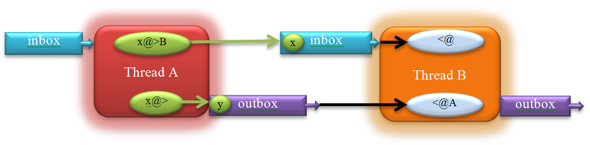

:title: Unicon Threads: User's Guide and Reference Manual
:author: Jafar Al-Gharaibeh and Clinton Jeffery
:trnumber: 14
:date: 2012-08-06
:abstract: Version 12 of the Unicon language includes concurrent threads of
   execution. Threads are presented as an extension of the co-expression
   type. This document describes the design of the Unicon threads, and
   provides several examples detailing their use.
:docclass: report

Introduction
============

This report describes the concurrency facilities in Unicon version 12. Concurrent programming introduces techniques, concepts and difficulties that do not exist in sequential programs. In some situations concurrent programming is a natural way to write programs, such as a server where threads serve different clients. In other situations, concurrent programming improves performance. Long running programs can run faster by having several threads running cooperatively on several CPU cores in the system, or programs that do a lot of slow I/O operations can allow other non-blocked threads to proceed and utilize the CPU. However, for programs that have a lot of dependencies and are sequential in nature, the complexities of parallelizing them can outweigh the benefits.

This document is not a comprehensive concurrent programming guide. It assumes that the reader is familiar with the Unicon language, and also has some basic knowledge about threads, their programming techniques and problems, such as synchronization and race. The reader who is unfamiliar with this concurrency can refer to a myriad of resources such as [1] or [2] for an overview. Since Unicon's concurrency facilities are implemented on top of POSIX threads, many of the concepts from pthreads programming apply, with many simpler, more concise, or higher-level ways of doing things available.

Threads and Co-Expressions
--------------------------

A co-expression is an independent, encapsulated execution context. Co-expressions are discussed in Chapter 4 in the Unicon book. While co-expressions are independent, they are not concurrent. Only one co-expression can be active at any given moment. Once a co-expression is activated, the calling co-expression blocks until the child co-expression returns the execution to it or fails. Threads on the other hand can be used to achieve true concurrent execution. Threads can run simultaneously and independently on different cores making use of the parallel hardware available on most machines. Threads in Unicon are viewed as special co-expressions that run asynchronously. Throughout this document, the term co-expression will refer to Icon's conventional synchronous co-expression. The term thread will refer to the asynchronous/concurrent co-expressions.

Overview
--------

A thread is an independent execution path within a program. A concurrent program may have two or more threads that execute simultaneously working toward some specific goal. Each thread has its own program counter, stack pointer and other CPU registers. However, all of the threads in a process share the address space, open files and many other pieces of process-wide information. This enables very fast communication and cooperation between threads, which leads to less blocking, faster execution and more efficient use of resources.

Unicon Programs start execution in the "main" procedure. In a multi-thread programming environment, the procedure main can be thought of as the entry point for a special thread referred to as the "main" thread. This main thread gets created by the operating system when the program first runs. The main thread can create new threads which can create even more threads.  Each thread has an entry point of execution where the thread first starts executing. Usually this is a procedure but it can be any Unicon expression, as is the case for co-expressions. When a thread first starts running in the entry point, it goes on its own execution path, separate from the thread that created it, which continues to run. A thread never returns. When it ends, it simply terminates; other threads continue to run. An important exception is the main thread; if the main thread ends the whole program ends. If there are any other threads running all of them will be terminated.

Why Threads?
------------

Since the emergence of the first computer, processors have been increasing in computational power. Central processing unit speeds grew faster than almost all of the other units in the computer, especially the I/O units. This causes programs, especially those which are I/O bound, to spend most of their execution time blocked waiting for I/O to complete.  On systems with multitasking support, several programs run at the same time. When one program blocks for I/O for example, another program is scheduled to run allowing a better utilization of the system resources. Multitasking offered a way to increase the overall system throughput and boosted the utilization of the increasingly powerful computers. Multitasking however, could not help make a process run faster, even on multiprocessor systems.

First Look at Unicon Threads
============================

Unicon threads facilities give the programmer flexibility in choosing the programming styles that suit the problem in hand. In many situations the same problem can be solved in different ways, using implicit features or explicit ones. The following sections cover the functions and features provided by the threads facilities in Unicon.

Thread Creation
---------------

Threads can be created in two ways in Unicon, using the thread reserved word or using the function spawn(). The difference between the two is the separation between creating a thread and running it. The thread reserved word creates a thread and starts its execution. The function spawn() however takes a previously created co-expression and turns it into a thread. In many cases the thread reserved word allows more concise code. spawn() on the other hand is useful in situations where several threads need to be created and initialized before running them. spawn() also takes extra optional parameters to control some aspects of the newly created thread. The following code creates and runs a hello world thread.

.. code-block:: unicon

   thread write("Hello World!")

This is equivalent to:

.. code-block:: unicon

   spawn( create write("Hello World!") )

Or:

.. code-block:: unicon

   co := create write("Hello World!")
   spawn(co)

Both thread and spawn() return a reference to the new thread. The following program creates 10 threads:

.. code-block:: unicon

   procedure main()
      every i := !10 do thread write("Hello World! I am thread: " , i )
      write("main : done")
   end

In this example, the main thread continues to execute normally after firing 10 threads. Because of the non-deterministic nature of threads, there is no guarantee which thread gets to print out its hello world message first, or what order the messages are printed out including the message from the main thread "main : done".  All of the possible permutations are valid. No assumptions can be made about which one will continue running or finish first. It depends on the host OS CPU process/thread scheduler. The order is unpredictable.

Furthermore, the main thread might finish and terminate the program before some or all of the threads get executed or print out messages. To avoid such situations, the main thread needs to wait for other threads to finish before exiting the program. This is can be achieved using the function wait(), which blocks the calling thread until the target thread is done. The above program can be rewritten as the following:

.. code-block:: unicon

   procedure main()
      L:=[ ]
      every i := !10 do put(L , thread write("Hello World! I am thread: " , i ))
      every wait(!L)
      write("main : done")
   end

wait(!L) forces the main the thread to wait for every thread to finish, causing the message "main : done" to be the last thing printed out before the program ends. wait() is very useful in cases where threads need to synchronize so that one thread blocks until another finishes. wait() provides a very basic synchronization technique, but most concurrent programming tasks require synchronization beyond waiting for a thread to finish. More advanced synchronization mechanisms are discussed later in section 3.

Thread Evaluation Context
-------------------------

Similar to co-expressions, threads have their own stack, starting from a snapshot of parameters and local variables at creation time. This allows co-expressions and threads to be used outside the scope where they are created. It also allows a thread to start evaluation using the values of variables at the time of creating the thread rather than when running it in the case of spawn(). Another important side effect of this process is avoiding race conditions because each thread gets a copy of the variables instead of having all the threads competing on the same shared variables. Race conditions and thread safe data will be covered in depth in the following section. The following example and its output demonstrate the idea of an evaluation context:

.. code-block:: unicon

   procedure main()
      local x:= 10, y:=20, z:=0
      write( "Main thread: x=", x, ", y=", y, ", z=",z)
      thread (x:=100) & write("Thread 1: x=", x)
      thread (y:=200) & write("Thread 2: y=", y)
      thread (z:=x+y) & write("Thread 3: z=", z)
      delay(1000)
      write( "Main thread: x=", x, ", y=", y, ", z=",z)
   end

Output:

.. code-block:: text

   Main thread: x=10, y=20, z=0
   Thread 3: z=30
   Thread 1: x=100
   Thread 2: y=200
   Main thread: x=10, y=20, z=0

NOTE: the delay(1000) should give the threads enough time to run and finish before the main program finishes. Don't leave it to chance: wait() will block until threads finish instead of a 1sec delay.

The output shows that the changes to the variables are per thread and are not visible in the main thread or in the other threads. Local variables' copies in different threads can be thought of as passing parameters by value to a procedure. This is true for local variables of immutable data types; global variables and mutable types such as lists on the other hand are shared. Any change in the structure of such types is visible across all threads. Contrast the following example with the one above:

.. code-block:: unicon

   procedure main()
      local L
      L := [20, 10, 0]
      write( "Main thread: L[1]=", L[1], ", L[2]=", L[2], ", L[3]=",L[3])
      thread (L[1]:=100) & write("Thread 1:  L[1]=", L[1])
      thread (L[2]:=200) & write("Thread 2:  L[2]=", L[2])
      thread (L[3]:=L[1]+L[2]) & write("Thread 3:  L[3]=", L[3])
      delay(1000)
      write( "Main thread: L[1] =", L[1], ", L[2]=", L[2], ", L[3]=",L[3])
   end

Output:

.. code-block:: text

   Main thread: L[1]=20, L[2]=10, L[3]=0
   Thread 2:  L[2]=200
   Thread 3:  L[3]=300
   Thread 1:  L[1]=100
   Main thread: L[1] =100, L[2]=200, L[3]=300

Instead of using three variables x, y and z, a list of size three is used. x from the previous example maps to L[1], y maps to L[2], and z maps to L[3]. The program does the same thing as before, the difference is that any change to the content of L is visible in other threads. Unlike the output in the first case where the values of x, y, and z remained the same in the main thread, the output in the second example shows that the changes to the list elements in the other threads were visible in the main thread.

Passing Arguments to Threads
----------------------------

When creating a new thread for a procedure, the parameters that are passed to the procedure at thread creation time can be thought of as a one-time one-way communication between the creator thread and the new thread. This is very useful in initializing the new thread or passing any data that thread is supposed to work on. The following program has three threads in addition to the main thread. The main thread passes a list to each thread which in turn calculates the summation of the list elements and prints it out to the screen:

.. code-block:: unicon

   procedure main()
     L1 := [1, 2, 3]
     L2 := [4, 5, 6]
     L3 := [7, 7, 9]
     t1 := thread sumlist( 1, L1)
     t2 := thread sumlist( 2, L2)
     t3 := thread sumlist( 3, L3)
     every wait(t1|t2|t3)
   end
   procedure sumlist(id, L)
      s:=0
      every s+:=!L
      write(" Thread id=", id, " result=", s)
   end

Output:

.. code-block:: text

    Thread id=2 result=15 Thread id=1 result=6 Thread id=3 result=23

Since the lists are independent, there are no chances of a race condition. The example shows that the second thread was the first to finish and print out its result. If the problem solution requires sharing data or guaranteeing that one thread should finish before another thread, then a synchronization mechanism should be used. This is the subject of the next section.

Thread Synchronization
======================

Thread synchronization can be done in many different ways. Some problems require more synchronization than others. Some may require using advanced synchronization mechanisms and rely on the language support to achieve full control over the execution of threads and protect shared data. This section covers many synchronization techniques in the Unicon language and also introduces the concept of race condition in a multi-thread environment, and thread safe code.

The Non-Deterministic Behavior of Threads
-----------------------------------------

Programming with threads introduces a whole new set of concepts and challenges that non-threaded programs do not have to deal with.  In most multi-threaded programs, threads need to communicate through shared data. Because threads run in different non-deterministic order they access and update shared data in a non-deterministic fashion. Consider the following popular example where two threads try to increment a shared variable called x whose initial value is 0.

Thread 1Thread2

.. code-block:: unicon

       x:=x+1                                        x:=x+1

While x:=x+1 does not look like it would make a problem, in reality it does. This happens because x:=x+1 is not atomic. In many computer systems this can be broken down to three operations: fetch the value of x, increment x and then store the new value back in x. These three operations might occur at different times in different threads. Thread 2 for example might fetch x, followed by Thread 1 also fetching it but before Thread 2 stores back the new value of x, leaving Thread 1 working on the old value of x. Thread 1 should not be allowed to read the value of x in the middle of an operation where another thread is updating the value of the variable.  Consider the following scenarios, starting with  x:=0

TIMEScenario 1

TIME

Thread 1Thread 2

.. code-block:: unicon

        fetch x  (0)                               fetch x (0)
        increment x (1)                        increment x (1)
        store x   (1)                             store  x (1)

-------------------------------------------------------------------- The final value of x is 1

TIMEScenario 2

TIME

Thread 1Thread 2

.. code-block:: unicon

        fetch x  (0)
        increment x (1)
        store x   (1)
   fetch x (1)
   increment x (2)
   store x   (2)

--------------------------------------------------------------------- The final value of x is 2

In Scenario 1 the final value of x is 1, even though there are two increments done by the two threads. In Scenario 2 however the final value is 2. This unpredictable outcome does not necessarily mean a problem or a bug that must be handled.  Non-deterministic execution is part of multi-threaded programming culture that many programs can live with. For example, if one or more threads depend on a counter to update the screen every 100 increments or so, but it does not need to be exactly 100 increments, then the threads can increment the counter without worrying about a race condition or synchronizing access to the shared counter. If deterministic execution must be guaranteed, programmers have to take extra steps to ensure a specific order and predictable results. That is where thread synchronization comes into play.

User Defined Synchronization
----------------------------

For some simple situations, synchronization can be achieved without relying on special synchronization primitives provided by the language. For example, if one thread is waiting for another thread to finish a task, a shared flag variable can be used in such case. In the following example, the main thread might finish before the child thread:

.. code-block:: unicon

   procedure main()
      thread  write("I am a thread: Hello World!")
   end

As seen in the previous section, this can be handled using the wait() function or delay(). The wait() function is the best solution for this situation. The function delay() works but there are two problems associated with it: it forces the program to wait a lot longer than necessary, and second, if the delay time is not long enough and depending on the system, the main thread might still finish before the child thread. Actually even with a long delay, there is no guarantee the child thread would be done. In a real application, delay() would be a poor choice. Here is an alternative solution other than using wait():

.. code-block:: unicon

   global done
   procedure main()
      thread  (write("I am a thread: Hello World!") & done:="true")
      until \done
   end

In this case, the loop until \done ensures that the main thread keeps spinning until the child thread set the variable done to a non-null value. It avoids the problems with using delay(), at the expense of burning up 100% of one CPU in a spin-lock. Note that declaring done to be global is a key for the example above to work. If it were local, the main thread would spin indefinitely and never finish! That is because any change to done in the child thread would be invisible in the main thread. If none of these approaches seems acceptable, that is a good sign. Use techniques from the following sections to avoid such inefficient synchronization.

Language Support for Synchronization
------------------------------------

Using function wait() or global variables to synchronize between threads might be sufficient in some situations, but most problems require more sophisticated and efficient synchronization methods. The following subsections introduce mutexes and condition variables.

Critical Regions and Mutexes
~~~~~~~~~~~~~~~~~~~~~~~~~~~~

A mutex (short for mutual exclusion) is a synchronization object used to protect shared data and serialize threads in critical regions, sequences of instructions within which only one thread may execute at a time or an error will occur. In the example discussed earlier at the beginning of this section, two threads compete to increment the variable x. The end result might not be what the programmer intended. In such cases a mutex may be used to protect access to the variable x. Any operation (including data structure traversal) where more than one thread can execute non-deterministically, leading to data corruption or incorrect results is called thread unsafe. Thread unsafe code or data structures have to be handled correctly via synchronizations mechanisms to achieve correct behavior with correct results.

A mutex object is created using the mutex() function. The returned mutex object can be locked/unlocked via the functions lock() and unlock() to serialize execution in a critical region. The following example demonstrates the use of a mutex to protect increments to the global variable x:

.. code-block:: unicon

   global x
   procedure main()
      mtx_x := mutex()
      x := 0
      t1 := thread inc_x(mtx_x)
      t2 := thread inc_x(mtx_x)
      every wait(t1 | t2)
      write("x=", x)
   end
   
   procedure inc_x(region)
      lock(region)
      x := x + 1
      unlock(region)
   end

It is important to note that the mutex object has to be initialized only once and can then be shared between all of the threads (t1 and t2) accessing the critical region (x := x + 1 ). lock(region) marks the beginning of the critical region protected by the mutex region. unlock(region) marks the end of the critical region. When a thread calls lock(region), it tries to acquire the mutex region. If region is not "owned" by any other thread, lock(region) succeeds and the thread becomes the owner of the mutex region and then enters the critical region, otherwise the thread blocks until the current owner of the mutex leaves the critical region by calling unlock(region). Since there are two threads and x:=x+1 is protected by a mutex, the output of the program is guaranteed to be x=2, unlike the case where a mutex is not used, in which case x=1 or x=2 are viable outputs.

The more critical-regions/mutexes a concurrent program has, the slower it runs. The length of the critical region also affects the performance. The longer the critical region, the more time it takes a thread to finish the critical region and release the mutex, which increases the probability that other threads become blocked waiting to acquire the mutex and enter the critical region. Locking a mutex and forgetting to unlock it is very likely to lead to a deadlock, a common problem in concurrent programming, where all threads block waiting for each other, and for resources to become available. Because all threads are blocked, resources will not be freed, and the threads block indefinitely.

Unicon provides a special syntax for critical regions which is equivalent to a lock()/unlock() pair, that aims mainly to guarantee that a mutex is released at the end of a critical region, beside enhancing the readability of the program. Here is the syntax:

.. code-block:: unicon

   critical mtx: expr

This is equivalent to:

.. code-block:: unicon

   lock(mtx)
   expr
   unlock(mtx)

Given a global variable named region that has been initialized as a mutex, the code to increment x in the previous example can be written as:

.. code-block:: unicon

   critical region: x := x + 1

The critical region syntax only unlocks the mutex if it executes until the end. If there is a return or break in the critical region expression body, then it is the programmer's responsibility to explicitly unlock the mutex of the critical region. For example:

.. code-block:: unicon

   critical region: {
      if x > 100 then { unlock(region); return }
      x := x + 1
      }

In some situations, a thread might have several tasks to finish and may not want to block waiting for a mutex that is possessed by another thread. For example, if a thread is creating items that can be inserted in one of several shared queues, the thread can insert every new item in the first queue that it acquires. trylock() is an alternative function for lock(). The only difference is that trylock() is non-blocking. If the thread cannot acquire the mutex immediately, the function fails. The most suitable way to use trylock() is to combine it with an if statement, where the then body unlocks the mutex after finishing the work on the protected object as follows:

.. code-block:: unicon

   if trylock(mtx) then {
        expr
        unlock(mtx)
        }

Both lock() and trylock() return a reference to the mutex or the object they acquired (upon succeeding in case of trylock()). This makes it very convenient to write code like the following assuming L1 and L2 are both lists that are marked as shared:

.. code-block:: unicon

   item := newitem()
   if L := trylock(L1 | L2) then {
        put(L, item)
        unlock(L)
        }

Note that trylock() may fail to lock any of the lists leaving item unprocessed. Depending on what the code needs to do, if it is required to guarantee that it does not proceed before one of the locks to L1 or L2 succeeds then it can be written as follows:

.. code-block:: unicon

   item := newitem()
   until L := trylock(L1 | L2)
   put(L, item)
   unlock(L)

Initial clause
~~~~~~~~~~~~~~

A procedure in a Unicon program can have an initialization clause at the top of the procedure. This gets executed only once the first time the procedure is entered. The initial clause provides a very convenient way to place local static variables and their initialization in the same procedure instead of relying on global variables and having to initialize them somewhere else. A procedure that produces a sequence of numbers one at each call can be written as:

.. code-block:: unicon

   procedure seq()
      static i
      initial i:=0
      i := i+1
      return i
   end

Initial clauses are thread-safe. They can be thought of as a built-in critical region that is run only once. No thread is allowed to enter the procedure if there is a thread currently still executing in the initial block. This can be useful specifically in a concurrent environment to do critical initialization such as creating a new mutex object instead of declaring a mutex variable to be global and initializing it somewhere else or passing it from one function to another where it will be actually used. A concurrent version of seq() would look like this:

.. code-block:: unicon

   procedure seq()
      local n
      static i, region
      initial { i:=0; region:=mutex() }
      critical region: n := i:= i+1
      return n
   end

With the use of the initial clause, seq() is self-contained and thread safe. Note the use of the local variable n to temporarily hold the value of the counter i while still in the critical region. That is because once the thread leaves the critical region, there is no guarantee that the value of i would remain the same before returning the value of i. Using the variable n guarantees that the value returned is correct even if the value of i is changed by another thread.

Thread-safe Data Structures
~~~~~~~~~~~~~~~~~~~~~~~~~~~

In Unicon, mutexes are not just independent objects as described above, mutexes are also attributes of other objects, namely attributes of the mutable data types. Any data structure in Unicon that can be used in a thread unsafe manner can be protected by turning on its mutex attribute. Instead of declaring a separate mutex, locking and unlocking it, the structure can just be marked as "needs a mutex/protection" and the language does an implicit locking/unlocking, protecting the operations that might affect the integrity of the data structure. For example, if several threads are pushing and popping elements into and out of a list, this creates thread-unsafe operations on the list that require protection.  The value of implicit mutexes is made clear after considering the alternative. The following producer-consumer example uses a list to send and receive data and protects it using an explicit mutex:

.. code-block:: unicon

   procedure main()
      L := [ ]
      mtx := mutex()
      p := thread produce(L, mtx)
      c := thread consume(L, mtx)
      every wait(p | c)
   end
   
   procedure produce(L, region)
      every i := !10 do
         critical region: put(L, i)
   end
   
   procedure consume(L, region)
   i := 0
   while i<10  do
      critical region: if x := get(L) then i+:=1 & write(x)
   end

Using a thread-safe list results in less lines of code to do the same thing and also produces a more efficient program doing less locking and unlocking at the language level, or even not doing explicit locking at all. For example, the program above may be rewritten as the following:

.. code-block:: unicon

   procedure main()
      L := mutex([ ])
      p := thread produce(L)
      c := thread consume(L)
      every wait(p | c)
   end
   
   procedure produce(L)
      every put(L, !10)
   end
   
   procedure consume(L)
      i := 0
      while i<10  do
         if x := get(L) then i+:=1 & write(x)
   end

The produce() and consume()  procedures do not do any locking, making concurrent programming in such a case just as easy as writing a sequential program. The only needed step is notify the language at the beginning that the data structure is shared, by passing it to the mutex() function. The mutex() function takes a second optional parameter denoting an existing mutex object or an object that is already marked as shared (has a mutex attribute). Instead of creating a new mutex object for the data structure, the existing mutex is used as an attribute for the data structure. If the second object is a structure that is not marked as shared, a new mutex is created. This is useful when two objects needs to be protected by the same mutex. For example, the list L and the table T in the following example share the same mutex:

.. code-block:: unicon

   mtx := mutex()
   L := mutex([ ], mtx)
   T := mutex(table(), mtx)

which is equivalent to the following if the mutex does not need to be explicit:

.. code-block:: unicon

   L := mutex([ ])
   T := mutex(table(0), L)

or

.. code-block:: unicon

   L := [ ]
   T := mutex(table(0), L)

In all cases, lock(L) and lock(T) lock the same mutex, serializing execution on both data structures. Not all operations on data structures produces correct results, only "atomic" operations do. In other words, implicit locking/unlocking takes place per operation, which means even if each one of the two operations is safe, the combination might not be. A critical region is still needed to combine the two. For example, if L[1] has the value of 3 and two threads are trying to increment L[1]:

.. code-block:: unicon

   L[1] := L[1] + 1

the result in L[1] could be 4 or 5. That is because reading L[1] (the right side of the assignment) and storing the result back in L[1] are two different operations (not atomic) and are actually separated in time. The good news is that solving such an issue does not require an extra explicit mutex. If L is marked as shared (passed to the mutex() function ) it can be passed to lock()/unlock() functions. It can be used with the critical syntax like the following:

.. code-block:: unicon

   critical L: L[1] := L[1] + 1

Condition variables
~~~~~~~~~~~~~~~~~~~

Mutexes are used to protect shared data in critical regions, and block threads if there is more than one thread trying to enter the critical region. Condition variables take thread blocking/resumption to a new level that is not tied to accessing shared data like a mutex. A condition variable allows a thread to block until an event happens or a condition changes. For example, the previous section showed a producer/consumer problem where the consumer keeps spinning to get values out of the shared list. In similar situations in real life applications, any spinning could be a waste of resources; other threads including producer threads could be using the resources doing something useful instead. The consumer needs to block until there is data to process in the list. This is where a condition variable comes into play.  A condition variable is created using the function condvar(). The return object is a condition variable that can be used with wait() and signal() functions. wait(cv) blocks the current thread on the condition variable cv. The thread remains blocked until another thread does a signal(cv), which wakes up one thread blocked on cv. A very important aspect of using a condition variable is that the condition variable must always be associated with a mutex. More specifically, the wait() function has to be always protected by a mutex. Unicon provides a built-in mutex for condition variables which can be thought of as an attribute similar to thread safe data structures. This means a condition variable can also be used with lock()/unlock() functions or the critical clause. It is important to realize that not only wait() has to be protected by a critical region, but also the condition or the test that leads a thread to wait on a condition variable.  See the following example:

.. code-block:: unicon

   if x=0 then wait(cv)

A thread wants to wait on cv if x=0, but what happens if the value of x has changed between the test and the call to wait(cv)? If a second thread changes the value of x and signals cv  to wake up the first thread, while the first thread transitions from the test to wait(), it ends up missing the wake up signal and might block indefinitely because it is waiting on a condition variable that it should not wait on.  The correct way to use wait() with a condition variable becomes:

.. code-block:: unicon

   lock(cv)
      if x=0 then wait(cv)
   unlock(cv)

or :

.. code-block:: unicon

   critical cv: if x=0 then wait(cv)

Because other threads might need to access the condition variable while some threads are waiting on it, the wait() function atomically blocks the thread and releases its corresponding mutex. After receiving a wake up signal, the blocked thread wakes up, acquires the mutex (blocking if necessary) and continues executing and that is when wait() returns. It is a good practice to do the condition variable test before assuming that it is in one state or another. This leads to a more correct way to use condition variables that ensures that a thread does not leave wait() before guaranteeing the test is in a specific state as follows:

.. code-block:: unicon

    critical cv: while x=0 do wait(cv)

Using a while in place of if will ensure the thread goes back to sleep if the thread happens to wake up and the condition outcome has not changed.

The producer/consumer example mentioned above can be rewritten using a condition variable. Since the consumer needs to sleep/wake up depending on the availability of elements in the list (the list state in other words), the state of the list needs to be guaranteed to remain the same while interacting with the condition variable for the same reason explained above (missing wake up signals). The list and the condition variable have to be protected by the same mutex. condvar() allows an optional argument that refers to an existing mutex to be associated with the condition variable. In the original example, using an independent mutex to protect the condition variable looks like this:

.. code-block:: unicon

   procedure main()
      L := [ ]
      mtx := mutex()
      cv := condvar(mtx)
      p := thread produce(L, cv)
      c := thread consume(L, cv)
      every wait(p | c)
   end
   
   procedure produce(L, cv)
      every i:=!10 do {
         critical cv: put(L, i)
         if *L=1 then signal(cv)
         }
   end
   
   procedure consume(L, cv)
      i := 0
      while i<10  do {
         if *L=0 then critical cv: until *L>0 do wait(cv)
         if x := get(L) then i+:=1 & write(x)
         }
   end

Another way to implement this program is built on top of the thread safe list example. Since there is no explicit mutex to pass to the condvar() function in the original example, a mutex can be first created and then passed along with the list to the mutex() function. The same mutex then can be passed to condvar(). The function binds the mutex already associated with the list to the condition variable. The final result is the same as the explicit mutex example, a list and a condition variable sharing the same mutex. Here is the example again with the shared list and a condition variable:

.. code-block:: unicon

   procedure main()
      mtx := mutex()
      L := mutex([], mtx)
      cv := condvar(mtx)
      p := thread produce(L, cv)
      c := thread consume(L, cv)
      every wait(p | c)
   end
   
   procedure produce(L, cv)
      every put(L, !10) & *L=1 & signal(cv)
   end
   
   procedure consume(L, cv)
      i := 0
      while i<10  do
         if x := get(L) then
   i+:=1 & write(x)
         else
            critical cv: until *L>0 do wait(cv)
   end

In previous examples, calls to signal() are not protected by any mutex. signal() does not need protection, because it does not block the thread, and hence there is no worry about causing a deadlock. The worst thing that can happen is signaling a condition variable that does not have any thread waiting on it, which is not a problem. However protecting calls to signal() is not a problem either. Depending on the problem, doing it one way or the other might be more or less efficient. There is no need to have a thread that spends a lot of time locking/unlocking a mutex if it is not necessary, creating contention in the critical region. However, a thread that keeps wasting time signaling condition variables that have no threads waiting on them is undesirable either.

The signal() function takes a second optional parameter denoting the number of threads to be woken up. By default, that number is one, but it can be any positive value. From example:

.. code-block:: unicon

   every !4 do signal(cv)

can be written as:

.. code-block:: unicon

   signal(cv, 4)

Furthermore, if all of the threads waiting on cv needs to be woken up, a special 0 ( or CV_BROADCAST) value can be passed to signal() causing it to broadcast a wakeup call for all threads waiting on cv:

.. code-block:: unicon

   signal(cv, 0)

or

.. code-block:: unicon

   signal(cv, CV_ BROADCAST)

Thread Communication
====================

Traditionally, co-expressions communicate implicitly, or explicitly using the @ operator. All co-expression communication is synchronous; at the two ends of the communication, the calling co-expression is blocked and the called co-expression runs. This simple communication model is called activation in Unicon. A co-expression C1 can activate another co-expression C2 using the following syntax:

.. code-block:: unicon

    x@C2

x is an optional value to be transmitted from C1 to C2. C1 waits until it gets activated by C2 or any other co-expression directly or indirectly activated by C2. As mentioned earlier, implicit activation takes place whenever a co-expression produces a value or falls off its end. With implicit activation, the co-expression activates its parent (the last co-expression to activate it).

Threads take communication to a completely new level with their dynamic nature. Threads run concurrently; in many cases, a running thread just wants to send a value to another thread without waiting for a reply, or receive a value from another thread if there is one without waiting. The @ operator is not suitable for this kind of (asynchronous) communication. Unicon adds four operators dedicated for asynchronous communication. These are @>, @>>, <@ and <<@. The operators correspond to send, blocking send, receive and blocking receive.

Thread Messaging Queues
-----------------------

Before presenting the communication operators and how they are used, it is first appropriate to look at messaging queues and how they are utilized to support the communication model between threads in Unicon. Each thread maintains two queues called the inbox and outbox that are created with the thread. When a thread sends a message with an explicit destination, the message is queued in the destination's inbox. Otherwise it is queued into the sender's outbox. A thread can receive messages from another thread by dequeuing messages from the source's outbox if there is an explicit source, otherwise it dequeues messages from its own inbox. The following figure presents two threads with the inboxes and outboxes.

   Thread messaging queues
Figure 1. Thread messaging queues

Send and Receive Operators
--------------------------

The first two operators are @> (send) and <@ (receive). These operators communicate messages containing arbitrary data between threads. The operators support co-expressions as well, with the same semantics. The send operator has the syntax

.. code-block:: unicon

   x @>T

x can be any data type including null which is equivalent to omitting it. T refers to a thread to which x is transmitted. X is placed in T's inbox. X can be picked by T using the receive operator which is presented later. The send operator can also have no destination such as:

.. code-block:: unicon

   x @>

In this case x is sent to no one, instead it is placed in the sender's outbox. The operator can be read as "produce x". x can then be picked later by any thread wanting a value from this sender. For example the sender thread in this case might be a thread creating prime numbers and placing them in its outbox to be ready for other worker threads.

The receive operator is symmetric to the send operator and takes two forms, with explicit source or with no source as follows:

.. code-block:: unicon

   <@T
   
   <@

The first case reads: receive a value from T, which gets a value from T's outbox, a value produced by T. Going back to the prime number example mentioned above, <@T would be the way to pick a prime number produced by the prime number generator thread T. <@ on the other hand reads values directly from the receiver's inbox. It reads messages sent explicitly to the thread doing the receive operation.

Both @> and <@ can succeed or fail. In the case of <@ the operator succeeds and returns a value from the corresponding queue (inbox/outbox) depending on the operand if the queue is not empty. If the queue is empty the operation fails directly. In the case of @>, if the value is placed in the corresponding queue the operation succeeds and returns the size of the queue. If the queue is full, the send operation fails. The inbox/outbox for each thread is initialized to have a limited size (it can hold up to 1024 values by default). This limit can be increased or decreased depending on the application needs. The limits are useful so that queue sizes do not explode quickly by default and also to have an implicit communication/synchronization as explained later in following sections.  Let us look at the producer/consumer example again written using the new operators:

.. code-block:: unicon

   procedure main()
      p := thread produce()
      c := thread consume(p)
      every wait(p | c)
   end
   
   procedure produce()
      every !10@> # place values in my outbox
   end
   
   procedure consume(p)
      © := 0
      while i<10  do
         if x := <@p then# get values from p
            i+:=1 & write(x)
   end

Each thread has exactly one inbox and one outbox, and each operator call is mapped to only one of these inboxes or outboxes as seen in Figure 1. All messages from all threads coming to thread B in the figure end up in its inbox. All threads trying to receive messages from A compete on A's outbox. Both the inbox and the outbox queues are public communications channels, and it is impossible to distinguish the source of a message if there are several threads sending messages to the same thread at the same time. Furthermore, if <@ has an explicit source like A in Figure 1, it only looks in A's outbox, and does not see messages from A coming directly to the inbox. Applications that require the sender's address can attach that information to messages by building them as records with two fields, one field for data and the other containing the sender's address. A better approach for private communications for some applications is the use of lists shared between the two communicating threads or the use of private communication channels discussed later in this document.

Inbox/Outbox and the Attrib() Function
--------------------------------------

As seen in previous sections, communications between threads is done though inbox/outbox queues which are governed by size limits. The size limit (defaults to1024) and the actual size dictate how synchronization is melted with the communication. The size operator * can be used with a thread to query its actual outbox size (how many values it contains, not the maximum limit) and can be used as follows:

.. code-block:: unicon

   outbox_size := *T

But this is only a single attribute for one queue. To access or change other queue attributes, a new function is introduced to Unicon: Attrib(). Attrib() uses the form Attrib(handle, attribcode, value, attribcode, value, ...). The integer codes used by the Attrib() function are supplied by an include file (thread.icn) with $define symbols for the attributes. This header file is part of a new thread package that is part of the Unicon distribution called package threads. It can be imported to a program via:

.. code-block:: unicon

   import threads

When values are omitted, Attrib() generally returns attribute values. To get the size of the outbox (the same as the * operator), the code is:

.. code-block:: unicon

   outbox_size := Attrib(T, OUTBOX_SIZE)

similarly,

.. code-block:: unicon

   inbox_size := Attrib(T, INBOX_SIZE)

gets the current size  of the inbox. On the other hand,

.. code-block:: unicon

   Attrib(T, INBOX_LIMIT, 64, OUTBOX_LIMIT, 32)

Sets the inbox and outbox size limits to 64 and 32 respectively. The following table summarizes of the available attributes and their meanings.

Attribute

Meaning

Read/Write?

INBOX_SIZE

Number of items in the inbox

Read Only

OUTBOX_SIZE

Number of items in the outbox

Read Only

INBOX_LIMIT

The maximum number of items allowed in the inbox

Read/Write

OUTBOX_LIMIT

The maximum number of items allowed in the outbox

Read/Write

Blocking Send and Receive
-------------------------

In many situations senders and receivers generate and consume messages at different speeds or based on needs. Instead of overloading slow receivers or busy waiting for slow senders, the two ends of communication needs a synchronizing mechanism to tell when to send new messages or when a new message is available. Two more send and receive operators provide such functionality, these are the blocking send operator @>> and the blocking receive operator <<@. These operators can be used in the same way @> and <@ are used, except that instead of failing when the operation cannot be completed, the new operators block and wait until the operation succeeds. In the simple producer/consumer example, the producer is only producing 10 values, since the default size of the queue is 1024, using a blocking send would not make any difference. The consumer however, can make use of the blocking receive instead of spinning in some cases while the queue is empty and the original blocking receive just keeps failing.  Take a closer look at the consumer code again:

.. code-block:: unicon

   procedure consume(p)
      © := 0
      while i<10  do
         if x := <@p then# get values from p
            i+:=1 & write(x)
   end

Using an if statement with <@ is necessary to check if the operation succeeds in receiving a value. A blocking receive is more suitable in this case and it simplifies the loop slightly since the if can be dropped, and also the counter is not necessary anymore. The counter is necessary in the previous case because the loop needs to keep track of how many <@ succeeded to count to 10. The consumer can be rewritten as:

.. code-block:: unicon

   procedure consume(p)
      every !10 do write(<<@p)# get exactly 10 values from p, block if necessary
   end

In some cases, a thread might want to use a blocking receive to get values from a second thread, but it is not willing to block indefinitely; probably the thread can do some other useful work instead of waiting. The <<@  operator accepts a timeout parameter to impose a limit on how long to wait for a result before giving up. Here is how <<@ would look like in this case:

.. code-block:: unicon

   result := timeout <<@ #  get from my inbox

or

.. code-block:: unicon

   result := timeout <<@ T# get from T's outbox

The timeout operand is a non-negative integer denoting the maximum time to wait in milliseconds. Negative integers are treated as a null value, defaulting to an indefinite blocking receive. A 0 operand indicates no waiting time, making the end behavior effectively similar to a non-blocking receive.

The following table summarizes the different forms of the send and receive operators and their operands:

Operator

Operands

Behavior

.. code-block:: unicon

   @>
   (send)

msg@>

Place msg in my outbox, fail if the outbox is full

msg@>T

Place msg in T's inbox, fail if T's inbox is full

.. code-block:: unicon

   <@
   (receive)

<@

get a message from my inbox, fail if the inbox is empty

<@T

get a message from T's outbox, fail if T's outbox is empty

.. code-block:: unicon

   @>>
   (blocking send)

msg@>>

Place msg in my outbox, block if the outbox is full

msg@>>T

Place msg in my T's inbox, block if the T's inbox is full

.. code-block:: unicon

   <<@
   (blocking receive)

<<@

Get a message from my inbox, block if the inbox is empty

<<@T

Get a message from T's outbox, block if T's outbox is empty

n<<@

Get a message from my inbox, block up to n milliseconds if the inbox is empty waiting for new messages to become available

n<<@T

Get a message from T's outbox, block up to n milliseconds if T's outbox is empty waiting for new messages to become available

Most applications do not need to use all of these options to operate; using a few modes would be sufficient. In a fast sender slow receiver application for example, the sender would block when the queue is full and unblock when the queue is empty (using @>>). The receiver on the other hand would keep consuming messages from the queue until it is empty. In that case it blocks until there is a new message added to the queue (<<@). For some applications however, this communication scheme might not be optimal, hence many options are provided. The different options in the table above give the programmer a wide range of control over when to block or resume a thread based on the availability of data in the communication queues. This control covers many applications' needs, and provides simple ways to abstract some concurrent programming activities such as load balancing and efficient use of resources.

Private Communication Channels
------------------------------

As mentioned in the previous sections, inbox and outbox communication queues are visible by all threads all the time. In some scenarios two or more threads need to communicate with each other without worrying about other threads sending and receiving messages at the same shared queues. While it is possible to build a protocol at the application level on top of the inbox and outbox queues to achieve such behavior, it is simpler and more efficient to have the threads communicate privately. This kind of communication can be done by sharing a list between two threads and protecting it by an explicit mutex, or using a thread-safe list. A more formal way for such communication is to use the channel() function.

Starting a private communication is similar to a network connection, except that this connection is taking place between two threads in the same process instead of two different processes that may be on different machines. A private communication channel between two threads and can be created using the function channel(). Channel() is part of the threads package and takes one parameter, which is the thread with which the connection will be initiated. If channel() succeeds, it returns a list representing a communication channel between the two threads. Representing a bidirectional channel that can be used by the two threads, given that each thread calls the function channel() with the other thread as an argument. Here is an example.

In thread A:

.. code-block:: unicon

           chB := channel(B)  | "failed to open a channel with B"

In thread B:

.. code-block:: unicon

           chA := channel(A)  | "failed to open a channel with A"

This channel is meant to be a directional communication channel. In theory one thread would use it as an outbox, and the other would use it as an inbox. That means only one thread will send messages over the channel while the other receive them from the other end.  The provided channel can be used with the communication operators (all four of them) with the same semantics as before. The only difference in this case is that the right operand is a communication channel instead of a thread.

.. code-block:: unicon

   Import threads
   procedure main()
      p := thread produce()
      c := thread consume(p)
      c @>p
      every wait(p | c)
   end
   
   procedure produce()
      c:=<<@
      chC := channel(c)
      every !10@>c # place values in channel c
   end
   
   procedure consume(p)
      chP := channel(p)
      every !10 do write(<<@chP)
   end

Conclusions
===========

True concurrency opens up major new application domains for the Unicon language. More importantly, it enables the language to utilize more than the small fraction of modern processors utilized by traditional sequential execution. For example, on a typical quad-core desktop PC, many applications will be able to get between 2x and 4x the performance of a sequential Unicon program with relatively minor changes. This is comparable to the speedup typically delivered by the optimizing compiler. Some applications will be able to do even better on processors with more cores.

This document presented Unicon's concurrency facilities from a programmer's perspective. The implementation and its performance are described in more detail in [3]. There are major areas for future work, including GPU- and APU support, and various forms of implicit concurrency that can be added to the language.

References
==========

1. Gregory Andrews and Fred Schneider. Concepts and Notations for Concurrent Programming. ACM Computing Surveys. 15:1, March 1983, pp 3-43.
2. David R. Butenhof. Programming with Posix Threads. Addison Wesley, 1997.
3. Jafar Al Gharaibeh. Programming Language Support for Virtual Environments. Ph.D. Dissertation, University of Idaho, 2012.

Appendix: Language Additions
============================

This section summarizes the new built-in functions and reserved words added for thread support.

New/Extended Functions
----------------------

The functions in this section has been added or extended specifically for the thread facilities.

spawn(co-expression, int:null, int:null) : thread
   Convert to thread. ``spawn(ce)`` fires ``ce`` as a separate thread. The
   two optional integers specify the amount of memory in bytes allocated
   for the thread's block region and string region respectively. The
   default values are 10% of the main thread heap size.

wait(x)
   Wait for a thread or condition variable. ``wait(x)`` waits for thread
   ``x`` to finish. If ``x`` is a condition variable, wait until signaled
   by another thread.

mutex(x:null, y:null) : x
   Create a mutex. ``mutex()`` creates a new mutex. If ``x`` is supplied it
   must be a structure that will be attached a mutex. If ``y`` is supplied
   it must be a mutex or a protected object and will cause the mutex to be
   shared with ``x``.

lock(x) : x
   Lock mutex. ``lock(x)`` locks the mutex ``x`` or the mutex attached with
   ``x``.

trylock(x) : x
   Try locking a mutex. ``trylock(x)`` tries to lock the mutex ``x`` or the
   mutex attached with ``x``. If it succeeds it returns ``x`` otherwise it
   fails.

unlock(x) : x
   Unlock mutex. ``unlock(x)`` unlocks the mutex ``x`` or the mutex attached
   with ``x``.

condvar() : condition variable
   Create a condition variable. ``condvar()`` creates a new condition
   variable.

signal(condition variable, int:1)
   Signal the condition variable. ``signal(x, y)`` signals the condition
   variable ``x``. If ``y`` is supplied, the condition variable will be
   signaled ``y`` times. If ``y`` is 0, a broadcast signal is sent waking
   up all threads waiting on ``x``.

Reserved Words
--------------

Two new reserved words were added to provide a convenient way to launch
threads and protect critical regions.

thread expr
   Create and launch a new thread to evaluate ``expr``.

critical x: expr
   Serialize the expression ``expr`` on ``x``. ``x`` has to be a mutex or a
   protected object that has a mutex. This will cause ``x`` to be locked
   before evaluating ``expr`` and unlocked afterward. Breaking out of
   ``expr`` must be combined with an explicit unlock for ``x``.
