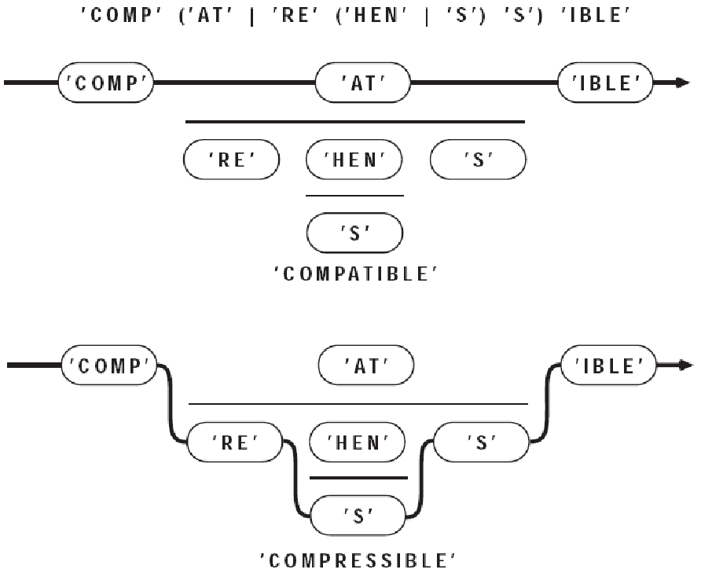
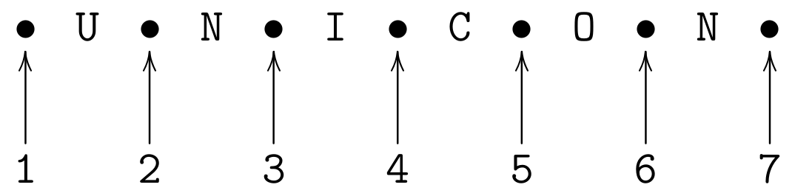
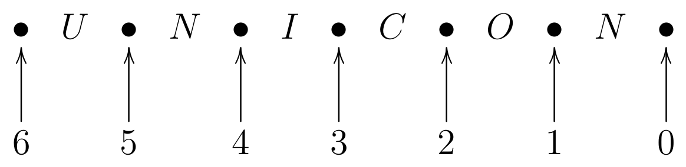

:title: Pattern Matching in Unicon
:author: Clinton Jeffery, Sudarshan Gaikaiwari, John Goettsche and Paden Rumsey
:trnumber: 18c
:date: 2017-10-02
:abstract: Unicon Version 13 introduces a pattern type for matching strings.
   The literal constants for this pattern type are strings, csets, and
   regular expressions, while the operators and composition features
   are based on the SNOBOL4 pattern type.
   Patterns are both an alternative and an addition to the string
   scanning control structure.
:docclass: report

Introduction
============

This technical report is a user's guide and reference to the pattern data type in the Unicon programming language. In order to understand this report, it will be helpful if the reader is familiar with Icon and Unicon's string scanning control structure. Compared with traditional methods, the pattern type allows more concise, more readable, and/or faster solutions for many string analysis problems. It is especially useful when:

* the format of strings is less than ideally structured
* the complexity of the patterns to be matched is high
* the ability to compose new patterns on the fly at runtime is desired
* there is a lot of string data and performance may be important

Icon Scanning vs. Snobol Patterns vs. Unicon Patterns
-----------------------------------------------------

Icon replaced SNOBOL's pattern data type with a string scanning control structure. The pattern type reintroduced into Unicon Version 13 is important for all the reasons that data is more convenient to manipulate than code: easier composition and reuse, modification and dynamic altering of patterns on the fly, and so on. SNOBOL veterans have complained that the Icon string scanning control structure is not as concise as SNOBOL patterns. Unicon patterns answer that criticism.

A "hello, world" type of example is

.. code-block:: unicon

   procedure main()
      write(read() ?? <[hH]ello[ \t]*[wW]orld>)
   end

This program reads a single line from standard input and executes a pattern match. The pattern will match as long as "hello" is followed by "world", with optional whitespace in between. Either or both words may be capitalized. If the match is successful, the substring that matched is written to standard output, stripped of any leading or trailing characters.

The Two Types of SNOBOL Pattern Statements
------------------------------------------

The two types of SNOBOL pattern statements, pattern matching and pattern replacement, use the following two templates:

.. code-block:: text

   label subject pattern goto
   label subject pattern = object goto

Instead of using a "label" or "goto", the pattern match in Unicon is a predicate expression, often used as the condition in an ``if`` expression. The SNOBOL pattern replacement statement has a more interesting Unicon embodiment. If a pattern match is performed on a variable, the matched portion is a substring variable that may be assigned with a replacement string. The following example searches for (a subset of) American-style dates and replaces them, moving the day to the beginning, as is common in other countries.

.. code-block:: unicon

   procedure main()
      s := "Adam's birthday is February 28, 1969. He is no spring chicken."
      month := <January|February|March>
      day := <[1-3]?[0-9]>
      year := <[0-9]{4}>
      s ?? month->part1 ||" "|| day->part2 || (", "||year)->part3 :=
         part2 || " " || part1 || part3
      write(s)
   end

This is neither SNOBOL nor Icon, exactly. Details of the patterns and operators used are presented later in this report. After you have read about them, as an exercise you can modify the regular expressions here to be more complete or more correct.

Pattern Matching Foundations
============================

Pattern matching consists of two phases: (1) construction of a pattern to be matched, and (2) application of the pattern in a context. Application of a pattern in turn features two primary modes: match and search. A match reports whether a pattern matches a given string at a specific location. Its result is an extent of the match, or a failure. The search for a pattern involves finding a match, reporting the start position and perhaps extent where the match has occurred.

In string scanning, the duality of match and search is seen in the built-in function set: ``find()`` is a search for a ``match()``; ``upto()`` is a search for an ``any()``. Pattern matching has two forms of pattern application: anchored and unanchored. An anchored pattern match tests whether a pattern occurs at a given position within a given subject string. An anchored match is performed by the tabmatch operator ``=p``. It is legal only within a string scanning environment.

.. code-block:: text

   s ? { ... =p ... }

An unanchored pattern match is a search for a match, performed with the syntax

.. code-block:: unicon

   s ?? p

This is a new string scan in a new environment, except with a pattern to match instead of an expression on the right side.

Pattern Literals
================

The simplest to interpret pattern values are literals, expressed as *regular expressions*. Regular expressions are concise, simple, readable, and sufficient for many purposes. However, regular expressions cannot match everything. Additional, more complex patterns can be constructed using *pattern constructor* operators and functions, described in the next section.

Unicon regular expressions consist of a regular expression body, enclosed in less than (``<``) and greater than marks (``>``), as in the example

.. code-block:: unicon

      x := <abc>

A regular expression is a pattern constructor that produces a single result of type pattern that may be used in subsequent pattern construction and matching operations. Within the body of a regular expression, most printable characters match themselves, and normal Unicon variables, values, operators and syntax constructs do not have their usual meaning. Instead, the following operators are supported:

ordinary characters evaluate to themselves
   for example ``<a>`` is a pattern that matches the letter ``a``. Spaces inside a regular expression literal are not typically significant; to allow a space as part of a pattern it must be quoted.

implicit concatenation
   inside a regular expression, juxtaposing two symbols is a concatenation. ``<abc>`` matches the string abc.

strings evaluate to their contents
   for example, ``<"abc">`` and ``<abc>`` construct the same pattern. Such ordinary Unicon string literals are the way to match any character that would otherwise be interpreted as a regular expression operator.

alternation
   the lowest precedence regular expression operator is alternation, indicated by a single vertical bar, which means either-or. ``<a|b>`` matches either ``a`` or ``b``. Alternation is lower precedence than concatenation.

Kleene star
   a unary suffix asterisk indicates that a pattern may occur zero or more times. Kleene star is of high precedence, so ``<abc*>`` matches ``a`` followed by ``b`` followed by zero or more ``c``'s. In contrast, ``<(abc)*>`` matches zero or more repetitions of ``abc``, and ``<[abc]*>`` matches zero or more occurrences of a, b, or c in any order.

csets
   within regular expressions, square brackets denote a pattern that matches any one member of the designated character set. Ordinary cset literals delimited by apostrophes are also accepted. Inside square bracketed csets, hyphens indicate ranges of characters, such as ``<[a-z]>``. Logically, a cset is just shorthand for a big alternation of all its members, so ``<[abc]>`` is equivalent to ``<(a|b|c)>``.

A more detailed definition of regular expressions in Unicon may be found in the Appendix. Other tools support many extensions of regular expressions, sometimes incompatibly, that you will not see here. Notably missing, for now, are caret (^) and dollar ($) for beginning-of-line and end-of-line.

Unicon regular expressions compile down to SNOBOL-style patterns, and SNOBOL-style pattern matching generally matches the *shortest* string that can be matched by a pattern, not the longest possible match. In the current version of Unicon, this can cause surprises in behavior, especially in patterns that can match the empty string. If your regular expression can match the empty string, that is the shortest match and that is what you will get.

The Unicon Pattern Data Type
============================

It is usually trivial to translate SNOBOL4 pattern construction code to Unicon patterns. This section explains Unicon patterns in detail so that programmers who have never been exposed to SNOBOL can understand and use them. Where necessary, differences between Unicon patterns and SNOBOL patterns are also pointed out. The simplest operands for pattern matching in Unicon are strings and character sets. These match themselves when used in a pattern matching expression, for example:

.. code-block:: unicon

           "Unicon" ?? "nic" 

Like all Unicon expressions this expression can either succeed or fail. If the pattern is found in the subject then the expression succeeds and returns the first substring of the subject matched by the pattern. In the above expression a substring corresponding to the 2nd to 5th characters of the subject is returned. While strings and characters can be used in pattern matching expressions the pattern data type allows complicated patterns to be constructed and stored in variables. This pattern construction is done with the following operators and functions.

Operators
---------

Patterns are often built up from simple components using concatenation (``||``) and alternation (``.|``). These operators seem redundant and less concise than the corresponding regular expression operators, but unlike regular expressions, they accept arbitrary Unicon expressions (variables, function calls, etc.) as operands. While Unicon's usual string concatenation operator is used for pattern concatenation, the alternation pattern constructor ``.|`` is very different from the alternation control structure ``|`` --- it constructs an alternative to be explored later during a pattern match, rather than indicating an immediate alternative (a generator) during the current expression evaluation.

When pattern match time occurs, a pattern formed by alternation of two elements succeeds if either of the elements matches. A pattern formed by concatenation of two elements matches if both those elements match consecutively. When two patterns are joined together by alternation they are called alternates. When two patterns ``P1`` and ``P2`` are combined using concatenation as ``P1 ``||`` P2`` then ``P2`` is the subsequent of ``P1``. Pattern concatenation has higher precedence than pattern alternation. So the pattern ``P1 ``.|`` P2 ``||`` P3`` matches either the pattern ``P1`` or the pattern formed by concatenation of ``P2`` and ``P3``. Parentheses can be used to group patterns differently. ``(P1 ``.|`` P2) ``||`` P3`` matches ``P1`` or ``P2`` followed by ``P3``.

Thus patterns can be composed from subpatterns. When a subpattern successfully matches a portion of the subject, the matching subject characters are bound to it. The next sub pattern in the pattern must match beginning with the very next subject character. If a subsequent fails to match, the pattern backtracks, unbinding patterns until another alternative can be tried. A pattern match fails when an alternative that matches cannot be found.

Suppose we wanted to construct a pattern that matched any of the following strings: COMPATIBLE, COMPREHENSIBLE and COMPRESSIBLE. The pattern can be constructed by

.. code-block:: unicon

   "COMP" || ("AT" .| "RE" || ("HEN" .| "S") || "S") || "IBLE"

One way to understand patterns is to construct bead diagrams for them. In a bead diagram, pattern matching is the process of attempting to pass a needle and thread through a collection of beads which model the individual pattern components. Pattern subsequents are drawn side-by-side, left-to-right. Pattern alternates are stacked vertically, in columns, with a horizontal line between each alternative. A bead diagram for the preceding pattern is shown in Figure 1.

   Bead Diagram

Consider the following pattern and its application

.. code-block:: unicon

           Manufacturer := "SONY" .| "DELL"
           Type := "Desktop" .| "Laptop"
           Machine := Manufacturer || " " || Type
           "SONY Laptop" ?? Machine

The pattern matching will succeed. However we would also like to determine which of the pattern alternatives actually matched. For this we use the conditional binary operator ``->``. The operator is called conditional, because assignment occurs only if the pattern match is successful. It assigns the matching substring on its left to the variable on its right. Note that the direction of assignment is just the opposite of the assignment operator ``:=``. Changing the above example to use conditional assignment.

.. code-block:: unicon

           Manufacturer := ("SONY" .| "DELL") -> Corporation
           Type := ("Desktop" .| "Laptop") -> SysType
           Machine := Manufacturer || " " || Type
           "SONY Laptop" ?? Machine
           write(Corporation)
           write(SysType)
   OUTPUT
           SONY
           Laptop

The immediate assignment operator ``=>`` allows us to capture intermediate results during the pattern match. Immediate assignment occurs whenever a subpattern matches, even if the entire pattern match ultimately fails. Like conditional assignment, the matching substring on its left is assigned to the variable on its right. Immediate assignment is often used as a debugging tool to observe the pattern matching process. When used with unevaluated expressions immediate assignment allows creation of a powerful class of patterns as we will see later.

During a pattern match, the cursor is Unicon's pointer into the subject string. It is integer valued, and points between two subject characters. It may also may be positioned before the first subject character, or after the final subject character. Its value may never exceed the size of the subject string by more than 1. An example of the index numbering system for the subject string UNICON can be found in below, in the discussion of the function ``Pos()``.

The cursor is set to 1 when a pattern match begins, corresponding to a position immediately to the left of the first subject character. As the pattern match proceeds, the cursor moves right and left across the subject to indicate where Unicon is attempting a match. The value of the cursor is assigned by the unary cursor position operator ``.>`` to a variable. It appears within a pattern, preceding the name of a variable. For example,

.. code-block:: unicon

           p := ("b" .| "r") || ("e" .|"ea") || ("d" .| "ds")
           pattern :=.>x || p ||.>y
           write("the beads are red")
           if "the beads are red" ?? pattern then 
                   write(repl(" ",x - 1), repl("_", y - x))

The above code will underline the part of the substring that is matched by the pattern. The output is

.. code-block:: text

   the beads are red
       -----

Table 1 summarizes the Unicon pattern matching operators.

.. list-table:: Pattern Construction Operators
   :header-rows: 1
   :widths: 45 55

   * - Operator
     - Operation
   * - ``||``
     - Pattern concatenate
   * - ``.|``
     - Pattern alternation
   * - ``->``
     - Conditional assignment
   * - ``=>``
     - Immediate assignment
   * - ``.>``
     - Cursor position assignment

The previous examples used patterns created from literal strings. Instead of specific characters, qualities of the string to be matched can also be specified. The ability to specify these qualities makes patterns powerful at recognizing more abstract patterns. There are 3 different types of pattern construction functions that allow specification of pattern qualities:

* Integer pattern functions
* Character pattern functions
* Pattern primitives

Integer Pattern Functions
-------------------------

These pattern construction functions take an integer as a parameter and return a pattern as result. The integer pattern functions are:

Len(i): Match fixed-length string
^^^^^^^^^^^^^^^^^^^^^^^^^^^^^^^^^

``Len(i)`` produces a pattern which matches a string exactly i characters long. i must be an integer greater than or equal to zero. Any character may appear in the matched string. For example, ``Len(5)`` matches any 5-character string, and ``Len(0)`` matches the empty string. ``Len()`` may be constrained to certain portions of the subject by other adjacent patterns:

.. code-block:: unicon

           s := "abcda"
           write(s ?? Len(3) -> out)
           s ?? Len(2) -> out || "a"
           write(out)
   OUTPUT
   abc
   cd

The first pattern match had only one constraint: the subject had to be at least three characters long. Thus ``Len(3)`` matched its first three characters. The second case imposes the additional restriction that ``Len(2)``'s match be followed immediately by the letter ``"a"``. This disqualifies the intermediate match attempts ``"ab"`` and ``"bc"``.

Using ``Len()`` with keyword ``&ascii`` as the subject provides a simple way to obtain a string of unprintable characters. For example, the ASCII control characters occupy positions 0 through 31 in the 256-character ASCII set. To obtain a 32-character string containing these control codes, use:

.. code-block:: unicon

           &ascii ?? Len(32) -> controls

Pos(i), Rpos(i): Verify cursor position
^^^^^^^^^^^^^^^^^^^^^^^^^^^^^^^^^^^^^^^

The ``Pos(i)`` and ``Rpos(i)`` patterns do not match subject characters. Instead, they succeed only if the current cursor position is a specified value. They often are used to tie points of the pattern to specific character positions in the subject. The following shows the cursor positions as used by ``Pos()``:

The following are the cursor positions used by Rpos().

``Pos(I)`` counts from the left end of the subject string, succeeding if the current cursor position is equal to I. ``Rpos(I)`` is similar, but counts from the right end of the subject. If the subject length is N characters, ``Rpos(I)`` requires the cursor be (N - I). If the cursor is not the correct value, these functions fail, and the pattern matcher tries other pattern alternatives.

.. code-block:: unicon

           s := "abcda"
           if s ?? Pos(1) || "b" then
                   write("Match succeeded")
           else
                   write("Match failed")
           s ?? Len(3) -> out || Rpos(0) 
   	write(out)
           s ?? Pos(4) || Len(1) -> out
   	write(out)
           if s ?? Pos(1) || "abcd" || Rpos(0) then
                   write("Match succeeded")
           else
                   write("Match failed")
   OUTPUT
   Match failed
   cda
   d
   Match failed

The first example requires a ``"b"`` at cursor position 1, and fails for this subject. ``Pos(1)`` anchors the match, forcing it to begin with the first subject character. Similarly, ``Rpos(0)`` anchors the end of the pattern to the tail of the subject. The next example matches at a specific mid-string character position, ``Pos(3)``. Finally, enclosing a pattern between ``Pos(1)`` and ``Rpos(0)`` forces the match to use the entire subject string. At first glance these functions appear to be setting the cursor to a specified value. Actually, they never alter the cursor, but instead wait for the cursor to come to them as various match alternatives are attempted.

Rtab(i), Tab(i): Match to fixed position
^^^^^^^^^^^^^^^^^^^^^^^^^^^^^^^^^^^^^^^^

These patterns are hybrids of ``Arb()``, ``Pos()``, and ``Rpos()``. They use specific cursor positions, like ``Pos()`` and ``Rpos()``, but match subject characters, like ``Arb()`` (see section 4.4.2). ``Tab(i)`` matches any characters from the current cursor position up to the specified position ``i``. ``Rtab(i)`` does the same, except, as in ``Rpos()``, the target position is measured from the end of the subject. ``Tab()`` and ``Rtab()`` will match the empty string, but will fail if the current cursor is to the right of the target. They also fail if the target position is past the end of the subject string. These patterns are useful when working with tabular data. For example, if a data file contains name, street address, city and state in columns 1, 30, 60, and 75, this pattern will break out those elements from a line:

.. code-block:: unicon

   P = Tab(30) -> NAME || Tab(60) -> STREET || 
   	Tab(75) -> CITY || Rem() -> ST

The pattern ``Rtab(0)`` is equivalent to primitive pattern ``Rem()``. It counts from the right end of the subject, but matches to the left of its target cursor. Example:

.. code-block:: unicon

           s := "abcde"
           s ?? Tab(3) -> out1 || Rtab(1) -> out2
   	write(out1, "\n", out2)
   OUTPUT
   ab
   cd
   Success

``Tab(3)`` matches ``"ab"``, leaving the cursor at 2, between ``"b"`` and ``"c"``. The subject is 5 characters long, so ``Rtab(1)`` specifies a target cursor of 6 - 1, or 5, which is between the ``"d"`` and ``"e"``. ``Rtab()`` matches everything from the current cursor, 3, to the target, 5.

Character Pattern Functions
---------------------------

These functions produce a pattern based on a character set argument. The argument passed to these functions is always converted to a character set

Any(c), NotAny(c): Match one character
^^^^^^^^^^^^^^^^^^^^^^^^^^^^^^^^^^^^^^

``Any(c)`` matches the next subject character if it appears in the cset ``c``, and fails otherwise. ``NotAny(c)`` matches a subject character only if it does not appear in ``c``. Here are some sample uses of each:

.. code-block:: unicon

           vowel := Any("aeiou")
           dvowel := vowel || vowel
           notvowel := NotAny("aeiou")
           "vacuum" ?? vowel -> out
   	write(out)
           "vacuum" ?? dvowel -> out
   	write(out)
           "vacuum" ?? (vowel || notvowel) -> out
   	write(out)
   OUTPUT
   a
   uu
   ac

In a larger pattern context, and when many alternatives are being tried, you may search for the multi-letter vowel combinations before falling back on a single-letter vowel match. A pattern such as:

.. code-block:: unicon

      vowel := "oy" .| "ei" .| "ie" .| Any('aieouy')

allows a few common digraphs in the definition of vowel. Of course, in a complex language such as English, the rabbit-hole is almost bottomless.

Break(c), Span(c), Nspan(c): Match a run of characters
^^^^^^^^^^^^^^^^^^^^^^^^^^^^^^^^^^^^^^^^^^^^^^^^^^^^^^

``Break(c)`` and ``Span(c)`` are multi-character versions of ``NotAny()`` and ``Any()``. These functions require a non-empty cset argument to specify a set of characters. ``Span(c)`` matches one or more subject characters from the set in ``c``. ``Span()`` must match at least one subject character, and will match the longest subject string possible. ``Nspan()`` matches zero or more subject characters from set ``c``; it is equivalent to ``(Span(c) .| "")``.

``Break(c)`` matches up to but not including any character in ``c``. The string matched must always be followed in the subject by a character in ``c``. Unlike ``Span()`` and ``NotAny()``, ``Break()`` will match the empty string. ``Break()`` and ``Span()`` are called stream functions because each streams by a series of subject characters. ``Span()`` is most useful for matching a group of characters with a common trait. For example, we can say an English word is composed of one or more alphabetic characters, apostrophes, and hyphens. A pattern for this is:

.. code-block:: unicon

           word := Span(&letter ++ "'-")

Some patterns that can be formed by ``Span()`` and ``Break()``.

.. list-table::
   :header-rows: 1
   :widths: 45 55

   * - Pattern
     - Function
   * - a run of blanks
     - ``Span(' ')``
   * - a string of digits
     - ``Span(&digits)``
   * - a run of letters
     - ``Span(&letters)``
   * - everything up to the next blank
     - ``Break(' ')``
   * - everything up to the next punctuation mark
     - ``Break(',.;:!?')``

Breakx(): Extended Break() function
^^^^^^^^^^^^^^^^^^^^^^^^^^^^^^^^^^^

Like SPITBOL, Unicon provides an extended version of ``Break()`` called ``Breakx()``. If necessary, ``Breakx()`` will look past the place where it stopped to see if a longer match is possible. It will do this if some subsequent pattern element fails to match. The pattern matcher checks to see if extending ``Breakx()`` might allow the subsequent pattern element match. If so, the operation succeeds. If not, other pattern alternatives (if any) prior to Breakx() are attempted. Suppose the pattern needs to match everything before the first ``"e"`` in a subject string, as with:

.. code-block:: unicon

           "integers" ?? Break("e") -> out
   	write(out)
   OUTPUT
   int

``Break()`` works fine in this scenario, however if whatever comes before the first occurrence of a two-letter pattern ``"er"`` is to be matched, then ``Breakx()`` is more appropriate.

.. code-block:: unicon

           "integers" ?? Breakx("e") -> out || "er"
   	write(out)
   OUTPUT
   integ

``Breakx()`` stopped at the first ``e`` in ``"integer"``, and tried to match the next pattern element, the two letters ``"er"``. But the next subject characters were ``"eg"``, a mismatch, so ``Breakx()`` was instructed to try again. ``Breakx()`` extended itself to the next ``"e"``, where ``"er"`` in the subject matches ``"er"`` in the pattern. The above example illustrates that ``Break(c)`` will never return a string containing any characters in c, while ``Breakx(c)`` might, if a subsequent pattern requires it. ``Breakx(c)`` provides a more selective, and more efficient version of the ``Arb()`` pattern. For example the following construction could have been used:

.. code-block:: unicon

           "integers" ?? Arb() -> out || "er"
   	write(out)
   OUTPUT
   integ

but ``Arb()`` pokes along one character at time, matching ``"i"``, ``"in"``, ``"int"``, and ``"inte"``, before finding the desired match, ``"integ"``. In contrast, ``Breakx()`` gets the right answer after only two attempts: ``"int"`` and ``"integ"``. The increased efficiency is even more pronounced with a long subject.

Primitives
----------

There are eight primitives built into the Unicon pattern matching system, of which seven have known uses. They are:

Rem(): Match remainder of the subject
^^^^^^^^^^^^^^^^^^^^^^^^^^^^^^^^^^^^^

``Rem()`` will match zero or more characters at the end of the subject string. For example

.. code-block:: unicon

          "NMSU Aggies" ?? "NMSU" || Rem() -> out
          write(out)
   OUTPUT
    Aggies

The subpattern ``"NMSU"`` is matched at its first occurrence in the subject. ``Rem()`` is matched from there to the end of the subject. If the example is changed to

.. code-block:: unicon

           "NMSU Aggies" ?? "Aggies" || Rem() -> out
   	write(out)
   OUTPUT
   

the ``"Aggies"`` matches at the end of the string leaving an empty remainder for ``Rem()``. ``Rem()`` then matches the empty string and the assignment to the out causes just a newline to be written to the standard output.

The pattern components to the left of ``Rem()`` must successfully match some portion of the subject string. ``Rem()`` begins after the last character matched by the earlier pattern component and matches all subject characters till the end of the string. There is no restriction on the particular characters matched.

Arb(): Match arbitrary characters
^^^^^^^^^^^^^^^^^^^^^^^^^^^^^^^^^

``Arb()`` matches an arbitrary number of characters from the subject string. It matches the shortest possible substring, including the empty string. The pattern components on either side of ``Arb()`` determine what is matched. Example:

.. code-block:: unicon

           "Pragmatic Programmer" ?? "a" || Arb() -> out || "a"
   	write(out)
   OUTPUT
   gm
           "Pragmatic Programmer" ?? "a" || Arb() -> out || "g"
   	write(out)
   OUTPUT
   

In the first statement, the ``Arb()`` pattern is constrained on either side by the known patterns ``"a"`` and ``"a"``. ``Arb()`` expands to match the subject characters between, ``"gm"``. Note the smaller substring between two occurrences of ``"a"`` is matched. In the second statement, there is nothing between ``"a"`` and ``"g"``, so ``Arb()`` matches the empty string. ``Arb()`` behaves like a spring, expanding as needed to fill the gap defined by neighboring patterns.

Arbno(): Match zero or more consecutive occurrences of pattern
^^^^^^^^^^^^^^^^^^^^^^^^^^^^^^^^^^^^^^^^^^^^^^^^^^^^^^^^^^^^^^

This function produces a pattern which will match zero or more consecutive occurrences of the pattern specified by its argument. ``Arbno()`` is useful when an arbitrary number of instances of a pattern may occur. For example, ``Arbno(Len(3))`` matches strings of length 0, 3, 6, 9,... There is no restriction on the complexity of the pattern argument. Like the ``Arb()`` pattern, ``Arbno()`` tries to match the shortest possible string. Initially, it simply matches the empty string. If a subsequent pattern component fails to match, Unicon backs up, and asks ``Arbno()`` to try again. Each time ``Arbno()`` is retried, it supplies another instance of its argument pattern. In other words, ``Arbno(PAT)`` behaves like

.. code-block:: text

   ("" | PAT | PAT PAT | PAT PAT PAT |...)

Also like ``Arb()``, ``Arbno()`` is usually used with adjacent patterns to draw it out. Consider the following example which tests for a list of one or more numbers separated by commas and enclosed by parentheses.

.. code-block:: unicon

           item := Span(&digits)
           list := Pos(1) || "(" || item || Arbno("," || item) ||
                   ")" || Rpos(0)
           if "(12,345,6)" ?? list then
                   write("Match succeeded")
           else
                   write("Match failed")
           if "(12,,6)" ?? list then
                   write("Match succeeded")
           else
                   write("Match failed")
   OUTPUT
   Match succeeded
   Match failed

``Arbno()`` is retried and extended till the subsequent ``")"`` matches. ``Pos(1)`` and ``Rpos(0)`` force the pattern to be applied to the entire subject string.

Abort(): End pattern match
^^^^^^^^^^^^^^^^^^^^^^^^^^

The ``Abort()`` pattern causes immediate failure of the entire pattern match, without seeking other alternatives. Usually a match succeeds when we find a subject sequence which satisfies the pattern. The ``Abort()`` pattern does the opposite: if we find a certain pattern, we will abort the match and fail immediately. For example suppose we are looking for an ``"a"`` or ``"b"``, but want to fail if ``"1"`` is encountered first:

.. code-block:: unicon

           if "ab1" ?? Any("ab") .| "1" || Abort() then
                   write("Match succeeded")
           else
                   write("Match failed")
           if "1ab" ?? Any("ab") .| "1" || Abort() then
                   write("Match succeeded")
           else
                   write("Match failed")
   OUTPUT
   Match succeeded
   Match failed

The second pattern matching expression deserves some elaboration as it shows how the pattern matching engine works. At each cursor position all pattern alternatives are tried. In the second pattern matching expression after the literal ``"1"`` matches ``Abort()`` matches causing the pattern to fail. The ``Any()`` pattern thus does not get a chance to match the character ``"a"`` at cursor position 2.

Bal(): Match balanced string 
^^^^^^^^^^^^^^^^^^^^^^^^^^^^^

The ``Bal()`` function produces a pattern that matches the shortest non-empty string in which parentheses are balanced. A string without parentheses is also considered to be balanced, so in the absence of parentheses, in unanchored mode ``Bal()`` simply matches each letter of the string one after another. According to ``Bal()`` the following strings are balanced:

.. code-block:: text

   (X) Y (A!(C:D)) (AB)+(CD) 9395 (8+-9/2)

and these are not:

.. code-block:: text

   )A+B (A*(B+) (X))

Unlike string scanning function ``bal()``, pattern ``Bal()`` is hardwired to only look for left and right parentheses. The matching string does not have to be a well-formed expression in the algebraic sense; it might just as easily be a Lisp S-expression or other parenthesis-based notation. Like ``Arb()``, ``Bal()`` is often useful when constrained by other pattern components. For example:

.. code-block:: unicon

           "ab+(14-2)*c" ?? Any("+-*/") || Bal() -> out || 
                           Any("+-*/") 
   OUTPUT
   (14-2)

Some additional examples of using ``Bal()`` are presented in the program below. Since ``Bal()`` happily matches spaces, these examples discard matches that consist only of a space character. In example 1, the pattern match applied to ``Bal()`` is used as a generator to drive an every loop; example 2 does the same, but also stores the matched string into a variable for convenient processing in a separate loop body. Example 3 uses the pattern from within a string scanning environment.

.. code-block:: unicon

   procedure main()                                                                
      s1 := "(a + b) - (c - (d*e)) + (f/g)"
   
      # example 1
      every write(" " ~== (s1 ?? Bal()))
   
      # example 2
      every (s1 ?? Bal() -> z) ~== " " do
         write("z: ", image(z))                                                    
   
      # example 3
      s1 ? {                                                                       
         repeat {                                                                  
            if s2 := =Bal() then write("s2: ", image(s2))                          
            else {                                                                 
               write("didn't balance at ", &pos)                                   
               move(1)                                                             
               }                                                                   
            if pos(0) then break                                                   
            }                                                                      
         }                                                                         
   end

Fail(): Seek other alternatives
^^^^^^^^^^^^^^^^^^^^^^^^^^^^^^^

The ``Fail()`` pattern signals the failure of this portion of the pattern match, causing the pattern matcher to backtrack and seek other alternatives. ``Fail()`` will also suppress a successful match, which can be very useful when the match is being performed for its side effects, such as immediate assignment. For example this fragment will display the subject characters, one per line:

.. code-block:: unicon

           out := &output
           subject ? Len(1) => out => Fail()

``Len(1)`` matches the first subject character, and immediately assigns it to out. ``Fail()`` tells the pattern matcher to try again, and since there are no other alternatives, the entire match is retried at the next subject character. Forced failure and retries continue until the subject is exhausted. The difference between ``Abort()`` and ``Fail()`` is that ``Abort()`` stops all pattern matching, while ``Fail()`` tells the system to back up and try other alternatives or other subject starting positions.

Fence(): Prevent match retries
^^^^^^^^^^^^^^^^^^^^^^^^^^^^^^

Pattern ``Fence()`` matches the empty string and has no effect when the pattern matcher is moving left to right in a pattern. However, if the pattern matcher is backing up to try other alternatives, and encounters ``Fence()``, the match fails. ``Fence()`` can be used to lock in an earlier success. Consider the following example: The pattern succeeds if the first ``"a"`` or ``"b"`` in the subject is immediately followed by a plus sign.

.. code-block:: unicon

           "1ab+" ?? Any("ab") || Fence() || "+"

In the example above, the pattern matcher matches the ``"a"`` and goes through the ``Fence()``, only to find that ``"+"`` does not match the next subject character, ``"b"``. The pattern matcher then tries to backtrack, but is stopped by the ``Fence()`` and fails. If ``Fence()`` were omitted, backtracking would match ``Any()`` to ``"b"``, and then proceed forward again to match ``"+"``. If ``Fence()`` appears as the first component of a pattern, the pattern matcher cannot back up through it to try another subject starting position. This allows the unanchored pattern matching mode to simulate the anchored mode.

Succeed(): Match Always
^^^^^^^^^^^^^^^^^^^^^^^

This pattern was added to Unicon to match SNOBOL4 pattern for pattern. The authors do not know of any meaningful use of ``Succeed()``.

Unevaluated Expressions
-----------------------

Consider the following pattern construction example which captures the next ``i`` characters after a colon:

.. code-block:: unicon

           npat := ":" || Len(i) -> item

This pattern is static in the sense that the value of ``i`` at time of pattern construction is captured by the pattern. Even if ``i`` subsequently changes the pattern uses the original value of ``i``. One way to use the current value of ``i`` is to specify the pattern each time it is used.

.. code-block:: unicon

           SUBJECT ?? ":" || Len(i) -> item

However this is not only inefficient, but also a possible maintenance nightmare. The *unevaluated expression* facility allows us to obtain the efficiency of static pattern construction yet use the current value of variables. An unevaluated expression is constructed by enclosing it in a pair of backquotes. So we can construct the pattern ``npat`` as

.. code-block:: unicon

           npat := ":" || Len(`i`) -> item

The pattern is only constructed once, and assigned to ``npat``. ``i``'s current value is ignored at this time; the variable's name is stored in the pattern. Later, when ``npat`` is used in a pattern match, the deferred evaluation operator fetches the then current value of ``i``. Deferred evaluation may appear as the argument of the pattern functions ``Any()``, ``Break()``, ``Breakx()``, ``Len()``, ``NotAny()``, ``Pos()``, ``Rpos()``, ``Rtab()``, ``Span()``, or ``Tab()``.

.. code-block:: unicon

        procedure main()
           pat := Tab(`i`) -> out1 || Span(`s`) -> out2
           sub := "123aabbcc"
           i := 5
           s := "ab"
           sub ?? pat
           write(out1, ":", out2)
           i := 4
           sub ?? pat
           write(out1, ":", out2)
        end
   
   OUTPUT
   
   123a
   abb
   123
   aabb

Note that ``i`` and ``s`` were undefined when ``pat`` was first constructed.

Immediate Assignment
^^^^^^^^^^^^^^^^^^^^

Immediate assignment can be used as a debugging aid to view the pattern matching process. However combined with unevaluated expressions immediate assignments give rise to a powerful class of patterns. In these patterns a variable that is assigned to during the pattern matching process is used later in the very same pattern match. Consider the following example where the first part of the subject contains the length of the field that is to be extracted. So the pattern first assigns the length to a variable ``n`` and uses that variable as a argument to Len().

.. code-block:: unicon

           fpat := Span(&digits) => n || Len(`n`) -> field        
           "12abcdefghijklmn" ?? fpat
           write(field)
   OUTPUT
   abcdefghijkl

Lack of Recursive Pattern Support
^^^^^^^^^^^^^^^^^^^^^^^^^^^^^^^^^

At the present time, Unicon's pattern facilities do not support the use of an unevaluated expression to achieve *recursive* patterns. For example, in SNOBOL it was possible to write a recursion comparable to the following:

.. code-block:: unicon

   procedure main()
      out := &output
      p := `p` || "Z" .| "Y"
      po := p -> out
      L := ["Y", "YZZZ", "XYZ", "YZZX", "AYZZZZB"]
      every !L ?? po
   end

On Unicon, this will result in a pattern stack overflow run-time error.

Limitations due to lack of eval()
^^^^^^^^^^^^^^^^^^^^^^^^^^^^^^^^^

A major difference between the SNOBOL4 and Icon families is that Icon lacks a general facility for evaluating string contents as expressions, the ability to introduce new code on the fly that is available in SNOBOL. To somewhat ameliorate this limitation, the pattern feature was augmented so that certain operations will be evaluated during the pattern matching phase instead of the pattern construction phase. Unicon supports the following language constructs in unevaluated expressions.

* function call
* method call
* variable reference
* field reference

Note the function or method calls can only have identifiers or constants as parameters. Expressions as parameters are not allowed. Multiple field references of the form ``x.y.z`` are not yet supported. An unevaluated function or method call is used in two ways. The pattern matcher performs the call and if it fails, treats the failure as if a pattern subcomponent has failed and tries to backtrack in search of other alternatives. However if the pattern call succeeds then the pattern matcher can either ignore the result of the function or use the result in the pattern matching process. To specify that the result should be used in pattern matching the unevaluated function call is enclosed in backquotes. Unevaluated expressions can also include operators for example to check if a variable is non null

.. code-block:: unicon

           `\x`

binary operators can be used using the prefix notation. Only one operator or function call can be used in an unevaluated expression. Unicon programs that use unevaluated expressions must be compiled with the ``"-f s"`` option which enables full string invocation.

Pattern expressions and Unicon control structure
------------------------------------------------

One of the goals while introducing pattern types in Unicon was to ensure that it integrated well with Unicon's syntax and features such as goal directed evaluation. Unicon's features such as generators and limiting generators can be used along side the pattern matching features to write concise and readable code. The following code changes all lines of the format

*year month day "unchanged portion"*

in the input file to

*month day year "unchanged portion"*

in the output file.

.. code-block:: unicon

   procedure main()
           p := Fence() || Len(4) -> yr || " " || 
                           Len(4) -> mo || " " || Len(2) -> day
           in := open("leninput", "r")
           out := open("lenoutput", "w")
           every	write(out, (line := !in) ?? 
                      p := mo || " " || day || ", " || yr || " ")
   end

The following code shows how the limiting generation control structure can be used to obtain the nth occurrence of a pattern. In this example the word ``red`` before the third occurrence of ``"fish"`` will be output

.. code-block:: unicon

   procedure main()
      s := "One fish two fish red fish blue fish"
      wrdpat := Break(&letters) || Span(&letters) -> word
      p := wrdpat || Span(" ") || "fish"
      every (s ?? p) \ 3
      write(word)
   end 

Conclusions
===========

The pattern matching facilities are still rough around the edges, but nevertheless provide benefits in many text processing tasks. They allow Unicon programmers to write more succinct and efficient code to perform text processing.

Since the new pattern facility closely follows the implementation of patterns in SNOBOL it also provides a path for programmers to migrate legacy SNOBOL code to Unicon. Translating SNOBOL pattern matching code to Unicon has been simplified because of the nearly one to one matching between SNOBOL operators and functions and Unicon operators and functions. The lack of an ``eval`` function in Unicon prevents the pattern data type from exhibiting all the power of SNOBOL patterns.

APPENDIX A: Language Reference
==============================

Regular Expressions
-------------------

Regular expressions in Unicon are pattern literals; evaluation constructs and produces a pattern value. Regular expressions are enclosed in tag-like ``<`` and ``>`` characters, within which the usual Unicon operator syntax does not apply and instead, the following elements are allowed. Unicon presently recognizes only the classic small core set of regular expression operators and a few common extensions. Regular expressions are extended incompatibly in myriad tools and if your favorite regular expression operator is not listed here, it is probably not in Unicon at present.

----

**r** — ordinary symbol r is a regular expression that matches r.

----

**r1 r2** — juxtaposition of two regular expressions is a concatenation.

----

**r1** ``|`` **r2** — alternation of two regular expressions produces a
regular expression that matches either r1 or r2. It is not a generator.

----

**r** ``*`` — the asterisk is a postfix operator that produces a regular
expression that matches zero or more occurrences of r.

----

**r** ``+`` — the plus is a postfix operator that produces a regular
expression that matches one or more occurrences of r.

----

**r** ``?`` — the question mark is a postfix operator that produces a
regular expression that matches zero or one occurrences of r.

----

**r{n}** — the curly braces are a postfix operator that produces a regular
expression that matches n occurrences of r.

----

``"lit"`` — string literals produce a regular expression that matches the
characters of the string, with the usual escapes.

----

``'lit'`` — cset literals produce a regular expression that matches any one
character of the cset, with the usual escapes.

----

``[chars]`` — square brackets produce a regular expression that matches any
one character of the cset, with minus interpreted as a range character.
*Not yet implemented: hex or octal escapes.*

----

**.** — in a regular expression, the period matches any one character except
the newline character.

----

**(r)** — parentheses are used for grouping and produce a regular expression
that matches r.

Pattern Variables
-----------------

----

**variable** — a variable in a pattern definition that may not be changed
during a pattern match operation.

----

Unevaluated `` `variable` `` — a backquoted variable in a pattern definition
that can be changed in a pattern match operation.

Pattern Operators
=================

**``pattern1 || pattern2``** — **pattern concatenation**

pattern concatenation operator produces a new pattern containing the left
operand followed the right operand.

----

**``pattern1 .| pattern2``** — **pattern alternation**

pattern alternation operator produces a pattern containing either the left
operand or the right operand.

----

**``substring -> variable``** — **conditional assignment**

assigns the substring on the left to the variable on the right if the
pattern match is successful.

----

**``result => variable``** — **immediate assignment**

assigns the immediate result on the left to a variable on the right within
a pattern.

----

**``.> variable``** — **cursor position assignment**

assigns the cursor position of the string to a variable on the right within
a pattern.

----

**``string ?? pattern``** — **comparison operator**

compares the string on the left to see if there are any matches of the
pattern on the right in the un-anchored mode.

----

**``=pattern``** — **comparison operator**

compares the current string in the string scanning environment to see if
there is a match of the pattern on the right in the anchored mode.

Pattern Built-In Functions
==========================

The new built-in functions in this section generally construct and produce a pattern as their return value. The resulting pattern may then be stored in a variable or composed with others to form more complex patterns, or used in the pattern match (??) or string scanning operators as described above.

----

**``Abort()``** — **pattern cancel**

causes an immediate failure of the entire pattern match.

----

**``Any(c)``** — **match any**

matches any single character contained in c appearing in the subject string.

----

**``Arb()``** — **arbitrary pattern**

matches zero or more characters in the subject string.

----

**``Arbno(p)``** — **repetitive arbitrary pattern**

matches repetitive sequences of p in the subject string.

----

**``Bal()``** — **balanced parentheses**

matches the shortest non-null string which parentheses are balanced in the subject string.

----

**``Break(c)``** — **pattern break**

matches any characters in the subject string up to but not including any of the characters in cset c.

----

**``Breakx(c)``** — **extended pattern break**

matches any characters up to any of the subject characters in c, and will search beyond the break position for a possible larger match.

----

**``Fail()``** — **pattern back**

signals a failure in the current portion of the pattern match and sends an instruction to go back and try a different alternative.

----

**``Fence()``** — **pattern fence**

signals a failure in the current portion of the pattern match if it is trying to backing up to try other alternatives.

----

**``Len(i)``** — **match fixed-length string**

matches a string of a length of ``i`` characters in the subject string. It fails if ``i`` is greater than the number of characters remaining in the subject string.

----

**``NotAny(c)``** — **match anything but**

matches any single character not contained in character set ``c`` appearing in the subject string.

----

**``Nspan(c)``** — **optional pattern span**

matches the longest available sequence of zero or more characters from the subject string that are contained in ``c``.

----

**``Pos(i)``** — **cursor position**

sets the cursor or index position of the subject string to the position ``i`` according the Unicon index system shown below:

.. code-block:: text

                      -6  -5  -4  -3  -2  -1  0
                      | U | n | i | c | o | n |
                      1   2   3   4   5   6   7

----

**``Rem()``** — **remainder pattern**

matches the remainder of the subject string.

----

**``Span(c)``** — **pattern span**

matches one or more characters from the subject string that are contained in ``c``. It must match at least one character.

----

**``Succeed()``** — **pattern succeeds**

produces a pattern that, when matched, will cause the surrounding pattern match to succeed without further scrutiny.

----

**``Tab(n)``** — **pattern tab**

matches any characters from the current cursor or index position up to the specified position of the subject string. ``Tab()`` uses the Unicon index system shown in ``Pos()`` and position ``n`` must be to the right of the current position.

----

**``Rpos(n)``** — **reverse cursor position**

sets the cursor or index position of the subject string to the position ``n`` back from the end of the string, equivalent to using Unicon's negative indices in ``Pos()``.

.. code-block:: text

                      6   5   4   3   2   1   0
                      | S | N | O | B | O | L |

----

**``Rtab(i)``** — **pattern reverse tab**

matches any characters from the current cursor or index position up to the specified position (back from the end) of the subject string, equivalent to using a negative index in ``Tab()``. Position ``n`` must be to the right of the current position.

----

In addition to these new functions, the built-in function ``image(x)`` produces an interesting string when invoked with a pattern argument, including the pattern's serial number and number of elements along with an approximation of the pattern's components. For example, if p were the pattern

.. code-block:: unicon

      p := Break(&letters) || Span(&letters) -> word
      write(image(p))

writes out

.. code-block:: unicon

   pattern_3(4) = Break(&letters) || (Span(&letters)) -> word

APPENDIX B: Monitoring Pattern Matching
=======================================

Unicon's execution monitoring facilities have been extended to allow the observation of pattern matching execution that is otherwise internal to the runtime system. Pattern matching always occurs in a string scanning context, so the execution monitoring events related to string scanning environments, including ``E_Snew``, ``E_Sfail``, ``E_Ssusp`` and ``E_Sresum``, are typically monitored as part of a tool that is monitoring pattern matches. The pre-existing events ``E_Spos``, ``E_Assign``, ``E_Value``, and ``E_Deref`` also occur as side-effects of pattern matching evaluation.

The following new events occur during pattern creation and pattern matching.

.. list-table::
   :header-rows: 1
   :widths: 30 30 40

   * - String Scanning Event
     - Event Value
     - Meaning
   * - ``E_Pattern``
     - number of bytes allocated
     - pattern (block) allocation
   * - ``E_Pelem``
     - number of bytes allocated
     - pattern element (block) allocation
   * - ``E_PatCode``
     - integer
     - pattern element code
   * - ``E_PatAttempt``
     - pattern
     - attempt to match a pattern
   * - ``E_PatMatch``
     - string matched
     - pattern match succeeded
   * - ``E_PatFail``
     - (none)
     - pattern match failed
   * - ``E_PelemAttempt``
     - integer pattern code
     - attempt to match an element
   * - ``E_PelemMatch``
     - integer pattern code
     - element match succeeded
   * - ``E_PelemFail``
     - integer pattern code
     - element match failed
   * - ``E_PatArg``
     - value
     - value being matched
   * - ``E_PatVal``
     - value
     - result of deferred evaluation
   * - ``E_PatPush``
     - 1 = Region Push
     - pattern elements pushed
   * - ``E_PatPop``
     - (none)
     - pattern elements popped

References
==========

.. bibliography:: utr18.bib
