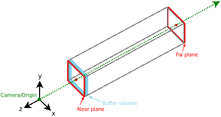
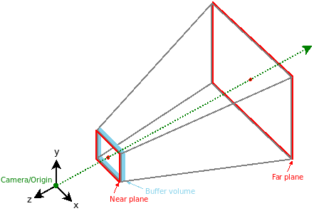
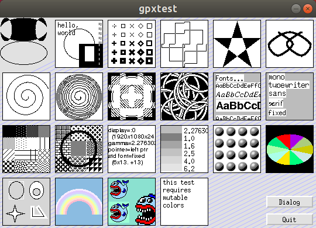
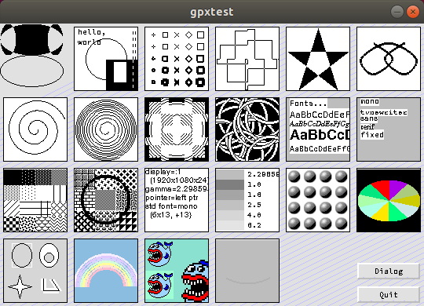
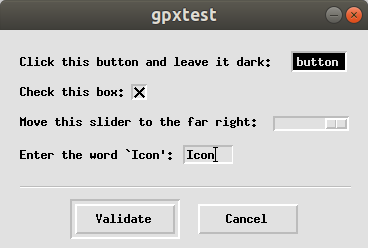
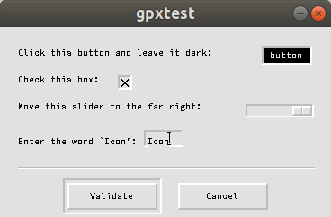
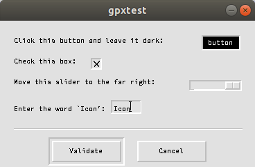

:title: Unicon OpenGL 2D and 2D/3D Graphics User's Guide
:author: Gigi Young and Clinton Jeffery
:trnumber: 22
:date: 2020-11-24
:abstract: Unicon version 13.3 has a new graphics implementation that
   extends the language's 2D capabilities.
   This guide is a gentle introduction on the new graphics features
   introduced by the OpenGL-based implementation of Unicon's 2D and
   integrated 2D/3D facilities.
:docclass: report

Introduction
============

The implementation of OpenGL-based 2D graphics facilities in Version
13.3 of Unicon introduces new features to Unicon programmers, such as
a display list architecture inherited from the 3D facilities and an
integrated 2D/3D graphics mode.  This guide introduces the new
features of Unicon's graphics facilities in this implementation. It
supplements IPD268a :cite:`Townsend:IPD268a` for Unicon's 2D facilities and UTR9d
:cite:`Martinez:UTR9d` for Unicon's 3D facilities. The reader should consult
:cite:`Young:2020:OpenGL` for additional details on this implementation.

Currently, the OpenGL-based 2D facilities described in this report
have only been implemented and tested on Linux systems.
The OpenGL 2D and 2D/3D facilities are enabled by installing the OpenGL and
FreeType development headers and libraries.
Additionally, Linux systems require the installation of X11 development headers
and libraries.
The source code is configured when ``OpenGL graphics`` appears in
the ``unicon -features`` listing.

The OpenGL graphics implementation is toggled on/off by setting/unsetting
the environmental variable ``UNICONGL2D``. Use mode ``"g"`` with
function ``open()`` to open a 2D-only window and mode ``"gl"``
to open an integrated 2D/3D window.

2D Features
===========

The OpenGL implementation of the 2D facilities introduces a display list
achitecture and transparency that will be familiar to users of
Unicon's 3D facilities. These two primary added features and a number of
smaller items augment Unicon's previous 2D graphics feature set. While
great effort is made to preserve the Unicon's classic 2D graphics, a
few changes can be observed.

Display List
------------

The display list of the 2D facilities is a list of records. Every record
on the display list possesses the field ``name`` which contains the
string literal identifying its record type. Most Unicon 2D graphics functions
create and append corresponding graphics records to the display list.
See Section 4 in this report for details on display list records and their
corresponding graphics functions.

Graphics function ``WindowContents()`` returns a reference to the
display list.  The reference to the most recently generated display
list record can be obtained by grabbing the last element of the
display list after returning from a successful call to a Unicon
graphics procedure that creates a display list record.

.. code-block:: unicon

   DrawRectangle(0,0,100,100)
   drawrect := WindowContents()[-1]

The display list can be modified by the user as long as it holds only
records specified in Section 4. Failure to comply is likely
to result in a run-time error.

Animation
~~~~~~~~~

The display list offers the ability for intuitive animation.
References to primitives on the display list can be used to modify
position, color, text, font, and more without needed to write specialized
drawing procedures for changing these attributes.
See Section 4 in this report (Modifiable Display List Record Fields)
for details on which fields of display list records are modifiable.
Changes to display list
record fields can be applied by calling graphics function ``Refresh()``.

All graphical primitives except
``FillPolygon``, ``DrawPolygon``, ``DrawLine``,
``DrawSegment``, and ``DrawPoint`` have
``x`` and ``y`` (positional) fields to be used for modifying the
position of a particular primitives.

.. code-block:: unicon

   drawrect.x +:= 5
   drawrect.y +:= 5
   Refresh()

For graphical primitives that do not possess positional fields,
the translational coordinates ``dx`` and ``dy`` can be used
instead. Display list records ``Dx`` and ``Dy`` affect
the translational coordinates of all subsequent graphical primitives
until another translational display list record of the same type is
encountered. Thus, ``Dx`` and ``Dy`` can be used to
translate groups of primitives. This is more efficient than modifying
each ``x`` and ``y`` for each graphical primitive that
possesses those fields.

Context attribute display list records are created and appended to the
display list by ``WAttrib()`` in order of the argument list given.
Only assignments create display list
records. However, all records are created before the first suspension
of ``WAttrib()``.

.. code-block:: unicon

   dl := WindowContents()
   WAttrib("dx=0","dy=0")
   dx := dl[-2]
   dy := dl[-1]
   DrawPolygon(0,0,0,100,100,100,100,0)
   DrawLine(0,0,100,100)
   DrawLine(0,100,100,0)

   dx.val +:= 5
   dy.val +:= 5
   Refresh()

Another technique is to build a list of references to display list records
that need to be modified in a render loop. A case statement can be used
on the ``name`` field of the records to differentiate between the types
of records. The following program uses an animation loop which results in a
color-shifting, filled circle that bounces off the walls of the window.

.. code-block:: unicon

   link graphics
   $include "keysyms.icn"

   procedure main()
      width := height := 400
      L := []
      &window := open("simple animation", "g", "size="||width||","||height)
      dl := WindowContents()

      WAttrib("fg=red")
      put(L, dl[-1])
      FillCircle(10,200,10)
      put(L, dl[-1])

      dirx := diry := 1
      speed := .1
      repeat {
         if *Pending() > 0 then {
            case Event() of {
               "q": exit(0)
               }
            }
         else every obj := !L do {
            case obj.name of {
               "FillCircle": {
                  if (obj.x + dirx*(obj.r + speed) > width) then
                     dirx := -1
                  else if (obj.x + dirx*(obj.r + speed) < 0) then
                     dirx := 1
                  if (obj.y + diry*(obj.r + speed) > height) then
                     diry := -1
                  else if (obj.y + diry*(obj.r + speed) < 0) then
                     diry := 1
                  obj.x +:= speed*dirx
                  obj.y +:= speed*diry
                  }
               "Fg": {
                  tmp := obj.r
                  obj.r := obj.g
                  obj.g := obj.b
                  obj.b := tmp
                  }
               }
            }
         WDelay(1)
         Refresh()
         }
   end

Optimizing Performance
~~~~~~~~~~~~~~~~~~~~~~

Graphics facilities that utilize a display list should provide a
mechanism by which to manage the list size. For Unicon, graphics functions
``CopyArea()`` and ``EraseArea()`` may be used to truncate
the display list, preventing the display list from growing indefinitely.

Calling ``CopyArea()`` with positional and
dimensional arguments to cover the entire destination window will delete
the destination window's display list and add a ``CopyArea`` display
list record.
Calling ``EraseArea()`` with positional and dimensional arguments
to cover the entire window will cause the display list to be deleted without
appending a new display list record.
These uses of ``CopyArea()`` and ``EraseArea()`` are useful
when previous rendering operations are fully obscured and no longer needed.

``EraseArea()`` is useful
when previous rendering operations are fully obscured and no longer needed.
On the other hand, ``CopyArea()`` can be used to condense multiple
rendering operations into one display list record as long as animation
is no longer needed for any part of the area copied. ``CopyArea()`` can
also be used to reduce the number of items on the display list for any portion
of the window smaller than its maximum dimensions if the obscured items
are removed manually.

Transparency
------------

Transparency is denoted by the alpha value, which ranges from 0 (fully
transparent) to 1 (fully opaque).
To ensure proper transparency blending, any transparent objects should be drawn
in the correct order, i.e. objects that appear farther away should be drawn
first. Once drawn in the correct order, the display list will preserve the
order, unless the ordering list is modified by the user.

Color Specification
~~~~~~~~~~~~~~~~~~~

Transparency can be specified explicitly within a color specification in a
few different ways. The first of which is a transparency modifier that
prepends the usual Unicon color name string. The available transparency
modifiers are in the following table taken from :cite:`Martinez:UTR9d`.

.. list-table::
   :header-rows: 1

   * - Transparency name
     - percent visible
   * - ``opaque``
     - 100
   * - ``dull``, a.k.a. ``subtranslucent``
     - 75
   * - ``translucent``
     - 50
   * - ``subtransparent``
     - 25
   * - ``transparent``
     - 5

Alternatively, the transparency modifier can be a floating-point
number from :math:`(0,1]`. If the transparency modifier is 0, then the value
of context attribute ``alpha`` is used. If the transparency modifier is
greater than 1, then an alpha of 1 is used.
Thus, ``Fg("translucent red")`` is equivalent to ``Fg("0.5 red")``.
The alpha value can also be set by defining RGBA values directly, such as
``Fg("#FF000080")`` or ``Fg("#65535,0,0,32768")``.

Context Attribute
~~~~~~~~~~~~~~~~~

The OpenGL implementation introduces a new context attribute, ``alpha``,
which has a default value of 1 (fully opaque).
``alpha`` denotes the alpha value of
a color specification which does not explicitly assign transparency, i.e.
``"red"`` or ``"#FF0000"``. Thus,

.. code-block:: unicon

   WAttrib("alpha=0.5","fg=red","bg=black")

would assign an alpha value of 0.5 to both the ``fg`` and ``bg``
colors. However, if alpha values are specified in the color phrase

.. code-block:: unicon

   WAttrib("alpha=0.5","fg=0.4 red","bg=0.7 black")

then the value of ``alpha`` is ignored.

Modifying Display List Record Fields
~~~~~~~~~~~~~~~~~~~~~~~~~~~~~~~~~~~~

The third way is by modifying the alpha field,
``a``, of a ``Fg`` or ``Bg`` display list record
(see Section 4 in this report for more details).

.. code-block:: unicon

   Fg("red")
   fg := WindowContents()[-1]
   fg.a := 32768
   Refresh()

It should be noted that the RGBA fields of ``Fg`` and ``Bg`` display
list records are 16-bit integers ranging from 0 to 65535 opposed to the alpha
values ranging from 0.0 to 1.0. To apply the alpha (or color) change, simply
use the library function ``Refresh()``. This is also an alternative to
using native mutable colors.

A Simple Program
~~~~~~~~~~~~~~~~

To bring everything together, the following program phases three colored
rectangles in and out in a loop.

.. code-block:: unicon

   link graphics
   $include "keysyms.icn"

   procedure main()
      local const := 0.01, incr1, incr2, incr3, alpha1, alpha2, alpha3,
            fg1, fg2, fg3
      incr1 := incr2 := incr3 := const
      &window := open("","g","size=200,200","bg=black")
      Fg("blue")
      fg1 := WindowContents()[-1]
      alpha1 := fg1.a/65535.0
      FillRectangle(25,25,150,150)

      Fg("0.67 green")
      fg2 := WindowContents()[-1]
      alpha2 := fg2.a/65535.0
      FillRectangle(50,50,100,100)

      Fg("0.33 red")
      fg3 := WindowContents()[-1]
      alpha3 := fg3.a/65535.0
      FillRectangle(75,75,50,50)
      Refresh()

      repeat {
         if *Pending() > 0 then
            case Event() of {
               "q": exit()
               }
         else {
            WDelay(10)

            if alpha1 >= 1.0 then incr1 := -const
            else if alpha1 <= 0 then incr1 := const
            alpha1 +:= incr1

            if alpha2 >= 1.0 then incr2 := -const
            else if alpha2 <= 0 then incr2 := const
            alpha2 +:= incr2

            if alpha3 >= 1.0 then incr3 := -const
            else if alpha3 <= 0 then incr3 := const
            alpha3 +:= incr3

            fg1.a := alpha1*65535
            fg2.a := alpha2*65535
            fg3.a := alpha3*65535
            Refresh()
            }
         }
   end

Fonts
-----

The OpenGL-based implementation uses FreeType for font rasterization, which
now allows for ``family`` in the font string format
``family[,styles],size`` to specify a TrueType or OpenType font file.
Both library functions ``WAttrib()`` and ``Font()`` can be used
to select a user-specified font file with

.. code-block:: unicon

   WAttrib("font=mymonofont.ttf,18")

or

.. code-block:: unicon

   Font("mymonofont.ttf,18")

The semantics of font specification remains otherwise unchanged.

Integrated 2D/3D Features
=========================

The integrated 2D/3D facilities are an optional extension to
Unicon's 3D mode, the mode obtained by passing ``"gl"`` to
``open()``. The
semantics of the integrated graphics mode can be imagined by looking through
the lens of a camera. The lens (near plane), contains all 2D rendering,
while the rest of the space (viewing volume) contains all 3D rendering.
Effectively, 3D windows now have an additional display list for 2D
primitives, and an integrated 2D/3D window is a 3D window in which the
2D display list is non-empty.

   Orthogonal viewing volume

   Perspective viewing volume

Canvas Attribute ``projection``
-------------------------------

The canvas attribute ``projection`` was added to give the option of
selecting an orthogonal (one-to-one) or perspective (foreshortening) projection
for the viewing volume. The call
``WAttrib("projection=ortho")`` selects an orthogonal projection while
the call ``WAttrib("projection=perspec")`` selects a perspective
projection. The default value of attribute ``projection`` is
``"projection=perspec"``. Changes to viewing volume
projection can be applied by calling ``Refresh()``.

Canvas Attribute ``camwidth``
-----------------------------

To give more control over the camera (viewing volume) dimensions, an additional
canvas attribute ``camwidth`` was added. By adjusting the
camera width with ``camwidth``, the camera height is implicitly
calculated based on the ratio of window width to height. ``camwidth``
cannot be given a value less than or equal to 0. Assigning 0 to
``camwidth`` causes ``WAttrib()`` to fail, while assigning a negative
value to ``camwidth`` causes its absolute value to be assigned.
Changes to camera dimensions can be applied by calling ``Refresh()``.

Context Attribute ``rendermode``
--------------------------------

The new context attribute ``rendermode`` dictates whether 2D or 3D
rendering is active. The semantics of the 2D and 3D graphics facilities
remain unaffected by the integrated graphics mode.
``WAttrib("rendermode=2d")`` activates 2D rendering
and ``WAttrib("rendermode=3d")`` activates 3D rendering. By default,
``"rendermode=3d"`` for mode ``"gl"``. If a graphics function is
used in the incorrect render mode, a run-time error will occur.

.. code-block:: unicon

   WAttrib("rendermode=2d")        # Activate 2D rendering
   DrawPolygon(...)
   WAttrib("rendermode=3d")        # Activate 3D rendering
   DrawPolygon(...)

For graphics function ``Clone()``, ``rendermode`` defaults to the
value of the source context unless specified by the passed argument list.
``Clone()`` can be used to bind a new context to the canvas to alleviate
the need to call ``WAttrib()`` to switch render modes. The following
example designates a window each for 2D and 3D rendering.

.. code-block:: unicon

   w3d := open("", "gl", ...)
   w2d := Clone(w3d, "rendermode=2d", ...)
   DrawPolygon(w2d, ...)   # Draw in 2D mode
   DrawPolygon(w3d, ...)   # Draw in 3D mode

``WindowContents()`` returns the display list of the corresponding
rendermode. Both

.. code-block:: unicon

   w3d := open("", "gl", ...)
   w2d := Clone(w3d, "rendermode=2d", ...)
   ...
   dl := WindowContents(w2d)

and

.. code-block:: unicon

   &window := open("", "gl", ...)
   ...
   WAttrib("rendermode=2d")
   dl := WindowContents()

return the 2D display list.
Graphics function ``Refresh()`` redraws both (2D and 3D) display lists,
if available. If a display list is empty, it is ignored. ``Eye()``,
a 3D graphics function, performs an implicit ``Refresh()`` in addition to
changing the camera attributes.

Modifiable Display List Record Fields
=====================================

The display list records with their modifiable fields are shown as Unicon
record declarations.
Every display list record has the field ``name``, containing the string
literal which identifies it. ``name`` should not be modified.
It is shown here as useful information rather than a modifiable
field. If no fields other than ``name`` are shown, it means that no
modifiable
fields are available. It is possible to query the fields of these records at
runtime, but modifying any fields other than the ones shown in this section
will result in undefined behavior.

Primitives
----------

----

**gl2d_blimage: record** — **DrawImage()**

**name:** ``"BilevelImage"``,
**x:** Real, **y:** Real, **width:** Int, **height:** Int,

----

**gl2d_readimage: record** — **ReadImage()**

**name:** ``"ReadImage"``,
**x:** Real, **y:** Real, **width:** Int, **height:** Int,

----

**gl2d_strimage: record** — **DrawImage()/ReadImage()**

**name:** ``"StringImage"``,
**x:** Real, **y:** Real, **width:** Int, **height:** Int,

----

**gl2d_drawstring: record** — **DrawString()**

**name:** ``"DrawString"``,
**x:** Real, **y:** Real, **s:** Int

----

**gl2d_wwrite: record** — **``WWrite*()``**

**name:** ``"WWrite"``,
**x:** Real, **y:** Real, **s:** Int

----

**gl2d_copyarea: record** — **CopyArea()**

**name:** ``"CopyArea"``,
**x:** Real, **y:** Real,

**x** and **y** define the coordinates of the destination window.

----

**gl2d_erasearea: record** — **EraseArea()**

**name:** ``"EraseArea"``,
**x:** Real, **y:** Real, **width:** Real, **height:** Real

----

**gl2d_fillpolygon: record** — **FillPolygon()**

**name:** ``"FillPolygon"``

----

**gl2d_drawpolygon: record** — **DrawPolygon()**

**name:** ``"DrawPolygon"``

----

**gl2d_drawline: record** — **DrawCurve()/DrawLine()**

**name:** ``"DrawLine"``

----

**gl2d_drawsegment: record** — **DrawSegment()**

**name:** ``"DrawSegment"``

----

**gl2d_drawpoint: record** — **DrawPoint()**

**name:** ``"DrawPoint"``

----

**gl2d_drawcircle: record** — **DrawCircle()**

**name:** ``"DrawCircle"``,
**x:** Real, **y:** Real, **r:** Real, **theta:** Real, **alpha:** Real

----

**gl2d_fillcircle: record** — **FillCircle()**

**name:** ``"FillCircle"``,
**x:** Real, **y:** Real, **r:** Real, **theta:** Real, **alpha:** Real

----

**gl2d_drawarc: record** — **DrawArc()**

**name:** ``"DrawArc"``,
**x:** Real, **y:** Real, **width:** Real, **height:** Real,
**theta:** Real, **alpha:** Real

----

**gl2d_fillarc: record** — **FillArc()**

**name:** ``"FillArc"``,
**x:** Real, **y:** Real, **width:** Real, **height:** Real,
**theta:** Real, **alpha:** Real

----

**gl2d_drawrectangle: record** — **DrawRectangle()**

**name:** ``"DrawRectangle"``,
**x:** Real, **y:** Real, **width:** Real, **height:** Real

----

**gl2d_fillrectangle: record** — **FillRectangle()**

**name:** ``"FillRectangle"``,
**x:** Real, **y:** Real, **width:** Real, **height:** Real

Context Attributes
------------------

----

**gl2d_fg: record** — **WAttrib()/Fg()**

**name:** ``"Fg"``,
**r:** Int, **g:** Int, **b:** Int, **a:** Int

----

**gl2d_bg: record** — **WAttrib()/Bg()**

**name:** ``"Bg"``,
**r:** Int, **g:** Int, **b:** Int, **a:** Int

----

**gl2d_reverse: record** — **WAttrib()**

**name:** ``"Reverse"``

----

**gl2d_gamma: record** — **WAttrib()**

**name:** ``"Gamma"``,
**val:** Real

----

**gl2d_drawop: record** — **WAttrib()**

**name:** ``"Drawop"``,
**s:** String

----

**gl2d_font: record** — **WAttrib()/Font()**

**name:** ``"Font"``,
**s:** String

----

**gl2d_leading: record** — **WAttrib()**

**name:** ``"Leading"``,
**val:** Int

----

**gl2d_linewidth: record** — **WAttrib()**

**name:** ``"Linewidth"``,
**val:** Int

----

**gl2d_linestyle: record** — **WAttrib()**

**name:** ``"Linestyle"``,
**s:** String

----

**gl2d_fillstyle: record** — **WAttrib()**

**name:** ``"Fillstyle"``,
**s:** String

----

**gl2d_pattern: record** — **WAttrib()**

**name:** ``"Pattern"``,
**s:** String

----

**gl2d_clip: record** — **WAttrib()**

**name:** ``"Clip"``,
**x:** Int, **y:** Int, **width:** Int, **height:** Int

----

**gl2d_dx: record** — **WAttrib()**

**name:** ``"Dx"``,
**val:** Int

----

**gl2d_dy: record** — **WAttrib()**

**name:** ``"Dy"``,
**val:** Int

References
==========

.. bibliography:: utr22.bib

Appendix: Platform Differences
==============================

Unicon's OpenGL-based 2D implementation strives to be backwards-compatible
with its X11-based predecessor and run existing Unicon 2D graphics
applications as-is.
Platform differences between Unicon 2D implementations do exist but
great effort is made to minimize them; see Appendix N of :cite:`Griswold:1998:GPI`.
The OpenGL 2D implementation achieves compatibility that is as good or
better than most other ports of Unicon's 2D graphics, such as the MS
Windows port.

This appendix summarizes the most relevant information to the Unicon
programmer from :cite:`Young:2020:OpenGL`. See Section 5 from :cite:`Young:2020:OpenGL` for a more detailed
evaluation of the OpenGL 2D implementation.

Graphical Accuracy
------------------

Due to semantic differences between OpenGL and platform-native APIs,
there are minor differences in the appearance of some primitives,
especially fonts and lines. Additional graphical differences occur on
different OpenGL implementations, such as Nvidia hardware-based
rendering versus Mesa software rendering.

The following figures depict the differences in rendering between the X11
implementation and the OpenGL implementation with Mesa and Nvidia OpenGL
drivers through the Unicon program ``gpxtest``.

   gpxtest (Xlib)

   gpxtest (Mesa)

   gpxtest (Nvidia)

   gpxtest dialog (Xlib)

   gpxtest dialog (Mesa)

   gpxtest dialog (Nvidia)

Fonts
~~~~~

The migration to FreeType for font rasterization requires the use of font files
which differ from native X11 fonts. Consequently, the four supported Unicon
font names---``mono``, ``typewriter``, ``sans``, and
``serif``---use different base fonts. It is possible for users to load
a specific font if needed by providing their own TrueType or OpenType font
files. See Section 2.3 (Fonts) for more details.

Lines
~~~~~

The OpenGL implementation currently lacks a quality algorithm for rendering
thick lines (``linewidth`` greater than 1) in addition to capping
and joining thick lines. Minor differences in arcs and circles
should be expected due to differences the algorithm between the OpenGL and
X11 implementations.

Performance
-----------

The OpenGL 2D implementation's performance is different than the
X11 implementation. The OpenGL implementation is faster on some operations
such as rendering dashed lines of any type, while the X11 implementation excels
at rendering normal filled and unfilled geometric primitives, text strings,
and copyareas.

Depending on the OpenGL driver used (e.g. Mesa vs. Nvidia),
the X11 implementation is anywhere from 3-5x faster than the OpenGL
implementation on programs that use a majority of filled and unfilled
primitives (rectangles, arcs, circles, polygons, and copyareas) with
``linestyle=solid`` and ``fillstyle=solid``. This type of
primitive composition is most likely to reflect the average 2D graphics
program.

What to Expect
--------------

This is the beta-test release of the OpenGL-based implementation for the
2D and integrated 2D/3D graphics facilities. The majority of existing Unicon
2D programs should work as expected under the OpenGL-based implementation.
However, programs that periodically draw new graphics without erasing the
window are likely to run into performance issues over time
due to display list growth. To improve performance
of legacy programs, see Section 2.1.2 (Optimizing Performance) in this
report.
