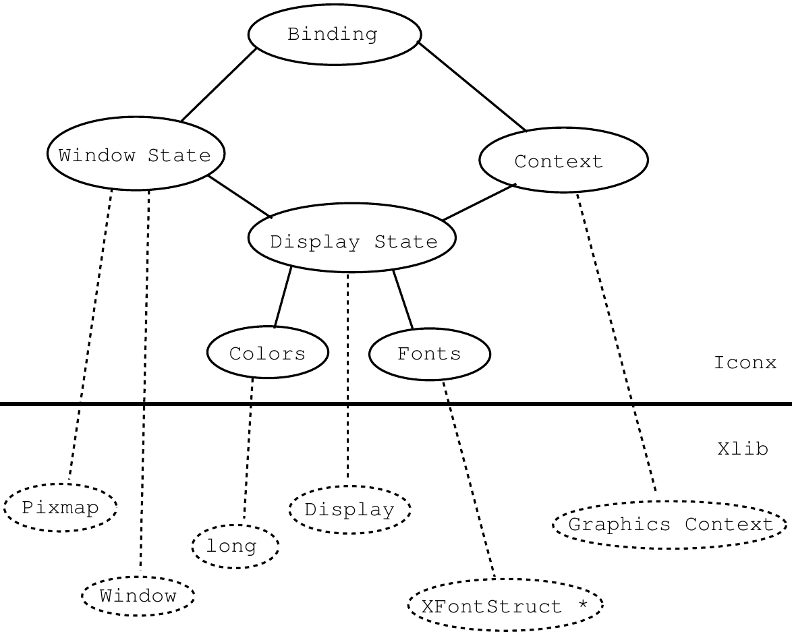
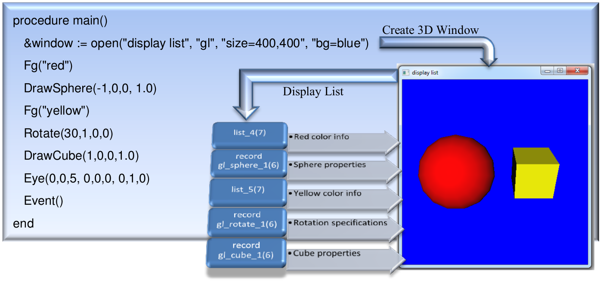

:title: The Implementation of Graphics in Unicon Version 12
:author: Clinton Jeffery, Naomi Martinez, and Jafar Al Gharaibeh
:trnumber: 5b
:date: 2014-09-03
:abstract: Version 11 of Unicon introduced a powerful set of 3D facilities,
   which were significantly enhanced in Version 12. This document
   describes the design and implementation internals of the 2D and 3D
   graphics facilities and their window system implementation. It is
   intended for persons extending the graphics facilities or porting
   Unicon to a new window system.
:docclass: report

1. Introduction
===============

This document describes the internals of the implementation of Unicon's
graphics and window system facilities. Much of the code is devoted to
hiding specific features of C graphics interfaces that were deemed
overly complex or not worth the coding effort they entail. Other
implementation techniques are motivated by portability concerns. The
graphics interface described below has been implemented to various
levels of completeness on the X Window System, Microsoft Windows, OS/2
Presentation Manager, and Macintosh platforms. Much of this document is
relevant also for Icon Version 9; Unicon's graphics facilities include
significant improvements to the 2D facilities and major extension in the
form of 3D graphics capabilities.

1.1 Relevant Source File Summary
--------------------------------

This document assumes a familiarity with the general organization and
layout of Unicon sources and the configuration and installation process.
For more information on these topics, consult Icon Project Documents IPD
238 [TGJ96] and IPD 243 [TGJ98] for UNIX, and Appendix B of this
document for MS Windows.

Unicon's window facilities consist of several source files, all in the
runtime directory unless otherwise noted. They are discussed in more
detail later in this document.

**header files** -- h/graphics.h contains structures and macros common
across platforms. Each platform adds platform-specific elements to the
common window structures defined in this file. In addition, each
platform gets its own header file, currently these consist of X Windows
(h/xwin.h), Microsoft Windows (h/mswin.h), OS/2 Presentation Manager
(h/pmwin.h),and the Macintosh (h/mac.h). The 3D facilities also have
platform-specific Unicon header files, currently OpenGL (h/opengl.h) and
the unfinished Direct3D port (h/direct3d.h), although these headers are
will remain placeholder stubs until the 3D facilities get ported to
something other than OpenGL. Every platform defines several common
macros in the window-system specific header file in addition to its
window system specific structures and macros. The common macros are used
to insert platform-dependent pieces into platform-independent code.

**Unicon functions** -- fwindow.r contains the RTL (Run-Time Language)
interface code used to define built-in graphics functions for the Unicon
interpreter and compiler. For most functions, this consists of type
checking and conversion code followed by calls to platform-dependent
graphics functions. The platform dependent functions are described later
in this document; fwindow.r is platform independent. You will generally
modify it only if you are adding a new built-in function. For example,
the Windows native functions are at the bottom of this file.

**internal support routines** -- rwindow.r, rwinrsc.r, rgfxsys.r and
rwinsys.r are basically C files with some window system dependencies but
mostly consisting of code that is used on all systems. For example,
rwindow.r is almost 100 kilobytes of portable source code related to
Unicon's event model, attribute/value system, portable color names, GIF,
JPEG, and PNG image file support, palettes, fonts, patterns, spline
curves and so forth.

**window-system specific files** -- Each window system gets its own
source files for C code, included by the various r\*.r files in the
previous section. Currently these include rxwin.ri and rxrsc.ri for X
Window; rmswin.ri for MS Windows; ropengl.ri for OpenGL; and rd3d.ri for
Direct3D. Earlier ports of now-dead graphics platforms are rpmwin.ri,
rpmrsc.ri, and rpmgraph.ri for Presentation Manager; and rmac.ri for the
Macintosh. Each platform will implement one or more such r\*.ri files.
In addition, common/xwindow.c contains so many X Window includes that it
won't even compile under UNIX Sys V/386 R 3.2 if all of the Unicon
includes are also present -- so its a .c file instead of a .r file.

**tainted "regular" Unicon sources** -- Many of the regular Unicon
source files include code under #ifdef Graphics and/or one or more
specific window system definitions such as #ifdef XWindows or #ifdef
PresentationManager. The tainted files that typically have to be edited
for a new window system include h/grttin.h, h/features.h, h/rexterns.h,
h/rmacros.h, h/rproto.h, h/rstructs.h, and h/sys.h. Other files also
contain Graphics code. This means that most of the system has to be
recompiled with rtt and cc after Graphics is defined in h/define.h. You
will also want to study the Graphics stuff in h/grttin.h since several
profound macros are there. Also, any new types (such as structures)
defined in your window system include files will need dummy declarations
(of the form typedef int foo;) to be added there.

Under UNIX the window facilities are turned on at configuration time by
typing

|  make X-Configure name=system
| instead of the usual make Configure invocation. The X configuration
  modifies makefiles and defines the symbolic constant Graphics in
  h/define.h. If OpenGL libraries are detected, configuration enables
  them automatically. Similar but less automatic configuration handling
  is performed for other systems; for example, an alternate .bat file is
  used in place of os2.bat or turbo.bat.

1.2 Graphics #define-d symbols
------------------------------

The primary, window-system-independent defined symbol that turns on
window facilities is simply Graphics. Underneath this parent #ifdef, the
symbol XWindows is meant to mark all X Window code. Other window systems
have a definition comparable to XWindows: for Microsoft Windows it is
MSWindows, for OS/2 it is PresentationManager, and for the Macintosh,
MacGraph. Turning on any of the platform specific graphics #define
symbols turns on Graphics implicitly.

2. Structures Defined in graphics.h
===================================

The header file graphics.h defines a collection of C structures that
contain pointers to other C structures from graphics.h as well as
pointers into the window system library structures. The internals for
the simplest Unicon window structure under X11 are depicted in Figure 1.
The picture is slightly simpler under MS Windows, with no display state
or related color or font management; on the other hand MS Windows maps
the Unicon context onto a large set of resources, including pens,
brushes, fonts and bitmaps.

   :width: 6in
   :height: 4.8189in

Figure 1: Internal Structure of an Unicon Window Value

At the top, Unicon level, there is a simple structure called a *binding*
that contains a pointer to a window state and a window context. Pointers
to bindings are stored in the FILE \* variable of the Unicon file
structure, and most routines that deal with a window take a pointer to a
binding as their first argument. Beneath this facade, several structures
are accessed to perform operations on each window.

The window state holds the typical window information (size, text cursor
location, an Unicon list of events waiting to be read) as well as a
window system pointer to the actual window, a pointer to a backing
pixmap (a "compatible device context" used to handle redraw requests),
and a pointer to the display state.

The window context contains the current font, foreground, and background
colors used in drawing/writing to the window. It also contains drawing
style attributes such as the fill style. Contexts are separate from the
window state so that they may be shared among windows. This is a big
win, and Unicon programs tend to use it heavily, so in porting the
window functions a central design issue must be the effective use of a
comparable facility on other window systems, or emulating the context
abstraction if necessary. Nevertheless, one might start out with
Couple() and Clone() disabled and only allow one hardwired context
associated with each window.

The display state contains whatever system resources (typically pointers
or handles) that are shared among all the windows on a given display in
the running program. For example, in X this includes the fonts, the
colors, and a window system pointer for an internal Display structure
required by all X library calls to denote the connection to the X
server.

3. Macros and Coding Conventions in Window System Headers
=========================================================

Since the above structure is many layers deep and sometimes confusing,
Unicon's graphics interface routines employ coding conventions to
simplify things. In order to avoid many extra memory references in
accessing fields in the multi-level structure, "standard" local
variables are declared in most of the platform dependent interface
routines in rxwin.ri and rmswin.ri. The macro STDLOCALS(w) declares
local variables pointing to the most commonly used pieces of the window
binding, and initializes them from the supplied argument; each window
system header should define an appropriate STDLOCALS(w) macro. Under
some window systems, such as MS Windows, STDLOCALS(w) allocates
resources which must be freed before execution continues, in which case
a corresponding FREE_STDLOCALS(w) macro is defined.

Some common standard locals are wc, ws, stdwin, and stdpix. While wc,
and ws are pointers to structures copied from the window binding,
stdwin, and stdpix are actual X (or MS Window) resources that are
frequently supplied to the platform-dependent routines as arguments.
Each window system will have its own standard locals. For example, MS
Windows adds stddc and pixdc since it uses a device context concept not
found in X11.

In much of the platform-dependent source code, the window system calls
are performed twice. This is because most platforms including X, MS
Windows, and PresentationManager do not remember the contents of windows
when they are reduced to iconic size or obscured behind other windows.
When the window is once again exposed, it is sent a message to redraw
itself. Unicon hides this entirely, and remembers the contents of the
window explicitly in a window-sized bitmap of memory. The calling of
platform graphics routines twice is so common that a set of macros is
defined in xwin.h to facilitate it. The macros are named RENDER2 through
RENDER6, and each of them takes an Xlib function and then some number of
arguments to pass that function, and then calls that function twice,
once on the window and once on the bitmap.

Platforms that provide backing store may avoid this duplicated effort.
In practice however it seems most window systems have redraw events even
if they implement retained windows (for example, MGR [Uhler88]).

4. Window Manipulation in rxwin.ri and rmswin.ri
================================================

The platform-dependent calls in the Unicon run-time system can be
categorized into several major areas:

-   Window creation and destruction
-   Low-level event processing
-   Low-level text output operations
-   Window and context attribute manipulation

4.1 Window Creation and Destruction
-----------------------------------

A graphics window is created when the Unicon program calls open() with
file attribute "g". The window opening sequence consists of a call to
wopen() to allocate appropriate Unicon structures for the window and
evaluate any initial window attributes given in additional arguments to
open(). After these attributes have been evaluated, platform resources
such as fonts and colors are allocated and the window itself is
instantiated. Under X, wopen() busy-waits until the window has received
its first expose event, ensuring that no subsequent window operation
takes place before the window has appeared onscreen.

A window is closed by a call to wclose(); this removes the on-screen
window even if other bindings (Unicon window values) refer to it. A
closed window remains in memory until all Unicon values that refer to it
are closed. A call to unbind() removes a binding without necessarily
closing the window.

4.2 Event Processing
--------------------

The system software for each graphics platform has a huge number of
different types of events. Unicon ignores most of them. Of the
remainder, some are handled by the runtime system code in the .ri files
implicitly, and some are explicitly passed on to the Unicon program.

Most native graphic systems require that applications be event-driven;
they must be tightly I/O bound around the user's actions. The
interaction between user and program must be handled at every instant by
the program. Unicon, on the other hand, considers this event-driven
model optional.

Making the event-driven model optional means that the Unicon interface
must occasionally read and process events when the Unicon program itself
is off in some other computation. In particular, keystrokes and mouse
events must be stored until the user requests them, but exposure events
and resizes must be processed immediately. The Unicon interpreter pauses
at regular intervals in between its virtual machine instructions (the
Unicon compiler emits polling code in its generated C code, so window
system facilities are supported by the compiler as well) and polls the
system for events that must be processed; this technique fails when no
virtual machine instructions are executing, such as during garbage
collections or when blocked on file I/O.

On some platforms such as X, this probably could be done using the
platform event queue manipulation routines. Instead, the Unicon window
interface maintains its own keystroke and mouse event queue from which
the Unicon functions obtain their events. This additional queue makes
the implementation more portable. Various window systems probably do not
support queue manipulation to the extent or in the same way that X does.
It also provides the programmer with a higher level event processing
abstraction which has proven useful.

Window resizing is partly handled by the interface. The old contents of
the window are retained in their original positions, but the program is
informed of the resize so it can handle the resize in a more reasonable
manner. As has already been noted exposure events are hidden entirely
via the use of a backing pixmap with identical contents for each window.
The pixmap starts out the same size as the window. It is resized
whenever the window grows beyond one of its dimensions. It could be
reduced whenever the window shrinks, but then part of the window
contents would be lost whenever the user accidentally made the window
smaller than intended.

The platform-dependent modules also contains tables of type stringint.
These tables are supported by routines that map strings for various
attributes and values to native window system integer constants. Binary
search is employed. This approach is a crude but effective way to
provide symbolic access "built-in" to the language without requiring
include files. Additional tables mapping strings to integers are found
in the platform independent source files.

5. Resource Management
======================

One of the most important tasks performed by platform-specific graphics
functions is the management of resources, both the on-screen resources
(windows) and the drawing context elements used by the window system in
performing output.

5.1 Memory Management and r*rsc.ri Files
----------------------------------------

Memory management for internal window structures is independent of
Unicon's standard memory management system. Xlib memory is allocated
using malloc(2).

Most internal Unicon window structures could be allocated in Unicon's
block region, but since they are acyclic and cannot contain any pointers
to Unicon values, this would serve little purpose (Actually, it is
probably the right thing to do, and will probably happen some day, but
its just not in the cards right now unless you feel like messing with
the garbage collector.). In addition when an incoming event is being
processed it has to be matched up with the appropriate window state
structure, so some of the window structures must be easily reached, not
lost in the block region. The window interface structures are reference
counted and freed when the reference count reaches 0.

5.2 Color Management
--------------------

Historically, managing colors under X Windows was painful. On
color-indexed systems (such as 256 color displays), if the same color
was allocated twice the color table entry was shared (which is good) and
that entry only freed once. For this reason, on color indexed systems
every color allocated by Unicon is remembered and duplicate requests are
identified and freed only once. In the general case it is impossible to
detect when a particular color is no longer being displayed, and so
colors are only freed on window closure or when a window is cleared.

Eventually it became important to eliminate this infrastructure on
modern true-color displays. The current code has both implementations
present and color allocation code should be read carefully, as various
portions no longer apply to most modern implementations.

5.3 Font Management
-------------------

Unicon supports a portable font name syntax. Since the available fonts
on systems vary widely, "interesting" code has been written to support
these portable names on various X servers. Each window system may need
to include heuristics to pick an appropriate font in the font allocation
routine in the window system's r\*.ri file.

6. External Image Files and Formats
===================================

Reading and writing window contents to external files is accomplished by
the routines loadimage() and dumpimage(), implemented in each platform's
window system specific file, such as rxwin.ri. These routines take a
window binding and a string filename and perform the I/O transfer.
Presently, the file format is assumed to be indicated by the filename
extension; this is likely to change. Ideally Unicon should tolerate
different file formats more flexibly, inferring input file formats by
reading the file header where possible, and running external conversion
programs where appropriate.

GIF, JPEG, and PNG files are self-identifying, so they are always
recognized independent of name. They are checked in system-independent
code before platform-specific image reading code is invoked. When
reading an image file, all system-independent formats are handled in the
function readImage() in rwindow.r. readImage() scans the filename and
picks the right underlying library to try and load the image first based
on the file extension. For example a file that has the extension JPG
would be passed to the jpeg library to load. If the file fails to load
using that format (due to an misnamed file for example with the wrong
extension) a brute-force mechanism is used to try and load the file
using any of the supported formats.

A structure of type imgdata is used to save the image attributes such as
the width and the hight of the image, the color format (RGB vs BGR) and
a flag to indicate whether the image data start at the top or at the
bottom (flipped). In addition to that, the struct also has a pointer to
the image data itself. When calling the function readImage(), the caller
should initialize the struct attributes to the desired values. For
example for images that are used as OpenGL textures, they are expected
to be in in RGB and the data starts at the bottom left corner (flipped
or up-side-down) format, whereas an image used as a background for a
window on Windows OS, the format should be BGR and the data starts at
the top left corner (no flip).

7. Implementation of 3D Facilities
==================================

In order to implement the 3D facilities, the Unicon runtime system was
modified to support 2D and 3D windows. The Unicon runtime system is
written in a custom superset dialect of C called RTL [Walker94]. The 3D
facilities use the existing 2D facilities code for window creation and
destruction, as well as handling keyboard and mouse input.

7.1 Requirements
----------------

The Unicon 3D graphics facilities were developed using OpenGL 1.2;
OpenGL 1.2 or later must be present on the system in order for the 3D
graphics facilities to work. A check for this is performed in wopengl()
which can be found in the file ropengl.ri. The requirement of OpenGL 1.2
is based on the fact that the function glTexBind(), which makes the
implementation of textures more efficient, is only available in OpenGL
1.2 and later.

Also needed for the Unicon 3D graphics facilities is a system that
supports a true color visual with a depth buffer of 16 and a double
buffer. The requirement of a depth buffer is a necessity to implement
lighting. For lighting to work properly in OpenGL, a depth test must
be performed, hence the need of a depth buffer. A double buffer is
needed to implement smooth animation and the list structure that is
used to redraw a window. More information can be found on redrawing
of windows in section 7.3.

7.2 Files
---------

Several files were modified in the implementation of the Unicon 3D
graphics facilities. Also a new file was added.

New File

ropengl.ri – contains the C helper functions for functions in fwindow.r,
rxwin.ri, and rwindow.r.

Modified Files

data.r – new runerr error codes.

fwindow.r – contains the built-in function implementations for the
Unicon 3D graphics facilities.

rmemmgt.r – garbage collector has been modified to recognize the Unicon
list of lists and records used to redraw windows.

rxwin.ri – modified WOpen() and wmap() to open windows in “gl” mode.

rwindow.r – WAttrib() was modified to recognize the context attribute in
the Unicon

   3D graphics facilities.

rwinsys.r – inclusion of ropengl.ri.

graphics.h – new fields were added to the context, binding, and canvas
structures.

sys.h – OpenGL header file inclusion (glu.h, gl.h, and glx.h).

fdefs.h – Unicon 3D graphics facilities function definitions.

grittin.h – OpenGL type definitions.

7.3 Redrawing Windows
---------------------

In the 2D graphics facilities, events that require the redrawing of a
window are handled by using a pixmap. Instead of using a pixmap, for the
Unicon 3D graphics facilities, a Unicon list of lists and records is
created for each window opened in “gl” mode. This list of lists keeps
track of all objects in a 3D graphics scene as depicted in Figure 2.
This list is called funclist and is found in the wstate structure of a
"gl" window. The individual lists of contain the function name and the
parameters of that function. Also placed on the list are attributes that
affect the scene. These include dim, linewidth, texcoord, texture,
texmode, and fg. When a window receives an event that requires
redrawing, the window is cleared, all attributes are reset to the
defaults, and the Unicon list of lists is traversed to redraw every
object in the scene.

   :alt: Figure 2. The display list keeps track of all object and
   attributes in the scene
   :width: 6in
   :height: 2.8134in

..

   There are some functions and attributes that are not placed in the
   list. Instead they much either modify the list or call the list to
   redraw the scene. The function EraseArea(), not only clears the
   screen but also clears the contents of the list. The attributes
   light0-light7, eye, eyeup, eyedir, and eyepos use the list to redraw
   the window with the new attributes. So if the position of a light
   changes, the new lighting calculations are performed and the scene is
   redrawn. Besides these functions and attributes, every function or
   attribute available in the 3D graphics facilities is placed on this
   list. In is important to note that functions and attributes that have
   no effect in the 3D graphics facilities are not placed in this list.

   The C function **rec_structor3d()** is used internally by the 3D
   facilities to create, for each type of display list primitive, the
   dynamic record type that holds the appropriate fields. They are
   generated the first time they are used. The return value of this
   function is a descriptor pointer that points at a descriptor for a
   record constructor procedure for the appropriate record type.

7.4 Textures
------------

In OpenGL, textures can be one, two, or three-dimensional and are
represented as multi-dimensional arrays. In the Unicon 3D graphics
facilities all texture are 2D dimensional, and represented as
three-dimensional arrays. This array keeps track of the position and
red, green, and blue components of each pixel in the texture image. When
a texture image is specified in a Unicon program, the texture is
converted from the Unicon internal representation of the image to a
three-dimensional array. For most cases, this does not take a long time,
but as a texture image gets larger, the slower the application will run.
Several measures have been taken in order to increase the efficiency of
converting the texture image into an array. Since lighting and texturing
are fairly expensive operations, especially if several lights are
activated, these features are temporarily deactivated. On old platforms
with no TrueColor support, converting a “g” window to a texture can be
fairly expensive. However almost all platforms support TrueColor, on
which a 2D graphical window can be used as a texture that gets updated
in real time.

   Instead of adding a texture to the list of lists as described in
   section 7.3, OpenGL’s internal texture resources are used. OpenGL
   assigns to each texture a name. The names assigned to each texture in
   a Unicon scene are stored in texname[], which can be found in a “gl”
   window’s context. To ensure that a texture name is not reused, a call
   to glGenTextures() made which produces unused texture names. When a
   texture is applied to the scene, only the index of the array
   texname[] is stored in the list. When the list is traversed, a call
   to glBindTexture() is made which binds the texture to the subsequent
   objects in the scene. One problem of using this representation of
   textures is that it places an upper bound on the number of texture
   used. This is because glGenTextures() requires the number of texture
   names to generate. Also by using glBindTexture(), never deletes a
   texture from the texture resources, possibly using up all texture
   resources. Future work might look into when to delete a texture and
   ways to check when the texture resources have been used up.

Some textures typically get reused in the scene. To avoid reloading them
from disk each time, the runtime system keeps tracks of all used
textures by mapping each texture to the file name the texture was loaded
from. The function lookup_texture_byname() is used to check if a texture
is already loaded in memory. If that is the case, the function returns a
pointer to the texture structure allowing the reuse of the already built
texture.

7.5 Texture Coordinates
-----------------------

The primitives as mentioned in previous sections are cubes, tori,
cylinders, disks, partial disks, points, lines, polygons, spheres, line
segments, and filled polygons. Some of these primitives are drawn using
different aspect of the OpenGL library, with some using the glu library.
Points, lines, line segments, polygons, and filled polygons are drawing
using glBegin(), glEnd(), and vertices in between the function calls.
Cylinders, disks, partial disks, and spheres are implemented using the
glu library. They are considered to be gluQuadrics objects. Finally
cubes and tori are a composition of several polygons.

   The texturing method used is influenced by the how the primitive is
   composed. For the primitives built using the OpenGL library, default
   texture coordinates are obtain much differently than those primitives
   built using the glu library. For those primitives built using
   glBegin() and glEnd(), glTexGen() is used to determine the default
   parameters when "texcoord=auto". In order to use this feature we must
   enable GEN_S and GEN_T with glEnable(). This generates texture
   coordinates for a 2D textures. The texture coordinates for a torus
   are obtained in the same ways.

..

   Primitives built using the glu library, have texture coordinates
   associated with them. These texture coordinates can be obtained by
   calling gluQuadricTexture().The use of the glu texture coordinates
   verses the OpenGL coordinates, is due to the fact that the glu
   texture coordinate look nicer. In order to use these texture
   coordinates instead of the ones specified by OpenGL, it is necessary
   to disable GEN_S and GEN_T. After the object has been drawn, GEN_S
   and GEN_T are turned back on.

   A cube uses default texture coordinates that map the texture onto
   each of the faces of a cube. In order to use these default
   coordinates, it is necessary to disable GEN_S and GEN_T, similar to
   glu objects.

..

..

7.6 3D Object Selection
-----------------------

Unicon utilizes OpenGL's built-in selection mechanism to support 3D
object selection. In simple terms, this mechanism works by making an
off-screen rendering pass using GL_SELECT rending mode (after a mouse
click), while restricting the viewing volume to a very small rectangle
(usually a few pixels) around the mouse cursor where the click took
place. Any object that happens to intersect with the viewing volume is
deemed to be selected. In order to identify the objects in the scene,
OpenGL uses integer “names” to refer to objects (using rh function
glPushName() ) which in turn are manifested by graphics primitive that
belong to each object.

A window context has a flag app_use_selection3D to indicate if the
application uses 3D object selection within that window or not. For many
applications that do not use 3D selection, this flag allows very early
skipping of execution of the selection rendering mode. Two more flags
are utilized by applications that use 3D selection. The first flag
selectionenabled is used to tell if 3D selection is turned on or off at
any point during execution. The application typically turns this flag on
for only those object that needs to be made selectable. The second flag,
selectionrendermode, is used to tell whether the current rendering pass
is the special selection rendering mode or not. This allows normal
rendering passes to skip the selection code. The combination of the two
flags enables the selection code only when the rendering mode is
GL_SELECT and the selection is turned on.

The list of all selectable object in a window is stored in the window's
context in array of strings named selectionnamelist. The content of this
list is populated by calls to WSection() function at the application
level. Generally speaking, WSection() starts a new selectable object
with a new string name. The string name is appended to the end of
selectionnamelist. The index of this name is stored in the WSection
record that gets inserted to the display list. This index itself is used
as the integer name that is passed to OpenGL during the GL_SELECT
rendering mode pass. If the object is selected after a mouse click,
OpenGL reports the integer code of the object. The integer code then is
used as the index to subscript selectionnamelist to retrieve the string
name of the object, which is what gets reported back at the application
level.

8.0 Porting Reference
=====================

This section documents the window-system specific functions and macros
that generally must be implemented in order to port Unicon's graphics
facilities to a new window system. The list is compiled primarily by
studying fwindow.r, rwindow.r, and the existing platforms.

A note on types: w is a window binding pointer (wbp), the top level
Unicon "window" value. i is an integer, s is a string. wsp is the window
state (a.k.a. canvas) pointer, and wcp is the window context pointer. A
bool return value returns one of the C macro values Succeeded or Failed,
instead of the usual C booleans 1 and 0.

8.1 2D Facilities
-----------------

These facilities have been ported multiple times and the interface is
somewhat stable.

ANGLE(a)
   Convert from radians into window system units. For example, under X
   these are 1/64 of a degree integer values, while under
   PresentationManager it converts to units of 1/65536 of a degree in a
   fixed-point format.

ARCHEIGHT(arc)
   The height component of an XArc.

ARCWIDTH(arc)
   The width component of an XArc.

ASCENT(w)
   Returns the number of pixels above the baseline for the current font.
   Note that when Unicon writes text, the (x,y) coordinate gives the left
   edge of the character at its baseline; some window systems may need to
   translate our coordinates.

int blimage(w, x, y, width, height, ch, s, len)
   Draws a bi-level (i.e. monochrome, 1-bit-per-pixel) image; used in
   DrawImage() which draws bitmap data stored in Unicon strings.

wcp clone_context(w)
   Allocate a new context, cloning attributes from w's context.

COLTOX(w, i)
   Return integer conversion from a 1-based text column to a pixel
   coordinate.

copyArea(w1, w2, x, y, width, height, x2, y2)
   Copies a rectangular block of pixels from w1 to w2.

DESCENT(w)
   Returns the number of pixels below the baseline for the current font.

DISPLAYHEIGHT(w)
   Return w's display (screen) height in pixels.

DISPLAYWIDTH(w)
   Return w's display width in pixels.

bool do_config(w, i)
   Performs move/resize operations after one or more attributes have been
   evaluated. Config is a word with two flags: the one bit indicates a
   move, the two bit indicates a resize. The desired sizes are in the
   window state pointer, e.g. w->window->width.

drawarcs(w, thearcs, i)
   Draw i arcs on w, given in an array of XArc structures. Define an
   appropriate XArc structure for your window system; it must include
   fields x, y and width and height fields accessible through macros
   ARCWIDTH() and ARCHEIGHT(). Also, a starting angle angle1 and arc extent
   angle2, assigned through macros ANGLE(), EXTENT(), and FULLARC. This is
   currently a mess. Imitation of the X or PresentationManager code is in
   order.

drawlines(w, points, i)
   Draw i-1 connected lines, connecting the dots given in points.

drawpoints(w, points, i)
   Draw i points.

drawsegments(w, segs, i)
   Draw i disconnected line segments; define an Xsegment structure
   appropriate do your window system, consisting of fields x1, y1, x2, y2.
   This type definition requirement should be cleaned up someday.

drawstring(w, x, y, s, s_len)
   Draw string s at coordinate (x,y) on w. Note that y designates a
   baseline, not an upper-left corner, of the string.

drawrectangles(w, rectangles, i)
   Draw i rectangles. Define an XRectangle structure appropriate to your
   window system.

int dumpimage(w, s, x, y, width, height)
   Write an image of a rectangular area in w to file s. Returns Succeeded,
   Failed, or NoCvt if the platform doesn't support the requested format.
   Note that this is the "platform- dependent image writing function";
   requests to write GIF or JPEG are handled outside of this function.

eraseArea(w, x, y, width, height)
   Erase a rectangular area, that is, set it to the current background
   color. Compare with fillrectangles().

EXTENT(a)
   Convert from radians into window system units, e.g. under
   PresentationManager it converts to units of 1/65536 of a circle and does
   some weird type conversion.

fillarcs(w, arcs, i)
   Fill wedge-like arc sections (pie pieces). See drawarcs().

fillrectangles(w, rectangles, i)
   Fill i rectangles. See drawrectangles().

fillpolygon(w, points, i)
   Fill a polygon defined by i points. Connect first and last points if
   they are not the same.

FHEIGHT(w)
   Returns the pixel height of the current font, hopefully ASCENT +
   DESCENT.

free_binding(w)
   Free binding associated with w. This gets rid of a binding that refers
   to w, without necessarily closing the window itself (other bindings may
   point to that window).

free_context(wc)
   Free window context wc.

free_mutable(w, i)
   Free mutable color index i.

free_window(ws)
   Free window canvas ws.

freecolor(w, s)
   Free a color allocated on w's display.

FS_SOLID

Define this to be the window system's solid fill style symbol.

FS_STIPPLE

Define this to be the window system's stippled fill style symbol.

FULLARC

Window-system value for a complete (360 degree) circle or arc.

FWIDTH(w)
   Returns the pixel width of the widest character in the current font.

wsp getactivewindow()
   Return a window state pointer to an active window, blocking until a
   window is active. Probably will be generalized to include a non-blocking
   variant. Returns NULL if no windows are opened.

getbg(w, s)
   Returns (writes into s) the current background color.

getcanvas(w, s)
   Returns (writes into s) the current canvas state.

getdefault(w, s_prog, s_opt, s)
   Get any window system defaults for a program named s_prog resource named
   s_opt, write result in s.

getdisplay(w, s)
   Write a string to s with the current display name.

getdrawop(w, s)
   Return current drawing operation, one of various logical combinations of
   source and destination bits.

getfg(w, s)
   Returns (writes into s) the current foreground color.

getfntnam(w, s)
   Returns (writes into s) the current font. This interface may get changed
   since a portable font naming mechanism is to be installed. Name is
   presently always prefixed by "font=" (pretty stupid, huh); must be an
   artifact of merging window system ports, will be changed.

geticonic(w, s)
   Return current window iconic state in s, could "iconify" or whatever.
   Obsolete (subsumed by canvas attribute, getcanvas()).

geticonpos(w, s)
   Return icon's position to s, an encoded "x,y" format string.

int getimstr(w, x, y, width, height, paltbl, data)
   Gets an image as a string. Used in GIF code.

getlinestyle(w, s)
   Return current line style, one of solid, dashed, or striped.

get_mutable_name(w, i)
   Returns the string color name currently associated with a mutable color.

getpattern(w, s)
   Return current fill pattern in s.

getpixel(w, x, y, long *rv)
   Assign RGB value for pixel (x,y) into \*rv.

getpixel_init(w, struct imgmem *imem)
   Prepare to fetch pixel values from window, obtaining contents from
   server if necessary. This function does all the real work used by
   subsequent calls to getpixel().

getpointername(w, s)
   Write mouse pointer appearance, by name, to s.

getpos(w)
   Update the window state's posx and posy fields with the current window
   position.

getvisual(w, s)
   Write a string to s that explains what type of display w is on, e.g.
   "visual=x,y,z", where x is a class, y is the bits per pixel, and z is
   number of colormap entries available. This X-specific anachronism is
   likely to go away.

HideCursor(wsp ws)
   Hide the text cursor on window state ws.

ICONFILENAME(w)
   Produce char \* for window's icon image file name if there is one.

ICONLABEL(w)
   Produce char \* for icon's title if there is one.

isetbg(w, i)
   Set background color to mutable color table entry i. Mutable colors are
   not available on all display types.

isetfg(w, i)
   Set foreground color to mutable color table entry i. Mutable colors are
   not available on all display types.

ISICONIC(w)
   Return 1 if the window is presently minimized/iconic, 0 otherwise.

ISFULLSCREEN(w)
   Return 1 if the window is presently maximized/fullscreen, 0 otherwise.

ISNORMALWINDOW(w)
   Return 1 if the window is neither minimized nor maximized, 0 otherwise.

LEADING(w)
   Return current integer leading, the number of pixels from line to line.

LINEWIDTH(w)
   Return current integer line width used during drawing.

lowerWindow(w)
   Lower the window to the bottom of the stack.

mutable_color(w, dptr dp, i, C_integer *result)
   Allocate a mutable color from color spec given by dp and i, placing
   result (a small negative integer) in \*result.

nativecolor(w, s, r, g, b)
   Interpret a platform-specific color name s (define appropriately for
   your window system). Under X, we can do this only if there is a window.

pollevent()
   Poll for available events on all opened displays. This is where the
   interpreter calls the window system interface. Return a -1 on an error,
   otherwise return count of how long before it should be polled (400).

query_pointer(w, XPoint *xp)
   Produce mouse pointer location relative to w.

query_rootpointer(XPoint *xp)
   Produce mouse pointer location relative to root window on default
   screen.

raiseWindow(w)
   Raise the window to the top of the stack.

bool readimage(w, s, x, y, int *status)
   Read image from file s into w at (x,y). Status is 0 if everything was
   kosher, 1 if some colors weren't available but the image was read OK; if
   a major problem occurs it returns Failed. See loadimage() for the real
   action.

rebind(w, w2)
   Assign w's context to that of w2.

RECHEIGHT(rec)
   The height component of an XRectangle. Gets "fixed up" (converted) into
   a Y2 value if necessary, in window system specific code.

RECWIDTH(rec)
   The width component of an XRectangle. Gets "fixed up" (converted) into a
   X2 value if necessary, in window system specific code.

RECX(rec)
   The x component of an XRectangle.

RECY(rec)
   The y component of an XRectangle.

ROWTOY(w, i)
   Return integer conversion from a 1-based text row to a pixel coordinate.

SCREENDEPTH(w)
   Returns the number of bits per pixel.

int setbg(w, s)
   Set the context background color to s. Returns Succeeded or Failed.

setcanvas(w, s)
   Set canvas state to s, make it "iconic", "hidden" or whatever. A canvas
   value extension such as fullscreen would go here. Changes in canvas
   state are tantamount to destroying the old window, creating a new window
   (with appropriate size and style) and adjusting the pixmap size
   correspondingly. Much of the associated logic, however, might be located
   in the event handlers for related window system events.

setclip(w)
   Set (enable) clipping on w from its context.

setcursor(w, i)
   Turn text cursor on or off. Text cursor is off (invisible) by default.

setdisplay(w, s)
   Set the display to use for this window; fails if the window is already
   open somewhere.

setdrawop(w, s)
   Set drawing operation to one of various logical combinations of source
   and destination bits.

int setfg(w, s)
   Set the context foreground color to s. Returns Succeeded or Failed.

setfillstyle(w, s)
   Set fill style to solid, masked, or textured.

bool setfont(w, char **s)
   Set the context font to s. This function first attempts to use the
   portable font naming mechanism; it resorts to the system font mechanism
   if the name is not in portable syntax.

setgamma(w, gamma)
   Set the context's gamma correction factor.

setgeometry(w, s)
   Set the window's size and/or position.

setheight(w, i)
   Set window height to i, whether or not window is open yet.

seticonicstate(w, s)
   Set window iconic state to s, it could be "iconify" or whatever.
   Obsolete; setcanvas() is more important.

seticonimage(w, dptr d)
   Set window icon to d. Could be string filename or existing pixmap (i.e.
   another window's contents). Pixmap assignment no longer possible, so one
   could simplify this to just take a string parameter.

seticonlabel(w, s)
   Set icon's string title to s.

seticonpos(w, s)
   Move icon's position to s, an encoded "x,y" format string.

setimage(w, s)
   Set an initial image for the window from file s. Only valid during
   open().

setleading(w, i)
   Set line spacing to i pixels from line to line. This includes font
   height and external leading, so i < fontheight means lines draw partly
   over preceding lines, i > fontheight means extra spacing.

setlinestyle(w, s)
   Set line style to solid, dashed, or striped.

setlinewidth(w, i)
   Set line width to i.

set_mutable(w, i, s)
   Set mutable color index i to color s.

SetPattern(w, s, s_len)
   Set fill pattern to bits given in s. Fill pattern is not used unless
   fillstyle attribute is changed to "patterned" or "opaquepatterned".

SetPatternBits(w, width, bits, nbits)
   Set fill pattern to bits given in the array of integers named bits. Fill
   pattern is not used unless fillstyle attribute is changed to "patterned"
   or "opaquepatterned".

setpointer(w, s)
   Set mouse pointer appearance to shape named s.

setpos(w, s)
   Move window to s, a string encoded "(x,y)" thing.

setwidth(w, i)
   Set window width to i, whether or not window is open yet.

setwindowlabel(w, s)
   Set window's string title to s.

ShowCursor(wsp ws)
   Show the text cursor on window state ws.

int strimage(w, x, y, width, height, e, s, len)
   Draws a character-per-pixel image, used in DrawImage(). See blimage().

SysColor

Define this type to be the window system's RGB color structure.

TEXTWIDTH(w, s, s_len)
   Returns the integer text width of s using w's current font.

toggle_fgbg(w)
   Swap the foreground and background on w.

unsetclip(w)
   Disable clipping on w from its context.

UpdateCursorPos(wsp ws, wcp wc)
   Move the text cursor on window state ws and context wc.

walert(w, i)
   Sounds an alert (beep). i is a volume; it can range between -100 and
   100; 0 is normal.

warpPointer(w, x, y)
   Warp the mouse location to (x,y).

wclose(w)
   Closes window w. If there are other bindings that refer to the window,
   they are converted into pixmaps, i.e. the window disappears but the
   canvas is still there and can be written on and copied from.

wflush(w)
   Flush output to window w; a no-op on some systems.

wgetq(w, dptr result)
   Get an event from w's pending queue, put results in descriptor \*res.
   Returns -1 for an error, 1 for success (should fix this).

WINDOWLABEL(w)
   Produce char \* for window's title if there is one.

FILE \*wopen(s, struct b_list \*lp, dptr attrs, i, int \*err_index,
is_3d)

Open window named s, with various attributes. This ought to be merged
from various window system dependent files, but presently each one
defines its own. Copy and modify from rxwin.ri or rmswin.ri. The return
value is really a wbp, cast to a FILE \*.

wputc(c, w)
   Draw character c on window w, interpret newlines, carriage returns,
   tabs, deletes, backspaces, and the bell.

wsync(w)
   Synchronize server and client (a no-op on some systems).

xdis(w, s, s_len)
   Draw string s on window w, low-level.

XTOCOL(w, i)
   Return integer conversion from a 0-based pixel coordinate to text
   column.

YTOROW(w, i)
   Return integer conversion from a 0-based pixel coordinate to text row.

.. _d-facilities-1:

8.2 3D Facilities
-----------------

This reference is subject to change as needed when the facilities are
ported. Note that drawing routines generally omit a window to be drawn
on, because OpenGL tends to assume an implicit / global current drawing
surface.

add_3dfont(char *fname, int fsize, char ftype)
   Allocate/insert a font matching a given criteria. Doesn't seem to do
   anything useful, it builds a linked list element but doesn't store
   anything much inside it.

apply_texmodechange(wbp w)
   Called when the texture mode has been toggled between “off” and either
   “on”, or a more specific (on) value of replace (default), blend, or
   modulate.

void cube(double length, double x, double y, double z, int gen)
   Draw a cube (due to scaling this may be any rectangular box-like shape).

| void cylinder(double radius1, double radius2, double height, double x
|  double y, double z, int slices, int rings, int gen)

Draw a cylinder.

| void disk(double radius1, double radius2, double angle1, double
  angle2,
|  double x, double y, double z, int slices, int rings, int gen)

Draw a disk. Angle2 < 360 (degrees) implies a partial disk.

drawpoly(wbp w, double* v, int num, int type, int dim)
   This function draws polygons, lines, points, segments, and filled
   polygons. There may well be normals and texture coordinates involved.
   The type parameter determines kind of polygonal primitive drawn.
   Abstract #defines U3D_POINTS...U3D_POLYGON specify these primitives in a
   portable way; see h/opengl.h and h/direct3d.h. At the language level
   they are specified by the meshmode attribute and we may need to reduce
   the number of supported modes for portability reasons.

drawstrng3d(w, double x, double y, double z, char *s)
   Draws a string within a 3D window in the current font at location
   (x,y,z). Might only support Unicon's four portable fonts.

int getlight(int light, char *buf)
   Return the current value of the specified light # in the result buffer
   buf.

int getmaterials(char *buf)
   Return the current material properties.

init_3dcanvas(wbp w)
   Each window system will have its own initialization; it includes setting
   up the viewport, the matrix mode, lighting, shade model, etc.

make_enough_texture_space(wcp wc)
   This function wraps around occasional calls to realloc() and
   glGenTextures. Probably all this would be done differently on other
   platforms.

int popmatrix()
   Pop a matrix either the projection or modelview matrix stack.

int pushmatrix()
   Push a matrix onto the current stack, that is either the modelview or
   projection stack.

int redraw3D(w)
   Redraw the 3D contents of window w by traversing its (Unicon) display
   list.

release_3d_resources(wbp w)
   This function frees all malloc's and window system resources associated
   with 3D window w. Usually this will include textures, selection
   resources, and a graphics context.

rotate(w, dptr argv, int i, dptr f)
   Applies a rotation (coordinates in array of 4 descriptors argv, starting
   at subscript i). Output parameter f holds resulting display list record,
   which is inserted into w's display list. Returns 0 for success, -*n* to
   specify runtime error 102 on argument #\ *n*, or 1 for allocation
   failure. The function should be refactored to replace calls to
   glRotated() with something more portable.

scale(wbp w, dptr argv, int i, dptr f)
   Applies a scaling (coordinates in array of 3 descriptors argv, starting
   at subscript i). Output parameter f holds resulting display list record,
   which is inserted into w's display list. Returns 0 for success, -*n* to
   specify runtime error 102 on argument #\ *n*, or 1 for allocation
   failure. The function should be refactored to replace calls to
   glScaled() with something more portable.

int settexture(int i)
   Set the current texture.

setmaterials(w, s)
   Given a string of semi-colon separated material properties (ambient,
   diffuse, specular, emission, and shininess), parse the string and set
   material properties. Most of this code is portable. The function should
   be refactored to replace calls to glMaterialfv() with something more
   portable.

setlight(wbp w, char* s, int light)
   Turn a light on or off and/or set its various component values. Calls to
   glLightfv() need to be abstracted/pulled out.

setmeshmode(wbp w, char* s)
   Set the mesh mode to one of points, lines, linestrip, lineloop,
   triangles, trianglefan, trianglestrip, quads, quadstrip, or polyon.
   OpenGL scalars stored need to be abstracted (GL_POINTS, etc.).

settexcoords(wbp w, char* s)
   Set the texture coordinates to either “auto” or to an even-numbered
   comma-separated list of values denoting alternating x,y pairs.
   Refactoring is needed to pull out many GL calls from a large amount of
   portable (string parsing and display list constrution) code.

setselectionmode(wbp w, char* s)
   Set the selection mode to “on” or “off”. Portable, move to rwin3d.ri.

setmaterials(wbp w, char* s)
   Given a string of semi-colon separated material properties (ambient,
   diffuse, specular, emission, and shininess), parse the string and set
   material properties. Calls to glMaterialfv() must be abstracted by
   refactoring.

setlinewidth3D(wbp w, LONG linewid)
   Set the line width. Call to glLineWidth() must be abstracted by
   refactoring.

| void sphere(double radius, double x, double y, double z,
|  int slices, int rings, int gen)

Draw a sphere

wfp srch_3dfont(char *fname, int fsize, char ftype)
   Search for a font matching a given criteria from among existing 3D
   fonts.

| int torus(double radius1, double radius2, double x, double y, double
  z,
|  int slices, int rings, int gen)

Draw a torus. Need to correct parameters.

int TexDrawRect(wbp w, int texhandle, int x, int y, int width, int
height)

Draws a rectangle in the texture texhandle.

int TexFillRect(wbp w, int texhandle, int x, int y, int width, int
height, int isfg)

Draw a filled rectangle in the texture texhandle.

int TexReadImage(wbp w, int texhandle, int x, int y, struct imgdata
\*imd)

Update the texture texhandle with new image data.

int TexDrawPoint(wbp w, int texhandle, int x, int y)
   Draws a point at x,y in the texture texhandle.

int TexDrawLine(wbp w, int texhandle, int x1, int y1, int x2, int y2)
   Draws a line in the texture texhandle.

int TexCopyArea(wbp w, wbp w2, int texhandle, int x, int y, int width,
int height, int xt, int yt, int width2, int height2)

Copies an area from a window to the texture texhandle.

int texwindow2D(wbp w1, wbp w2)
   Use a 2D window as a texture source.

int texwindow3D(wbp w1, wbp w2)
   Use an OpenGL window as a texture source.

translate(wbp w, dptr argv, int i, dptr f)
   Applies a translation (coordinates in array of 3 descriptors argv,
   starting at subscript i). Output parameter f holds resulting display
   list record, which is inserted into w's display list. Returns 0 for
   success, -*n* to specify runtime error 102 on argument #\ *n*, or 1 for
   allocation failure. The function should be refactored to replace calls
   to glTranslated() with something more portable.

FILE \*wopengl(char \*name, struct b_list \*lp, dptr attr, int n, int
\*err_index)

Open a 3D window with title name. Typically calls wopen() to get a 2D
window and then attaches a 3D context to it.

8.3 Platform-dependent 3D Internals
-----------------------------------

These functions are internal to the OpenGL implementation, and might or
might not need an analogous functionality in a port. They might require
refactoring in order to separate out OpenGL-specific functionality from
generic re-usable elements. In some cases, they may be functions that
need to be added to the OpenGL implementation in order to abstract out
an OpenGL-specific chunk from an otherwise portable reusable function.

int determinematerial(char *temp, long r, long g, long b, long a)
   Traverse the current display list and set material properties. RGBA are
   X11-style 16-bit color components in the range 0-65535.

int identitymatrix()
   Revert the current matrix stack top to the identity matrix.

wtp lookup_texture_byname(wbp w, char \*name, int len, int ttype, int
curtex)

look up the texture struct given the filename of the texture.

int setautogen(int i)
   Boolean on automatic texture coordinate generation.

int setmatrixmode(char *)
   Set the current matrix mode to “modelview” or “projection”.

Acknowledgements
================

Ralph Griswold and Gregg Townsend co-designed the 2D graphics facilities
that originated in Icon and are used in Unicon. Gregg Townsend and Sandy
Miller contributed to the implementation of those facilities. Darren
Merrill performed the first port of the facilities, to OS/2, and in the
process developed most of the separation into platform-dependent and
independent modules. Xuhua Zhang contributed the JPEG image support.

Appendix A: The X Implementation
================================

The reference implementation of Unicon's graphics facilities is written
in terms of Xlib, the lower-level X Window C interface [Nye88]. It does
not use the X resource manager. The end result of these two facts is
that the implementation is relatively visible: the semantics are
expressed fairly directly in the source code. Although it is necessary
to understand the semantics of the underlying X routines, hidden
behavior has been minimized.

Unicon does not rely on the X Toolkit Intrinsics (Xt) or any higher
level widget set such as Motif. This guarantees that Unicon will compile
and run on any X11 platform. Unicon programs implement their own look
and feel, which may or may not be consistent with the other applications
on a given X workstation. The Unicon Program Library includes routines
that implement user interface components with an appearance that is
similar to Motif.

The X implementation employs the XPM X pixmap library if it is
available; XPM is a proposed extension to Xlib for storing color images
in external files [LeHors91]. XPM provides color facilities analogous to
the built-in X black-and-white bitmap routines. In addition to the image
formats native to each platform, Unicon also supports GIF and JPEG as
portable image file formats.

Appendix B: The MS Windows Implementation
=========================================

The Microsoft Windows implementation of Unicon is written using Win32,
the lower-level 32-bit Windows API. It does not use the Microsoft
Foundation Classes. This makes it easier to build with different C
compilers, and easier to port to different Windows implementations, such
as Windows CE.

Installing, Configuring, and Compiling the Source Code
------------------------------------------------------

Building Unicon for Windows requires a current version of Mingw GCC. The
sources may also build with modest revision under MS Visual C++. Earlier
versions were built with MSVC versions 2, 5, and 6. Feel free to build
using other compilers, and send your configuration files to
jeffery@uidaho.edu. You will need a robust Win32 platform to compile
these sources; the build scripts and "make" process tend to fail on
older versions of Windows.

1. Unpack the sources.
   The best way to obtain the sources is via svn checkout, but you may be
   able to use a .zip file. See Icon Project Document 243 [ipd243] for a
   picture of the directory hierarchy. In particular, there should be a BIN
   directory along with the SRC directory under the unicon/ directory.

2. Configure the sources.
   Run "make W-Configure-GCC" (or "make W-Configure" under MSVC) to
   configure your sources to build wiconx and wicont, the Unicon virtual
   machine interpreter, and the Unicon bytecode compiler, with graphics
   facilities enabled.

3. Compile to make executables.
   Run "make Unicon" to build the currently-configured binary set. It is
   worth discussing why I provide makefiles instead of a project file for
   use in the Visual C++ IDE. The reason is that the source files for the
   Unicon virtual machine interpreter (generically called iconx; wiconx.exe
   in this case) are written in an extended dialect of ANSI C called RTL
   [ipd261]. Files in this language have the extension .r instead of .c and
   .ri instead of .h. During compilation, a program called rtt (the run
   time translator) translates .r\* files into .c files. If someone wants
   to show me how to insert this step into the Visual C++ IDE build
   process, I would be happy to use their IDE. You can write project files
   for the other C programs that make up the Unicon system, but most
   modifications to the language are changes to the interpreter.

Notes on the MS Windows internal functions
------------------------------------------

The functions documented here are those most likely to be involved in
projects to add features to Windows Unicon.

handle_child(w, UINT msg, WPARAM wp, LPARAM lp)
   This procedure handles messages from child window controls such as
   buttons. In many cases, this enqueues an event on the Unicon window.

int playmedia(w, char *s)
   This crude function will call one of several multimedia functions
   depending on whether s is the name of a multimedia file (.wav, .mid,
   .rmi are supported) or an MCI command string.

int getselection(w, char *s)
   Return the current contents of the clipboard text. The design of this
   and setselection() need to be broadened a bit to support images.

int setselection(w, char *s)
   Set the clipboard text to s.

References
==========

1. [LeH91] Arnaud LeHors. The X PixMap Format. Groupe Bull, Koala Project, INRIA, France, 1991.
2. [Nye88] Adrian Nye, editor. Xlib Reference Manual. O'Reilly & Associates, Inc., Sebastopol, California, 1988.
3. [TGJ96] Gregg M. Townsend, Ralph E. Griswold, and Clinton L. Jeffery. Configuring the Source Code for Version 9 of Icon; Technical Report IPD238c, Department of Computer Science, University of Arizona, April 1996. http://www.cs.arizona.edu/icon/docs/ipd238.htm.
4. [TGJ98] Gregg M. Townsend, Ralph E. Griswold, and Clinton L. Jeffery. Installing Version 9 of Icon on UNIX Platforms; Technical Report IPD243e, Department of Computer Science, University of Arizona, February 1998. http://www.cs.arizona.edu/icon/docs/ipd243.htm.
5. [Uhl88] StephenA. Uhler. MGR --- C Language Application Interface. Technical report, Bell Communications Research, July 1988.
6. [Wal94] Kenneth Walker. The Run-Time Implementation Language for Icon; http://www.cs.arizona.edu/icon/ftp/doc/ipd261.pdf. Technical Report IPD261, Department of Computer Science, University of Arizona, June 1994.
7. [Foley82] Foley, J.D; and A.Van Dam. *Fundamentals of Interactive Computer Graphics.* Reading, MA: Addison-Wesley Publishing Company, 1982.
8. [Griswold96] Griswold, Ralph E and Griswold, Madge T. *The Icon Programming Language, Third Edition.* San Jose, CA: Peer-To-Peer Communications, 1996.
9. [Griswold98] Griswold, Ralph E.; Jeffery, Clinton L.; and Townsend, Gregg M. *Graphics Programming in Icon*. San Jose, CA: Peer-To-Peer Communications, 1998.
10. [Jeffery00] Jeffery, Clinton; Mohamed, Shamim; Pereda, Ray; and Parlett, Robert. *Programming with Unicon*. Draft manuscript from http://unicon.sourceforge.net
11. [OpenGL99] OpenGL Architecture Review Board; Woo, Mason; Neider, Jackie; Davis; Tom; Shreiner, Dave. *OpenGL Programming Guide: the Official Guide to Learning OpenGL, Third Edition*. Reading, MA: Addison-Wesley Publishing Company, 1999.
12. [OpenGL00] OpenGL Architecture Review Board; Shreiner, Dave. *OpenGL Programming Guide: the Official Reference Document to OpenGL, Third Edition*. Upper Saddle Reading, MA: Addison-Wesley Publishing Company, 2000.
13. [Walker94] Walker, Kenneth; *The Run-Time Implementation Language for Icon*. Technical Report from http://www.cs.arizona.edu/icon/

