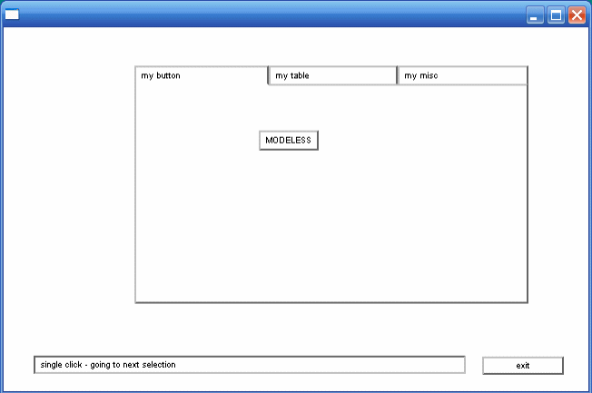
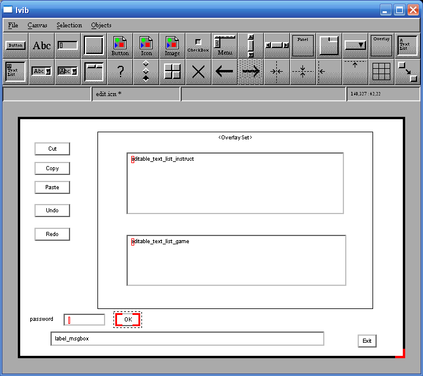
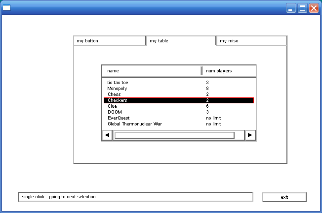
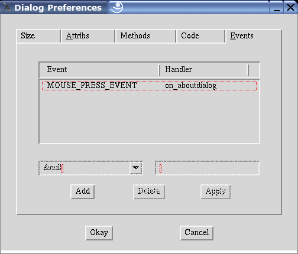

:title: An IVIB Primer
:author: Susie Jeffery and Clinton Jeffery
:trnumber: 6c
:date: 2019-02-28
:abstract: Unicon's improved visual interface builder program IVIB offers many
   more types of widgets than its precursor, VIB. IVIB also supports
   colors and fonts, allowing the programmer a wider variety of
   appearances. This primer explains the rudiments of using IVIB Version
   2.
:docclass: report

Introduction
============

Most applications these days provide easy to use, graphical interfaces. 
For the Unicon programmer, several options are available to create such
an interface. One option is to use the graphics facilities described in
the book "Graphics Programming in Icon" [Gris98]. The Icon Graphics book
includes chapters on writing user interfaces using the vidgets library
and its interface builder, VIB. Unfortunately, these facilities are hard
to customize, either with new widgets or with attributes such as colors
or fonts. Another option for MS Windows programmers is to write an
interface using MS Windows native facilities available from Icon; they
are documented in Icon Project Document 271, but are very limited.

This report describes how to use Unicon's new GUI toolkit and its
interface builder program, IVIB. This package was written by Robert
Parlett, with minor improvements by the authors and other contributors.
Compared with the Icon-based tools, Mr. Parlett's toolkit is elegant,
feature-rich, extensible, and deep. Unless you are familiar with similar
class libraries, IVIB and its GUI toolkit may seem daunting in its
complexity. This report demystifies some typical uses of IVIB Version 2.
We hope you come to enjoy it as much as we have. A great deal of
additional documentation on these tools can be found in the book
"Programming with Unicon" [Jeff01].

*Part I     A Simple IVIB Application*
--------------------------------------

Hello, Ivib
~~~~~~~~~~~

Before we delve into a real application, let us create a rhetorical
program with a single button that executes a procedure when we click on
it. For the sake of tradition, let's suppose our procedure ``p()`` is as
follows. Go ahead and type this procedure in using the ui program or
your favorite text editor, and save it to a file named ``p.icn``.

.. code-block:: unicon

   procedure p()
      write("hello, world")
   end

To start building our GUI, execute the Ivib program. Below its title bar
it has a menu bar with File, Canvas, Selection, and Objects menus, and
below that it has a tool bar that allows you to easily create many kinds
of widget in the GUI library. Below the toolbar is the main Ivib drawing
area, called the canvas.

The Button widget is the top leftmost widget in the toolbar. Go ahead
and click on it; a button labeled "Button" appears in the upper left
area of the canvas. You can drag it approximately to the center of your
canvas area. To modify aspects of the widget's functionality or
appearance, right click on it and select Dialog from the popup menu. The
widget's setup dialog allows you to change all aspects of the widget.
The top half of the dialog controls properties relevant to all widgets,
such as position on screen, graphical attributes, and what variable name
will hold the widget. The bottom half of the dialog controls properties
specific to the particular type of widget being modified (in this case,
a TextButton). TextButtons have a Label attribute that contains the text
on the face of the button. Click in that text area and change "Button"
to "Go!". Then click on the Okay button at the bottom of the dialog.
Your resulting screen might look something like this:

Figure 1: go.icn

At this point, you have created a graphical interface with a button on
it. When you save this as ``go.icn``, Ivib will generate the Unicon
source code for the graphical interface, with the Ivib representation of
that graphical interface encoded as a strange looking comment at the end
of the file. If you compile it, you can produce a working program, but
it won't do anything when the Go! button is pressed.

Ivib and Event-driven Programming
~~~~~~~~~~~~~~~~~~~~~~~~~~~~~~~~~

Event-driven programming is writing code in terms of responses to
events. You don't own the control flow, the GUI library does. The GUI
library calls certain methods in response to each event; your options
are to either stick your application code directly in those method
bodies, or stick calls to your code in those method bodies.

Suppose our procedure ``p()`` given above is located in a file
``p.icn``, which will hopefully be true by now. What we want to do is
make the interface call ``p()`` whenever the button is pressed. An
object (whose class is a subclass of Dialog in package gui) owns the
control flow and processes user input. Each user activity (key press,
mouse click) in the dialog is turned into an Event object and sent to
the interface object being manipulated (the button, scrollbar, or other
widget that was "clicked"). In Ivib, the object's dialog has an
Events... tab that allows the programmer to associate a different
handler method with code to handle each kind of event. To sum up: an
interface has a corresponding Dialog class. For each widget *foo* you
can optionally ask for a class variable ``foo`` that holds the actual
widget object reference, and can write methods that are called when an
event occurs on that widget.

In order for our button to call our procedure ``p()``, we need to find
out (or assign) the button's variable name. To do this, select the
button, right click on it, and open its Dialog. The Name tab contains a
``Name`` field that determines the variable name for this widget. Change
the name from ``text_button_1`` to ``go``. Your dialog should look
something like this:

| 
| Figure 2: TextButton Setup Name Tab

Click Okay to exit the dialog. Save the ivib session (File...SaveAs) in
file go.icn.

At this point, you can compile go.icn as a standalone program that does
nothing (unicon go). But it might be more interesting to tell the dialog
what code to execute (namely, a call to the procedure ``p()`` mentioned
earlier) when the "go" button is clicked. Go over to the Events tab,
click on Add, and associate a method ``on_go()`` with ``ACTION_EVENT``
by clicking the Apply button.

| 
| Figure 3: TextButton Setup Event Tab

Click OK, and then save your file. At this point if you go into file
``go.icn`` and look at the code, the dialog has an empty method

.. code-block:: unicon

   method on_go(ev)
   end

into which we can insert a call to ``p()`` using the ui IDE, or emacs or
another text editor:

.. code-block:: unicon

   method on_go(ev)
      p()
   end

Save ``go.icn`` with this call to ``p()`` added, and then compile
``go.icn`` and ``p.icn`` together (``unicon go p``), and run it
(``./go``). If successful, this application will run as described and
write ``"Hello, world"`` to standard output when you click the button.

Warning! Editing your file with Ivib and a text editor at the same time
makes it easy for you to overwrite work done in one tool when you save
in another tool. The safest thing is to Quit Ivib when you are editing
code, and quit your editor when you do an Ivib session. In the future we
will make Ivib smarter about trying not to lose your work, and probably
integrate it into an IDE so the text editor and Ivib sessions always
know when to switch back and forth.

A Simple IVIB Application
~~~~~~~~~~~~~~~~~~~~~~~~~

For a more realistic example, we are going to create a simple
application that will demonstrate the use of Buttons, Text List boxes,
Menu Bars, Labels, multiple screens, File Input/Output, and error
handling. Our application will contain a main screen with a Menu Bar and
a Button. A File Selection Dialog box listing all the files in a
directory will be displayed when the button is pressed. The Menu Bar
will have options to Exit, display the About Box, and display a Help
File.

This dazzling example is given in glorious click-by-click detail in
order to familiarize you with IVIB and to teach you many of its
capabilities by osmosis. All you should have to do is follow the
instructions. Hopefully you will feel recklessly capable of writing
similar applications on your own afterwards.

The Main Screen
~~~~~~~~~~~~~~~

First, create a directory where you can save all the files created for
this application. Change into this directory, and launch Ivib (if Ivib
is already running, you can click on the File menu's New item). You will
see a blank canvas. We are now going to create a Menu Bar. In
particular, we will have a File menu that pulls down to an Exit command
and a Help menu that pulls down to an About box and a Help command.

Menu Bar
~~~~~~~~

**Add a Menu Bar** by clicking on the Menu component from the Ivib Menu.
A Menu Bar with an Edit me item will be added to the canvas. (Although
Menu Bars have an associated variable name just like you saw in the
Button example, you generally won't have to edit or use the name of a
Menu Bar, since event handling code is not attached to Menu Bars, but
instead to the menu objects placed inside those menu bars.)

Right click on the Menu Bar and select the dialog option. The MenuBar
setup in the bottom box of the dialog will look like this:

::

   |
   |
   -----------Edit me
   |       |
   |       |
   |

**Add the File menu**. Select ``Edit me``, hit the edit button, and
change the ``Label`` field to File. Click Okay. The tree will now look
something like this:

::

   |
   |
   -----------File
   |       |<-------------------------------------click here and Add label
   |

**Add the Exit command**. Highlight the branch by clicking in the
position shown above. The Add label button will become available; click
on it. A new branch labeled Edit me will be added to the branch. Edit
this branch by clicking on the Edit button, change the Label field to
say Exit, and switch to the Code tab. Change the object name to exit and
then click the Event handler checkbox to create an ``on_exit`` handler
method. Before you click OK the screen should look like:

| 
| Figure 4: TextMenuItem Setup Code Tab

Press Okay.

The tree will now look something like this:

::

   |
   |
   -----------File
   |       |
   |       |-------------Exit(Txt)  
   |       |     
   | <-----------------------------------------click here to add a menu item

**Add the Help menu** from the trunk of the tree. Highlight the branch
by clicking in the position shown above. The Add Menu button will become
available; click on it. A new branch labeled Edit me will be added to
the tree. Edit this branch by clicking on the Edit button, change the
Label field to say Help, and click Okay. The tree will now look
something like this:

::

   |
   |
   -----------File
   |       |
   |       |-------------Exit(Txt)|
   |       |
   |
   |---------Help
   |       |<-----------------------------------------click here to add a menu label
   |

**Add the About command**. Highlight the branch by clicking in the
position shown above. The Add label button will become available; click
on it. A new branch labeled ``Edit me`` will be added to the branch.
Edit this branch by clicking on the Edit button, change the Label to
``About...`` and select the Code tab. Change the object name to about
and then click the event handler to create an ``on_about`` handler
method. Click Okay. The tree should now look something like this:

::

   |
   |
   -----------File
   |       |
   |       |-------------Exit(Txt)
   |       |
   |
   |---------Help
   |      |
   |      |------------About
   |      |<-----------------------------------------click here, Add a label
   |

**Add the Help command**. Highlight the branch by clicking in the
position shown above. The Add label button will become available; click
on it. A new branch labeled Edit me will be added to the branch. Edit
this branch by clicking on the Edit button, change the label to Help,
and switch to the Code tab. Change the object name to help, and then
click the Event handler checkbox to create an ``on_help`` event handler
method. Click Okay. The tree will now look something like this:

::

   |
   -----------File
   |       |
   |       |-------------Exit(Txt)
   |       |
   |
   |---------Help
   |      |
   |      |------------About(Txt) 
   |      |
   |      |------------Help(txt)
   |

Hit Okay.

Buttons and Labels

**Add a Button to the canvas**, by clicking on the Button Component from
the Ivib Menu Bar. Move the Button to somewhere near the left side of
the canvas. Right click on the Button and select the dialog option.
Change the label to say List Files, then select the Name tab. Change the
name to ListBtn and then select the Events tab. Click on Add to create
an on_ListBtn handler method, then click on Apply, and then click Okay.

**Add a Message Box Label** to the canvas by clicking on the Label
component (designated "Abc") on the Ivib menu bar. Move the label to the
bottom of the canvas. Resize the width to almost the size of the canvas
and resize the height to about the same height as the button.

Right click on the Message Box and select the dialog option. Change the
label to be empty, then click on the Name tab. Change the name to
MsgBox, then click on the Other tab. Click on the Class variable radio
button and the Draw Border checkbox so that there will be a border
around our message box.

Select the **Attribs Tab**. Click Add and replace the Edit and me to fg
and red respectively. This will change the foreground color to red.

::

    Attrib        Value
    fg            red

Click the **Apply** button to save the attribute. Press the Add button
and replace the Edit and me with the values below. This will change the
font attributes.

::

    Attrib        Value
    font          serif,18,bold

Hit the **Apply** button to save the changes. Hit Okay.

**Enter the canvas attributes**. Select the Canvas menu option Dialog
prefs...

On the **Attribs** tab change the background from pale gray to yellowish
white by selecting Add and changing the fields as follows:

::

    Attrib        Value
    bg            yellowish white

Hit the **Apply** button to save the changes

On the **Methods** tab, leave the ``Generate main() procedure`` button
on so the box is checked. We want to put our  main procedure in  this
file.

On the **Code** tab, change the Name field to maindialog.

::

    Name  maindialog

Hit Okay.

From Ivib, go to the File menu and save the file.

::

      File->Save as:    main.icn

Make sure you save them in the directory you made for this application

The About Box
~~~~~~~~~~~~~

We want to create a small canvas for our About box. The About box will
contain one Text List containing application information. From Ivib, go
to the File menu and select New and a blank canvas will appear. Resize
the canvas by dragging the bottom right corner so it is about 3/4 the
original size.

Add a Text List Box by clicking on the Text List component on the Ivib
Menu Bar (this is the one in the upper right corner). Move it to the
center, then right click on it to get the dialog selection. Under the
Name tab, change its name to AboutTxtLst, then select the **Other** tab
and click on the Class variable radio button. Hit Okay.

**Add the canvas attributes**. Select the Dialog prefs... item from the
Canvas menu.

On the **Attribs** tab, click Add. A pair of text input boxes will
appear for the attribute you want added; the attribute name field says
"Edit" and the attribute value says "me". Replace the "Edit" with
attribute name "label" and replace the attribute value "me" with a the
value "About Ivib Primer". Click Apply.

On the **Methods** tab, **un**-click the ``Generate main() procedure``
button so the button is not down. We do not want a main procedure in
this file.

On the **Code** tab, change the name to aboutdialog. Finally, on the
Events tab, click Add and change the event to MOUSE_PRESS_EVENT and
change the method name to on_aboutdialog (this method will quit the
dialog). Click Apply. The screen should look like:

| 
| Figure 5: Dialog Preferences Events Tab

Click Okay.

From Ivib, go to the File menu and save the file with the name
about.icn.

::

     File->Save as:    about.icn

Make sure you save it in the directory you made for this application.

The Help Screen
~~~~~~~~~~~~~~~

We want to create another small canvas for the Help information. This
canvas will contain a Text List, a Cancel Button and a Label for
messages. From Ivib, go to the File menu and select New and a blank
canvas will appear. Resize the canvas by dragging the bottom right
corner so it is about 3/4 the original size.

**Add a Text List Box** to this canvas by clicking the Text List
component from the Ivib Menu Bar. Move it to the center and then right
click on it to get the dialog attributes. Select the Name tab, and
change the name to HelpTxtLst. Select the Other tab, and click on the
Class variable radio button. Click Okay.

**Add a Button** to the canvas, by clicking on the Button Component from
the Ivib Menu Bar. Move the Button to somewhere near the bottom of the
canvas below the text box.

Right click on the Button and select the dialog option. Change the Label
to Close, and select the Name tab. Change the name to CloseBtn. On the
Events tab, click Add to create an on_CloseBtn() handler method. Click
Apply, and then Okay.

**Add a Message Box** to the canvas by clicking on the Label component
(Abc) on the Ivib menu bar. Move the label to the bottom of the canvas
and resize it to be almost the length of the canvas.

Right click on the Label and select the dialog option. Change the Label
field to be empty.

On the **Name** tab, change the name to MsgBox. On the **Other** tab,
select the Class variable radio button. Click the **Draw Border** check
box so that there will be a border. Click Okay.

**Add the canvas attributes**. Select the Ivib Canvas menu's **Dialog
prefs...** item. On the **Attribs** tab, Press Add to add an attribute.
Change the attribute name from ``Edit`` to ``label`` and change the
value ``me`` to ``Ivib Primer Help``. On the **Methods** tab,
**un**-click the ``Generate main() procedure`` button so the box is not
checked. We do not want a ``main()`` procedure in this file.

On the **Code** tab, change the name to helpdialog. Click Okay.

From Ivib, go to the File menu and save the file.

::

       File->Save as:    help.icn

Make sure you save the file in the directory you made for this
application.

You can exit out of Ivib now with the File menu's Quit item.

Adding the code
~~~~~~~~~~~~~~~

The code is now done for the GUI components. It is in the files
main.icn, about.icn, and help.icn.

If you look at the file main.icn you will notice Ivib created a class
called maindialog and various methods that are associated with the
components we added. For example, method on_about() will be the method
used when you click on the about menu item on the menu bar. Method
init_dialog() is the first method called when the class is created. It
is a good place to initialize variables. It is our job to write the code
for these methods.

If any of the components are not spelled correctly, correct them using
Ivib to keep the program code consistent with the graphics. However,
when you change the names using Ivib, Ivib will add your new names, but
not delete the old names. You may want to search the file for any
references to the old names and remove all methods and references to the
old names. If you do not remove the old names, your code will still
work, but you will have unused methods and objects cluttering up the
file. **Also, remember Unicon is case sensitive. All references to the
objects must be the same case.**

**Main Dialog Class**. Edit the file main.icn using your favorite
editor. This file contains the main procedure, which starts the
application by displaying the main screen. Some of the methods in the
file main.icn are shown below:

.. code-block:: unicon

   import gui
   $include "guih.icn"
   #
   # maindialog is the class created by Ivib in the file main.icn
   #
   class maindialog : Dialog(MsgBox,........)
      ...
   method on_ListBtn(ev)
   end

   method on_about(ev)
   end

   method on_exit(ev)
   end    

   method on_help(ev)
   end
      ...
   end # dialog class

Find the main() procedure and change it if needed so it looks as shown
below. This will cause the main screen to be displayed when the program
starts up.

.. code-block:: unicon

   procedure main()
      local d
      d := maindialog()
      d.show_modal()
   end

Add code so the About Canvas is displayed when the About Menu item is
selected. Add the following code to on_about():

.. code-block:: unicon

   method on_about(ev)
      aboutdialog().show_modal()
   end

Add code so the Help Canvas is displayed when the Help Menu item is
selected. Add the following code to on_help():

.. code-block:: unicon

   method on_help(ev)
      helpdialog().show_modal()
   end

We also need to add code to terminate the application when the Exit menu
item is selected. Add the dispose() function to on_exit().

.. code-block:: unicon

   method on_exit(ev)
      dispose()
   end

Save this file as main.icn. Make sure you save it in the directory you
made for this application.

Makefile
~~~~~~~~

The following instructions mainly apply to Linux/UNIX users. An ASCII
file called a makefile (and often named makefile or Makefile) is written
to compile and link all our code together using the ``make`` program. On
Windows, if you obtain a version of the make program such as
``make.exe`` or ``nmake.exe``, you can follow these instructions; in the
makefile the executable (main) may need to be modified to say
``main.exe``.

Create another file named makefile and enter the following. Be careful
to follow make's syntax by beginning the unicon command lines with tab
characters; some text editors (such as "edit") convert these to spaces
on you, which may cause the make (or nmake) program to fail. For
example, if you just copy and paste these lines from your web browser,
you will not have tab characters pasted where they need to be; sorry!
Notepad, or better yet a real programmer's editor, will preserve your
tab characters.

::

   #
   # makefile
   #
   CFLAGS=-c
   main: main.u about.u help.u  
           unicon -G -o main main.u about.u help.u 
   about.u: about.icn
           unicon $(CFLAGS) about
   help.u: help.icn
           unicon $(CFLAGS) help
   main.u: main.icn
           unicon $(CFLAGS) main

Make sure you save it in the directory you made for this application At
the shell/command-line prompt enter:

::

   ...%        make

If everything went well, there will not be any errors at this point.

Note: if no make or nmake is available you can enter at the
shell/command prompt:

::

   ...% unicon -G main.icn about.icn help.icn 

Running the Program
~~~~~~~~~~~~~~~~~~~

At the shell/command prompt enter:

::

   ...% main

(On Linux if the current directory is not on your PATH you can say
./main)

When successful, the main screen will be displayed. You should be able
to hit the menu items and view the help and about dialogs.

**The About Box**. Edit the file about.icn using your favorite editor.
Some of the methods in the file about.icn are shown below

.. code-block:: unicon

   #
   # aboutdialog is the class created by Ivib in the file about.icn
   #

   class aboutdialog : Dialog(AboutTxtLst)
      ...
      method init_dialog()
      end
      method on_aboutdialog(ev)
      end
      ...
   end    # aboutdialog

We need to fill the Text List with the About information. We could
actually have done this from inside Ivib, but just for fun let's add
code to ``init_dialog()`` so the Text List is filled when the canvas is
displayed. Edit about.icn and add the following code to the
``init_dialog()`` and ``on_aboutdialog()`` methods.

.. code-block:: unicon

   method init_dialog()
      local l
      l := [
            "This is an example application",
            "To demonstrate an About Box",
            "Also, how to show another form",
            "Plus: using Makefiles with",
            "Ivib"
            ]
        AboutTxtLst.set_contents(l)
    end

    method on_aboutdialog(ev)
        dispose()
    end

**The Help Screen**. Edit the file help.icn using your favorite editor.
Some of the methods in the file help.icn are shown below.

.. code-block:: unicon

   #
   # helpdialog is the class created by Ivib in the file help.icn
   #

   class helpdialog : Dialog(HelpTxtLst, MsgBox)
      ...
      method init_dialog()
      end
      method on_CloseBtn(ev)
      end
      ...
   end  # helpdialog class

The help screen will read in a text file and display it in the text list
we created. We'll add code to the method init_dialog() to open the help
file and display it. Edit the file help.icn and add the following code
to the method init_dialog():

.. code-block:: unicon

      method init_dialog()
      local l, helpfile, fd
         helpfile := "help.txt"
         if fd := open(helpfile) then {
            MsgBox.set_label("File " || helpfile || " ")
            l := []  # create an empty list
            while put(l, read(fd)) # read lines, put in list
            close(fd)
            HelpTxtLst.set_contents(l)
            }
         else
            MsgBox.set_label("Cannot open help file: " || helpfile)
      end

We also need to add code to terminate the application when the Cancel
Button is clicked. Add a call to the dispose() function to
on_CloseBtn().

.. code-block:: unicon

   method on_CloseBtn(ev)
      dispose()
   end

You will also need to create a text file named help.txt with any
information you find helpful.

**The Main Screen**. The main dialog will demonstrate the use of file
dialog box. It will open a file dialog when the List Button is pressed
and display the selected file in a message box. First we need to link in
the FileDialog class from the Unicon class library. Add the link
statement before the maindialog class declaration as follows:

::

   import gui
   $include "guih.icn"

   link filedialog         # this the line you add

Add the following code to the ``on_ListBtn()`` method. The file dialog
will be displayed when the List button is pressed and the selected file
will be displayed in the MsgBox.

.. code-block:: unicon

   method on_ListBtn(ev)
      local s, fd
         fd := FileDialog()
         fd.set_attribs("label=Select file demonstration")
         fd.show_modal(self)
         s := fd.get_result() | fail
         if /s | s == "" | s[-1] == "\\" then {
            MsgBox.set_label("Select a file")
            return
            }   
         MsgBox.set_label("File : " || s || " was selected ")
   end

The application is now complete. Use the makefile or Unicon command to
compile and link the program and run the application as described in the
Makefile section above. Now you can go back and add labels, or resize
components as needed.

*Part II: Another Simple IVIB Application*
------------------------------------------

The following example demonstrates how to create a simple application
that uses modeless dialogs, edit dialog features, tab sets, and
overlays. The application will contain a main screen with a table,
overlay and tab set. The main screen will call an edit dialog that will
have cut, copy, paste, undo, and redo features. This example will
illustrate:

#. Modeless Dialogs
#. Tab Sets, Overlays
#. Capturing Table events double clicks, right clicks, column clicks
#. Copy, Cut, Paste from clipboard
#. Using buttons and keeping selected regions for copy, cut, paste
#. Single Undo/Redo instead of default compound undo/redo
#. Tab Jumps to components

Modeless Dialogs
~~~~~~~~~~~~~~~~

We are going to create a main dialog that contains a table of games.
After you select one of the games from the table, a modeless dialog will
be displayed. First, create a directory where you can save all the files
created for this application. Change into this directory, and launch
Ivib. You will see a blank canvas.

Enter the canvas attributes. Either right click on the Canvas for Dialog
or go to the file menu option Canvas->Dialog prefs.

On the **Code** tab, enter:

::

   Name  dialogmain

On the **Methods** tab, leave the ``Generate main() procedure`` checkbox
ON so the box is checked. We want to put our ``main()`` procedure in
this file. Leave all the other checkboxes on on the Methods Tab checked
also.

On the **Attribs** tab, Hit Add and replace Edit me with:

Attrib

     

Value

``font``

``sans,12``

Hit **Apply**. This will set the default font to sans 12 for every
component in this dialog.

On the **Events** tab, hit the Add Button.

Under Event: Hit scroll down to CLOSE_BUTTON_EVENT. Under Handler enter:
``on_dialogmain``. We will use this method to capture the Windows X
(close) event at the top right of the Dialog. Hit **Apply**.

Hit **Okay** to close Dialog Prefs.

**Add a Button to the canvas**, by clicking on the Button Component from
the Ivib Menu Bar. Move the Button to somewhere around the left side of
the canvas. Note: you can resize the canvas or the button by dragging
the right bottom corner to make it larger/smaller.

Right Click on the Button to add some attributes as follows:

| On the **General** tab enter:
| **Label** Modeless

| On the **Other** tab:
| Check the **Class variable** checkbox

| On the **Name** tab:
| Name text_button_modeless

| On the **Events** tab:
| Hit the Add Button

Under **Event**: Scroll down to ``BUTTON_RELEASE_EVENT``

Under **Handler** enter: (it may be automatically added)
``on_text_button_modeless``

Hit **Apply**.

This will create a method ``on_text_button_modeless()`` that will be
invoked by a ``BUTTON_RELEASE_EVENT``.

Hit Okay.

You may need to resize the button so the text will fit.

Add an Exit Button by clicking on the Button icon on the Tool Bar. Right
Click on the Button to add some attributes as follows:

On the **General** tab, enter: Label Exit

On the **Name** tab, enter: Name text_button_exit

On the **Other** tab, check the: Class variable checkbox

On the Events Tab: Hit the Add Button

Under Event: Scroll down to ``BUTTON_RELEASE_EVENT``

| Under Handler enter: (it may be automatically added)
| ``on_text_button_exit``

| Hit Apply
| Hit Okay

Move the exit button to the bottom right side of the dialog as shown in
Figure 6 of main.icn below:

Figure 6: main.icn my button Tab

**Add a Message Box Label** to the canvas by clicking on the Label
component (Abc) on the Ivib menu bar. Move the label to the bottom of
the canvas and resize it to be almost the width of the canvas. Refer to
the Figure 6. The message label is the long rectangle at the bottom of
main.icn. Right Click on the Label to add some attributes as follows:

| On the **Other** tab, check the:
| Class variable checkbox

Click the **Draw Border** check box so that there IS a border.

| On the **Name** tab enter:
| Name label_msgbox

| On **General** Tab enter:
| Label : (make it blank - this label will be our message box) Hit Okay

From the Menu, Slect File->Save As and enter main.icn

::

   File->Save as:    main.icn

Make sure you save them in the directory you made for this application.

**Create an Edit Dialog** by going to the Ivib menu to File->New. A
blank canvas will appear.

**Enter the canvas attributes**. Either right click on the Canvas for
Dialog or go to the file menu option: Canvas->Dialog prefs.

| On the **Code** tab enter:
| Name dialogedit

On the **Methods** tab, **un**-check the ``Generate main() procedure``
checkbox, so the checkbox is NOT checked. We DO NOT want to put a main
procedure in this file.

On the **Attribs** tab, hit Add and replace Edit me with:

::

   Attrib      Value
   label       Edit dialog     Hit Apply
   font        sans,12     Hit Apply 

This will add a title to the top of the canvas and change the default
font to sans. You can also add different background and foreground
colors by using the attributes bg and fg.

| On the **Events** Tab :
| Hit Add and scroll down to ``CLOSE_BUTTON_EVENT``. Enter on_dialogedit
  for the Event Handler and hit Apply. We will use this method to
  capture the Windows X (close) Event at the top right of the Dialog.
  Note Ivib may have added another event handler. Please delete it. The
  CLOSE_BUTTON_EVENT handled by the on_dialogedit method should be the
  only entry. Hit Okay to close Dialog Prefs.

Add an Exit Button by clicking on the Button icon on the Tool Bar. Right
Click on the Button to add some attributes as follows:

On the **General** tab enter:

::

   Label  Exit

On the **Name** tab enter:

::

   Name text_button_exit

On the **Other** tab check the:

::

   Class variable checkbox

| On the **Events** Tab, hit the Add Button.
| Under Event: Scroll down to ``BUTTON_RELEASE_EVENT``

| Under Handler enter:
| ``on_text_button_exit`` (it may be automatically added)

| Hit **Apply**.
| Hit **Okay**

You may need to resize the button so the text will fit. Move the Exit
button to bottom right corner as shown in Figure 7 of edit.icn below:

Figure 7: edit.icn

**Add a Message Box Label** to the canvas by clicking on the Label
component (Abc) on the Ivib menu bar. Move the label to the bottom of
the canvas and resize it to be almost the width of the canvas. Refer to
Figure 7 of edit.icn. The message label is the long rectangle at the
bottom of figure 7. Right click on the Label to add some attributes as
follows:

| On the **Other** tab check the:
| **Class variable** checkbox

Click the **Draw Border** check box so that there is a border.

| On the **Name** tab enter:
| Name label_msgbox

| On **General** tab enter:
| Label : (make it blank - this label will be our message box)
| Hit **Okay**

From Ivib, go to the File menu and execute this command:

::

      File->Save as:    edit.icn

Make sure you save them in the directory you made for this application
and close Ivib.

3) Using an editor, open up main.icn

**Caution!** Because you are saving files using Ivib and your editor,
make sure that you save your file using the text editor before changing
the graphics using Ivib. Also, make sure that you refresh the buffer
(get the the latest) in your text editor after you change the graphics
using Ivib. If you are nervous about writing over your changes you can
make a backup copy to see how this works. Using the Gnu Emacs editor is
a good idea, since it reminds you to refresh the buffer if Ivib has
changed anything. Also, if you renamed any variables, the old names and
their methods may still be there. Note: all variables are case sensitive
so CancelBtn is not the same as cancelbtn. For example, if you forgot to
uncheck ``generate main procedure``, the main procedure will still
remain. You will need to manually remove the main procedure and uncheck
it in Ivib.

Edit main.icn and add the following code to the on_text_button_modeless
method:

.. code-block:: unicon

    method on_text_button_modeless(ev)
      dedit := dialogedit()                   
      dedit.show_modeless()             # show edit dialog
      dispatcher.message_loop(dialogmain())
    end

The third line ``dispatcher.message_loop(dialogmain())`` makes the modal
dialogmain the parent of the modeless dialogedit. When using modeless
dialogs, at least one dialog must be modal. In this case, it is the main
dialog. You only need to add this line once. If you call a modeless
dialog from dedit, the dialogedit, you will not need this line.

Also, add ``dispose()`` to the ``on_text_button_exit()`` method to close
the dialog.

.. code-block:: unicon

   method on_text_button_exit(ev)
     dispose()
   end

Add the following code to on_dialogmain so the dialog will close for the
X event

.. code-block:: unicon

   method on_dialogmain(ev)
     if \ev.param = -11 then  #windows x box
        on_text_button_exit(ev)
   end 

Save main.icn.

**Edit edit.icn** and add the following code to
``on_text_button_exit()`` to close the dialog.

.. code-block:: unicon

   method on_text_button_exit(ev)
      dispose()
   end

Also add the following code to on_dialogedit.

.. code-block:: unicon

   method on_dialogedit(ev)
     if \ev.param = -11 then  #windows x box
        on_text_button_exit(ev)
   end

Save edit.icn.

Compile the program:

::

   > unicon -o demo -G main.icn edit.icn

Run the program

::

   > demo

When the main dialog comes up, you can click on the 'Modeless' button
and a new edit dialog will appear. Notice you can go back and forth from
main dialog to edit dialogs. Every time you click, a new dialog will be
created. This is different from the show_modal dialogs where the focus
was only given to one dialog at a time.

We may not want our users creating too many dialog boxes. Let’s add Some
code to limit them to one only. If they click on the modeless button,
and there is already a dialog open, we will set the focus on the already
opened dialog box.

**In main.icn**, add the global variable dedit at the top of main.icn
(before the class declaration). This is the edit dialog variable that
will tell us if the dialog is open.

::

   global dedit

Add the following code to the ``on_text_button_modeless()`` method and
the ``int_dialog()`` method.

.. code-block:: unicon

   method on_text_button_modeless(ev)
      local winedit

      if \dedit then {
         if winedit := dedit.get_win() then {
            Raise(winedit)
            dedit.set_focus(dedit.label_msgbox)
            return
         }
      }

      dedit := dialogedit()                   
      dedit.show_modeless()             # show edit dialog
      dispatcher.message_loop(dialogmain())
   end
   method init_dialog()
      dedit := &null
   end

Save main.icn in the correct directory. In edit.icn, add the dedit :=
&null line to the on_text_button_exit method:

.. code-block:: unicon

   method on_text_button_exit(ev)
       dedit := &null
       dispose()
    end

This sets the global variable ``dedit`` to ``&null`` when the Dialog is
closed. It can be closed by hitting the exit button or by hitting the X
button in the right top corner.

Save the file. Compile and run the program. You will get only one edit
dialog no matter how many times you hit the modeless button.

Tables and Tabs Sets
~~~~~~~~~~~~~~~~~~~~

**Do not be confused!** Tables with a capital T are GUI components that
arrange elements into rows and columns; they are not the same thing as
the ``table`` data type.

**Add a Tabset to the main.icn canvas** by clicking on the Tabset
Component from the Ivib Tool bar. It is the fourth component from the
right on the top row. Move the Tabset to somewhere around the middle of
the canvas. Enlarge it so it is similar to Figure 6. Right Click on the
TabSet to add some attributes as follows:

On the **Other** tab check the: Class Variable checkbox

On the **Name** Tab enter: Name tab_set_demo

On the **General** tab you see: tab_item_1\*

Click on it and an Edit box will appear. Change it as follows to create
a tab for the button:

::

   Label: My button
   Name: tab_item_btn

Hit **Apply**.

Now create another tab for a table by hitting Add and tab_item_2 will be
added and highlighted. Change it as follows to create a tab for the
Table:

::

   Label: My Table
   Name: tab_item_table

**Class variable** should be checked. Hit **Apply**.

Now create a third tab by hitting Add and tab_item_3 will be added and
highlighted. Change it as follows to create a tab for the Table:

::

   Label  My misc
   Name: tab_item_misc

Hit **Apply**.

Hit Okay and the dialog box will close. You will need to enlarge
horizontally the dialog so that the three tabs appear in order. Refer to
Figure 6.

Move the modeless button from the main canvas to the my button tab.

Right click on the Tabset to open the Tabset Setup dialog box. At the
bottom, on the General Tab, you see:

::

   tab_item_btn*
   tab_item_table
   tab_item_misc

The ``*`` after ``tab_item_btn`` indicates it is the tab item, you are
currently editing. Click on tab_item_table so it is highlighted, then
hit the which button. Now ``tab_item_table`` should have the star. Hit
Okay, and you will now see on the main dialog that the
``tab_item_table`` tab can be edited.

Add a table to this tab, by clicking on the Table Component on the Ivib
Tool Bar. It is the fourth component from the left in the bottom row.
Move the table from the main canvas to the my table tab. Resize it as
shown in the Figure 8 of main.icn below:

Figure 8: main.icn

We are going to add some columns in the table so **right click on the
table** to get the Table Setup Dialog.

On the **Other** tab check the: **Class Variable** checkbox.

On the **General** tab in Table Setup, Hit the Add button.

Now we will add the first column to our information table. Add the
following to the **General** tab:

.. code-block:: unicon

   Label :Name
   Width: 200
   Align l
   Name: table_column_1 (class variable should be checked)

Hit Apply

Add another column by clicking the **Add** button:

.. code-block:: unicon

   Label :# of Players
   Width: 125
   Align  l
   Name: table_column_2
   (class variable should be checked)

Hit **Apply**

On the **Selection** tab, the drop down box that says No selection,
change this to **Select One**. Note: If you change it to Select Many,
then they can select multiple rows by Control Shift and Click (mouse) at
the same time.

On the **Events** tab, hit the Add Button.

| Under Event: Scroll down to ``MOUSE_RELEASE_EVENT``
| Under Handler enter: ``on_table_1`` (it may be automatically added)

Hit Apply

This will create a method ``on_table_1()`` that will be invoked by a
``MOUSE_RELEASE_EVENT``. Note: Make sure that this is the only event
added. Sometimes Ivib initially adds an ``ACTION_EVENT``. Please delete
all other events.

Click **Okay** to close the setup dialog. You will probably need to make
the Tabset and the Table larger as shown in Figure 8.

From the Ivib Menu, Save As ``main.icn``.

Add the following code to the ``init_dialog()`` method in ``main.icn``:

.. code-block:: unicon

   method init_dialog()
      local lst
      lst := [["tic tac toe","3"], ["Monopoly","8"], ["Chess","2"], ["Checkers","2"],
                ["Clue","6"],["DOOM","3"],["EverQuest","no limit"],["Global Thermonuclear War","no limit"]]
      table_1.set_contents(lst)
      dedit := &null
   end

Save main.icn. Compile and run the program. You should be able to click
on the tabs to display the three different tabs. Notice the 'My table
Tab' is displayed first. We can change this by setting the **Which**
back to ``tab_item_btn`` in Ivib if we want the button tab to show
initially.

Capturing Events, Click Counts and GoTo
~~~~~~~~~~~~~~~~~~~~~~~~~~~~~~~~~~~~~~~

We are now going to add code so that an edit dialog box will come up
every time we double click on one of the games in the table. We will add
a global variable editdlg that is a table of dialogs. The keys for the
table are the positions in the table. This example will demonstrate:

#. Double Click
#. Finding the selected positions and the contents of the table using
   ``get_contents()`` and ``get_selections()``
#. Setting the position of the table by using set_selections and go_to.
#. Using Events to capture the right click and the Windows X close.

Add the following global variable to ``main.icn``. This is the table
that will keep track of all the dialogs

::

   global editdlg

Also, add two more lines to the ``init_dialog()`` method. The first new
line initializes and creates the table ``editdlg``. The second new line
sets the click delay so we can distinguish double clicks from single
clicks.

.. code-block:: unicon

   method init_dialog()
   local lst
      lst := [["tic tac toe","3"], ["Monopoly","8"], ["Chess","2"], ["Checkers","2"], ["Clue","6"],["DOOM","3"],["EverQuest","no limit"],["Global Thermonuclear War","no limit"]]
      table_1.set_contents(lst)
      dedit := &null
      editdlg := table()
      set_double_click_delay(100000)  # set click  delay  ford double click
   end

Add the following code to the method ``on_table_1()``:

.. code-block:: unicon

   method on_table_1(ev)
   local posn,poslst,msg,gamelst,cc
   poslst := []
   posn := 0
   game := ""
   gamelst := []
   cc := 0

   if \ev & \ev.source  & \ev.type &  \ev.param then 
      write("sc ",image(ev.source)," type ",image(ev.type)," param ",image(ev.param))
   else
       return

   if \ev.param = -6 then { #right click
          posn := table_1.get_table_content().get_line_under_pointer() | 0
          if posn < 1 then return

          table_1.set_selections([posn]) #  add to selected list, highlight it
          table_1.goto_pos(posn)   
          table_1.set_cursor(posn)
          label_msgbox.set_label("right click demo at pos  "||posn)
          self.display()
          return
    }
   # 
   #  returns list of selected items in this case only one because 'select one' is set for the table
     poslst :=  table_1.get_selections() | [] 
      if *poslst > 0 then
        posn := poslst[1]   # the selected position
      else
        return    
   #  returns a list of lists with 2 items game and number players   
      gamelst :=  table_1.get_contents()  

   #  get the selected name of the game from the table, the first item in the list
      game := gamelst[posn][1]
       cc := get_click_count()
      if cc > 1 then {
          game := game || " double click "
   #    create a global table editdlg to keep track of all the open dialogs  
        if not member (editdlg, posn) then {
          (editdlg[posn] := dialogedit(posn,game))
          editdlg[posn].show_modeless()
        }
        else {
          Raise(editdlg[posn].get_win())
           editdlg[posn].set_focus(editdlg[posn].label_msgbox) 
        }
        return

      }  # end cc > 1

      if posn >= *gamelst then
          posn := 1
       else
          posn +:= 1

       table_1.set_selections([posn]) #  add to selected list, highlight it
       table_1.goto_pos(posn)   
       table_1.set_cursor(posn)
       label_msgbox.set_label("single click - going to next selection ")
       label_msgbox.display()
    end

Save main.icn.

First, this code will write the ev.param, ev.type and ev.code to
determine what the ev.param is for a right click. It is -6, so if there
is a right click, it is displayed in label_msgbox and the selected
position is highlighted and returns out of the method. Second, this code
gets the selected item from a list of selected items by calling
get_selections. Since we have set the table in Ivib to ‘select one’,
only one item may be selected. So the list is either a one item list or
empty if nothing has been selected. We can get the table contents by
calling get_contents. For tables, it will return a list of lists where
each list (inside the big list) represents a row of size equal to the
number of columns. In this example, we only have two columns; games and
players. If an item is double clicked, then the edit dialog for the
selected game and position is displayed.

This example also demonstrates the use of the goto_pos, set_cursor and
set_selections methods. If an item is single clicked, then the selection
is moved to the next position unless it is the last position. If it is
the last position, then it is moved to the first position. This is a
pretty stupid thing to do, but it does demonstrate these features.

We are also passing the game name and its position to the edit dialog.
So two variables will need to be added to the class definition for
dialogedit in edit.icn as follows:

.. code-block:: unicon

   class dialogedit : Dialog(posn, msg, label_msgbox, text_button_exit)

Note: Add posn as the first and msg as the second. The order is
important. Also, note that Ivib will not alter them, but it will add new
components in front of them. This means that you must move them back to
the beginning if you add new components using Ivib.

Since we now have more multiple dialogs, we need to make sure they are
set to &null when the edit dialog terminates. Therefore, the following
code will also need to be added to edit.icn.

.. code-block:: unicon

    method init_dialog()
    if \msg & \posn then
      label_msgbox.set_label(posn||" "||msg)
    end

   method  on_text_button_exit(ev)
      delete(editdlg,posn)
      dedit := &null
      dispose()
   end

Save edit.icn. Compile and run the program. If you right click on any of
the rows in the table, 'right click demo at position x' will be
displayed in the message label. If you double click on any of the games,
you will see either a new dialog or an existing dialog will be raised to
the front. The new dialog will display the chosen game and it's
position. If you single click, the cursor position goes to the next game
or to the beginning if you are on the last game. This program also
writes to standard output the values of ev.source, ev.type, and ev.param
every time the mouse is released on the table.

Overlays, and Hour Glasses
~~~~~~~~~~~~~~~~~~~~~~~~~~

Open up edit.icn using Ivib. Add an Overlay to the edit.icn canvas, by
clicking on the Overlay Component from the Ivib Tool Bar. It is the
second component from the right in the top row. Move the Overlay to
somewhere around the middle of the canvas. Enlarge it so its width and
length are about twice the default size (see figure 7 of edit.icn). The
overlay works very much like the Tabset component. It allows the program
to hide components.

Right Click on the Overlay to add some attributes as follows:

On the **Other** tab, check the **Class Variable** checkbox.

On the **Name** tab, enter:

::

   Name overlay_set

| On the **General** tab, you see:
| overlay_item_1\*

Click on it and an Edit box will appear. Change the name as follows:
This will be the initial overlay

::

   Name: overlay_item_blank

Hit Apply.

Create a second overlay by hitting **Add** and ``overlay_item_2`` will
be added and highlighted. Change the name as follows:

::

   Name: overlay_item_edit
   Hit Apply.

Click on **overlay_item_edit** so it is highlighted, then hit the
**which** button. Now **overlay_item_edit** should have the star.

Hit **Okay** to close the setup dialog.

**Add an EditableText List Box** to the overlay by clicking the
**EditableText List** component from the Ivib Menu Bar. It is the first
one from the left in the second row. Move it on top of the Overlay and
resize it (see figure 7 of edit.icn). Now, right click on it to get the
dialog attributes.

On the **Other** tab, check the: **Class Variable** checkbox.

On the **Name** tab, enter:

::

   Name editable_text_list_instruct

Hit **Okay**.

**Add another EditableText List Box** to the overlay by clicking the
**EditableText List** component from the Ivib Menu Bar. It is the first
one from the left in the second row. Move it on top of the Overlay and
move it directly under the editable_text_list_instruct editabletextlist.
(see figure 7 of edit.icn) Now, right click on it to get the dialog
attributes

On the **Other** tab, check the **Class Variable** checkbox.

On the **Name** tab, enter:

::

   Name editable_text_list_game

Hit **Okay**.

Set the overlay back to the blank overlay by right clicking on the
Overlay to change the which. At the bottom in the OverlaySet Setup
panel, Click on **overlay_item_blank** so it is highlighted, then hit
the **which** button. Now **overlay_item_blank** should have the star.
Hit Okay.

Copy, Cut, Paste, Undo and Redo
~~~~~~~~~~~~~~~~~~~~~~~~~~~~~~~

**Add 6 Buttons**. Move the buttons to the left of the overlay set (see
figure 7 of edit.icn). Right Click on each the Buttons to add some
attributes as follows:

On the **Other** tab, check: **Class Variable**

On the **Name** tab, enter: Name text_button_cut

On the **General** tab, enter: Label Cut

On the Events Tab add:

::

   Event                   Handler
   BUTTON_RELEASE_EVENT            on_text_button_cut

**Make SURE this is the ONLY event. Delete any other events that may
have been added by Ivib.**

**Hit Apply.
Hit Okay.**

Do the same for the remaining buttons as follows:

::

   Name text_button_copy
   Label  Copy
   Name text_button_paste
   Label  Paste
   Name text_button_undo
   Label  Undo
   Name text_button_redo
   Label  Redo
   Name text_button_ok
   Label  OK

We are going to create code to add and verify the password. First **Add
a label** to the canvas by clicking on the Label component (Abc) on the
Ivib menu bar. Move the label below the buttons (see figure 7 of
edit.icn). Right Click on the Label to add some attributes as follows:

On the **Name** tab, enter: ``Name: label_pw``

On **General Setup**: ``Label : Password``

On the **Other** tab, check the **Class Variable** checkbox.

Hit **Okay**.

**Add a textfield** to the canvas by clicking on the textField component
on the Ivib tool bar. This is the component third from the top left.
Move the textfield below the buttons and just to the right of the
label_pw (see figure 7 of edit.icn). You may need to resize it. Right
Click on the textfield to add some attributes as follows:

On the **Other** tab, check **Class Variable**

On the **Name Tab** enter: **Name text_field_pw**

Hit **Okay**.

You will probably want to resize it. Refer to Figure 7 of edit.icn. Save
the Dialog in Ivib as ``edit.icn``.

Now edit the source file ``edit.icn``. Remember to refresh the Ivib
changes.

Notice that in the class declaration, the components:
``text_button_copy``, ``text_button_cut``, ``text_button_paste``,
``text_button_redo``, ``text_button_undo``, ``text_button_ok``,
``editable_text_list_instruct``, ``editable_text_list_game``,
``overlay_set``, ``text_field_pw`` have been added before ``posn`` and
``msg``. You will need to move them to the end because we are passing
``posn`` and ``msg`` from the main dialog, and they must be the first
and second variable.

The class variables should look something like this when you are
finished:

.. code-block:: unicon

   class dialogedit : Dialog(posn, msg, text_button_copy, text_button_cut,
      text_button_paste, text_button_redo, text_button_undo, text_button_ok,
      editable_text_list_instruct, editable_text_list_game, overlay_set,
      text_field_pw , text_button_exit, label_msgbox, overlay_item_blank,
      overlay_item_edit, label_pw .............    )

We are going to let the user enter the game instructions only if they
type in the password and hit the OK button. The overlay is initially set
to ``overlay_item_blank`` because we set the which button in Ivib.
However, when the correct password is typed, then the overlay will
switch over to ``overlay_item_edit`` so the instructions can be entered.
If the wrong password is typed and the OK button is hit, then we will
make the user wait. This demonstrates the use of the hour glass mouse
pointer. (Although, usually we use the hourglass when the program is
processing). Add the following code to edit.icn as follows:

.. code-block:: unicon

   method init_dialog()
   if \msg & \posn then {
      label_msgbox.set_label(posn||" "||msg)
      editable_text_list_game.set_contents([msg]) 
   }
   text_field_pw.set_displaychar("*") # replace characters with * in password
   end

   method on_button_ok(ev)
   local pw, t2, wait
   pw := ""
   label_msgbox.set_label("")
   label_msgbox.display()

   pw :=  text_field_pw.get_contents()
   if pw == "joshua" then {
        overlay_set.set_which_one(overlay_item_edit)
        label_msgbox.set_label("Enter Game Instructions ")
        label_msgbox.display()

   }
   else {
      t2 := &time  
      WAttrib(win,"pointer=" || ("wait"|"watch"))  # change mouse pointer to hourglass
      label_msgbox.set_label("Incorrect Password Please wait ")
      while &time - t2  < 5000 do 
           wait := 1
      WAttrib(win,"pointer=arrow")  # change mouse pointer to arrow
      label_msgbox.set_label("OK try again ")
      label_msgbox.display()

     }
   end

Save edit.icn. Compile and run the program. Double click on a game to
get to the edit screen. You will see that if you type in the correct
password ('joshua'), and hit Ok, the blank edit box where you can type
in instructions will be visible. Hard coding passwords is not a good
idea, but this example demonstrates the use of overlays and replacing
the characters with stars. If you type in the wrong password, you will
have to wait.

Open up edit.icn using your editor. Add the following code to the
``init_dialog()`` method:

.. code-block:: unicon

    method init_dialog()
     text_button_copy.clear_accepts_focus()  # keeps selected region 
     text_button_cut.clear_accepts_focus()    
      ........
      .........
    end

NOTE: THIS CODE IS NECESSARY TO ALLOW THE SELECTED REGION IN THE
EDITABLE TEXTLIST TO REMAIN SELECTED. OTHERWISE, THE SELECTED REGION
WILL BE LOST WHEN THE EVENT OF HITTING THE COPY OR CUT BUTTON IS
INVOKED.

Now add the following code for copy, cut, paste, redo and undo.

.. code-block:: unicon

   method on_button_cut(ev)
   editable_text_list_instruct.handle_cut()
   end
   method on_button_copy(ev)
   editable_text_list_instruct.handle_copy()
   end
   method on_button_paste(ev)
   editable_text_list_instruct.handle_paste()
   end
   method on_button_undo(ev)
   editable_text_list_instruct.handle_undo()
   end
   method on_button_redo(ev)
   editable_text_list_instruct.handle_redo()
   end

Save edit.icn and compile and run the program.

::

   unicon -o demo -G main edit myeditabletextlist

You should be able to copy/cut/paste/undo/redo in the
``editable_text_list_instruct`` box. However, you may want to copy text
from other sources. We need to be able to cut/copy and paste using the
Windows clipboard. To do this we will need to create a subclass for our
EditableTextList. We will create a new file myeditabletextlist.icn that
will inherit all the methods of editabletext list except for:

::

   handle_copy
   handle_paste
   handle_cut

Create a new file myeditabletextlist.icn and copy in the following code:

.. code-block:: unicon

   #
   # myeditabletextlist subclass of EditableTextList to 
   # allow clipboard operation in Cut/Copy?paste
   #
   import gui
   link graphics
   import undo
   $include "guih.icn"

   class myeditabletextlist : EditableTextList()

      method handle_cut(e)
         start_handle(e)
         if has_region() then {
            copy_to_clipboard(get_region())
            delete_region(e)
         }
         end_handle(e)
      end

      method handle_copy(e)
         start_handle(e)
         if has_region() then {
            copy_to_clipboard(get_region())
         }
         end_handle(e)
      end

     method copy_to_clipboard(l)
      local large_str, i

      if /l | *l = 0 then fail
      large_str := l[1]

       every i := 2 to *l do
           large_str ||:=  l[i]

       WAttrib("selection=" || large_str)     
       return large_str

      end

      method get_list_from_clipboard()
      local large_str, l, str,start,blank1,tab1,p
      blank1 := ' '
      tab1 := '\t'
      start := 1
      end1 := 1
      str := ""
      p := 1
      large_str := ""
      large_str := WAttrib("selection")
      if /large_str then fail
      l := []

      while   end1  :=   upto("\n",large_str,start,0) do {
         str := large_str[start:end1]
         if p := upto(&ascii--blank1,str) then
            str := str[p:0]
          put(l, str)
         start := end1 + 1
     }
     str := large_str[start:0]
     if p := upto(&ascii--blank1--tab1,str) then
        str := str[p:0]
     put(l,str)

     return l
     end

   #  insert_cr is a global variable to tell paste
   #  to add a line feed after each line 
      method get_pasteable_clipboard(insert_cr)
         local x, t, s, c
         x := []
         t := ""

         x :=  get_list_from_clipboard() | fail

          every j := 1 to *x do  t := t || trim(string(x[j]))  || " "

         # Apply the filter to the string to paste
         s := ""
         every c := !t do {
            if member(printable, c) then
               s ||:= c
         }
         if *s = 0 then
            fail
         return s
      end

      method handle_paste(e,insert_cr)
         local s, ce, ed

         start_handle(e)
         if s := get_pasteable_clipboard(insert_cr) then {
            ce := CompoundEdit()

            if has_region() then {
               ed := EditableTextListDeleteRegionEdit(self)
               ed.redo()
               ce.add_edit(ed)
            }
            ed := EditableTextListPasteEdit(self, s)
            ed.redo()
            ce.add_edit(ed)

            undo_manager.add_edit(ce)
            changed := 1
         }
         end_handle(e)
      end
    end # myeditabletextlist class

Now open up edit.icn using Ivib. Right click on the Overlay set and
switch to overlay_item_edit. Right click on the top edit box
text_list_instruct to get the dialog box.

| On the **Name** tab, change the **Class** to ``myeditabletextList``.
| (Make sure this is all in lower case to match the class in
  myeditabletextlist.icn)

Hit **Okay**, and save edit.icn

This will allow all cut/copy/pastes into ``editable_text_list_instruct``
to use our subclass to pick up the windows clipboard.

::

   unicon -o demo -G main edit myeditabletextlist

Now, when you run demo you should be able to cut, copy, paste from other
documents into the instructions edit box (editable_text_list_instruct).

Tab Jumps and Compound Undo/Redos
~~~~~~~~~~~~~~~~~~~~~~~~~~~~~~~~~

There are a few more things we will add to the demonstration:

#. Tab Jumps
#. Compound Undos/Redos
#. Using events on table columns

**Tab Jumps**. Open up edit.icn using your editor. Be sure to refresh to
the changes from Ivib from above. Add the following code to the
``init_dialog()`` method:

.. code-block:: unicon

    method init_dialog()
    editable_text_list_game.clear_accepts_focus() # allows tab jump or disables tab insert

     .......
     ........
    end

NOTE: This code will not allow the tab to jump to the
editable_text_list_game box. It will disable any type of input to it.
After completing this Tutorial, you may want to make
editable_text_list_game a 'myeditabletextlist' component so you can use
the tabs, copy, cut, paste, undo, redo from the buttons. This will
require that events are used to determine which edit box
(editable_text_list_game or editable_text_list_list) to apply the
function.

You may want to use the tab key to jump from one component to another.
In our demo, the tab key just inserts a tab into the first text box in
edit.icn. Suppose, we would like the tab key to jump to another
component. To do this, you need to add the following methods to the
subclass myeditabletextlist.icn:

.. code-block:: unicon

      method keeps(e)
         # This component keeps all events.
         return e ~=== "\t"
      end

      method handle_event(e)

         if (e === "\t")  then 
            return

         (\self.vsb).handle_event(e)
         (\self.hsb).handle_event(e)
         if e === (&lpress | &rpress | &mpress) then
            handle_press(e)
         else if e === (&ldrag | &rdrag | &mdrag) then
            handle_drag(e)
         else if e === (&lrelease | &rrelease | &mrelease) then
            handle_release(e)
         else if \self.has_focus then {
            case e of {
               Key_Home : handle_key_home(e)
               Key_End : handle_key_end(e)
               Key_PgUp : handle_key_page_up(e)
               Key_PgDn : handle_key_page_down(e)
               Key_Up : handle_key_up(e)
               Key_Down : handle_key_down(e)
               Key_Left : handle_key_left(e)
               Key_Right : handle_key_right(e)
               "\b" : handle_delete_left(e)
               "\r" | "\l": handle_return(e)
               "\^k" : handle_delete_line(e)
               "\^a" : handle_select_all(e)
               "\^e" : handle_end_of_line(e)
               "\d" | "\^d" : handle_delete_right(e)
               "\^x" :  handle_cut(e)
               "\^c" :  handle_copy(e)
               "\^v" :  handle_paste(e)
               "\^z" :  handle_undo(e)
               "\^y" :  handle_redo(e)
               default : handle_default(e)
            }
         }
      end

Compile and run the program. Notice that the tab key makes the cursor
jump from component to component. If you want to order the tab jumps, go
into Ivib, hit control-shift and simultaneously select the
text_button_paste, text_button_undo, text_button_redo,text_field_pw,
text_button_ok, text_button_exit in that order respectively. While still
holding the control-shift, go to the Selection Item on the menu and
select 'Reorder'. Now you can tab jump from top to bottom.

Compound Undos and Redos
~~~~~~~~~~~~~~~~~~~~~~~~

If you use undo and redo in our demo dialog, you will notice that the
Undo undoes compound edits instead of single edits. If you would like to
undo single edits, you will need to create a subclass of the
undomanager. Create a file ``myundomanager.icn`` and copy the following
code in to it.

.. code-block:: unicon

   import undo
   # UndoManager is a CompoundEdit.  Until it is closed it allows undos and redos
   # within its list of edits, moving a pointer into the list appropriately.
   #
   class myundomanager:UndoManager(limit, index)
      method add_edit(other)
         if \closed then
            return self.CompoundEdit.add_edit(other)
         while *l >= index do
             pull(l)
          put(l, other)
          index +:= 1

         while (*l > limit) & (index > 1) do {
            index -:= 1
            pop(l)
         }
      end
   end # class

Now, edit ``myeditabletextlist.icn``, and add initially code to use
``MyUndoManager``. Add this code right before the class end statement:

.. code-block:: unicon

      initially(a[])
         wordlist := []
         noedit := 0
         tab_move := &null
         self.LineBasedScrollArea.initially()
         self.set_accepts_focus()
         undo_manager := myundomanager()  # use local undomanager
         printable := cset(&cset[33:0]) ++ '\t\n'
         tab_width := 8
         set_wrap_mode("off")
         self.cursor_x := self.cursor_y := 1
         set_fields(a)   # insert initially before class end statement
      # NO END STATEMENT FOR INITIALLY

    end # class myeditabletextlist.icn

Compile and link

::

   unicon -o demo -G main edit  myeditabletextlist  myundomanager

Run the demo again to test the single undos/redos.

Table Column Events
~~~~~~~~~~~~~~~~~~~

So far we have just been using the table on the main screen to select
the games (rows). We may also want to use the Name column or the
#Players column. In this example, we will sort the columns when a column
is selected. The columns are actually components (subclasses of
TextButton), and can be reached via the get_column(n) method of Table,
where n is the index of the column.

Edit main.icn. Add a class variable ``table_1_col_select`` to the class
declaration. We will use this variable to tell us if the column has been
clicked. The class declaration should look like the following:

.. code-block:: unicon

   class dialogmain : Dialog (table_1_col_select, tab_item_btn, ..........

Add the following lines to the end of ``init_dialog()``:

.. code-block:: unicon

   method init_dialog()
      .......
      ......
      table_1_col_select := 0  # class variable initialize
      on_table_1()  # Listen for events
   end

Next we need to add code to on_table_1 which is triggered by a
MOUSE_RELEASE_EVENT to listen for a column event.

Add the following code to the beginning of the method on_table_1():

.. code-block:: unicon

   method on_table_1(ev)
    local posn,poslst,msg,gamelst,cc
   poslst := []
   posn := 0
   game := ""
   gamelst := []
   cc := 0
   table_1.get_column(1).connect(self, "on_table_column_1", MOUSE_RELEASE_EVENT)
     if  table_1_col_select = 1 then {
        table_1_col_select := 0 
        return
     }

    table_1.get_column(2).connect(self, "on_table_column_2", MOUSE_RELEASE_EVENT)
     if  table_1_col_select = 1 then {
        table_1_col_select := 0 
        return
     }

   if \ev & \ev.source  & \ev.type &  \ev.param then  
   .......
   ........

   end

Add the following to methods to handle the events. These methods Sort
the selected columns:

.. code-block:: unicon

   method on_table_column_1()
   local lst,k,slst ,T
   lst := []
   slst := []
   table_1_col_select := 1
   lst :=    table_1.get_contents()
   T := table()

   every k := 1 to *lst do 
     insert(T,lst[k][1],lst[k][2])

   lst := sort(T,1)
   table_1.set_contents(lst) # sort by table key
   end

   method on_table_column_2()
   local lst,k,slst ,T
   lst := []
   table_1_col_select := 1
   lst :=    table_1.get_contents()
   T := table()
   every k := 1 to *lst do 
     insert(T,lst[k][1],lst[k][2])

   lst := []
   lst := sort(T,2)  # sort by table elements
   table_1.set_contents(lst)
   end

Compile and run. When you click on the table columns, they should sort
by Name or number of players. This demonstrates the use of table
columns.

Conclusions and Future Work
~~~~~~~~~~~~~~~~~~~~~~~~~~~

Using IVIB is easy, but becoming proficient with it requires some
familiarization and a certain comfort level with object-oriented
programming. We believe this GUI toolkit is easier to learn than most
competing tools. We plan to merge traditional IDE code editing,
compiling, and executing capabilities into Ivib in a future release.

It is possible to use Ivib with regular procedural code, and it would be
easy to extend Ivib to call a procedure for each event. This would allow
Icon programmers to benefit from the new GUI toolkit. We would be happy
to see this added to Ivib.

Acknowledgements
^^^^^^^^^^^^^^^^

Robert Parlett inspired and astonished us by writing a GUI library
better than we could have hoped for, entirely on his own, as a volunteer
effort. His work was done in Idol and porting it to run under Unicon
allowed us to identify some bugs in the new compiler. We hope our work
adds value to Robert's accomplishment. Phillip Thomas provided
corrections to this manuscript.

References
==========

Ralph Griswold, Clinton Jeffery, and Gregg Townsend, "Graphics
Programming in Icon", Peer-to-Peer Communications, 1998.

C. Jeffery, S. Mohamed, R. Pereda, R. Parlett, "Programming with
Unicon", unicon.sourceforge.net/ub/ub.pdf, 2001-2005.

.. image:: assets/utr6/unilogo.jpg

