:title: Unicon 3D Graphics User's Guide and Reference Manual
:author: Naomi Martinez, Clinton Jeffery, and Jafar Al Gharaibeh
:trnumber: 9d
:date: 2017-01-26
:abstract: Version 11 of the Unicon language introduced 3D graphics facilities,
   which have since been improved. This document describes the design of
   the Unicon 3D graphics facilities, and provides several examples
   detailing their use.
:docclass: report

1. Introduction
===============

| Most application programming interfaces for writing 3D computer
  graphics applications are complicated and difficult to master.
  Toolkits such as OpenGL [OpenGL00] and Open Inventor are powerful, but
  several weeks or even months are needed to gain proficiency. Even
  after gaining proficiency, many lines of code are required to
  implement most features. There is much that can be simplified.

Unicon [Jeffery03] is a superset of the Icon programming language
[Griswold96] that offers many features that minimize the time and effort
spent programming. Programs written in Unicon require from two to ten
times fewer lines of code than programs written in languages such as C,
C++, or Java. This report describes a set of simple, easy to use 3D
graphics facilities for Unicon.

Icon and Unicon already provide facilities that simplify the process of
programming 2D graphics applications [Griswold98]. Unicon’s 3D graphics
facilities are based upon and integrated with the 2D facilities.
Unicon’s 3D facilities are built on top of one of the leading 3D
graphics libraries, OpenGL. OpenGL is more widely portable and available
than most similar toolkits.

This paper discusses the design and demonstrates the use of Unicon’s 3D
graphics facilities. Section two contains the design of the Unicon 3D
graphics facilities. Examples and sample code can be found in section
three. References for functions and attributes are found in section
four. The implementation of the Unicon 3D graphics facilities is
discussed in [JeffMart14].

2. Design
=========

The Unicon 3D graphics facilities aim to provide the basic elements of
3D computer graphics in a simplified fashion. The basic functionality
includes primitives, transformations, lighting, and texturing. With
these features, the Unicon 3D graphics facilities should provide a good
basis to construct an OpenGL scene using Unicon.

The features of the Unicon 3D graphics facilities differ from the
features of OpenGL in several ways. The Unicon 3D graphics facilities
introduce several not available in OpenGL. These features include the
direct use of image files as textures and the use of the foreground
attribute to manipulate material properties. Also there are several
features of OpenGL that are not available in the Unicon 3D graphics
facilities. These feature include blending, fog, antialiasing, display
lists, selection, and feedback. If there is need to, future work might
include implementing these features.

2.1 Application Programming Interface (API) Reduction
~~~~~~~~~~~~~~~~~~~~~~~~~~~~~~~~~~~~~~~~~~~~~~~~~~~~~

OpenGL contains over 250 functions that can be called to render 3D
graphics applications. Also needed are many window system calls that are
not provided by OpenGL, to open and close windows and handle input from
the user. The Unicon 3D graphic facilities reduce the number of
functions that a Unicon user must typically learn to use. The Unicon 3D
graphics facilities contain sixteen new functions and six functions that
have been extended from the 2D graphics facilities.

Some of the API reduction was obtained by trivial application of Unicon
language features. The ability to store different data types in the same
variable and the fact that Unicon handles functions with a variable
number of arguments and varying types reduced the number of functions
needed in the API. For example there are six different functions one can
call to clear a window in OpenGL. Unicon users only need one. Other
methods of reduction include providing OpenGL features with default
parameters and eliminating unnecessary function calls.

2.2 Opening Windows for 3D Graphics
~~~~~~~~~~~~~~~~~~~~~~~~~~~~~~~~~~~

The first step in 3D graphics programming is opening windows to render
3D graphics, as in the line:

.. code-block:: unicon

      W := open("win", "gl")

To open a 3D graphics window, call the built in function open(), passing
in the title of the window to be opened and mode "gl". In the above
example, "win" is the title of the window to be opened. The parameter
"gl" indicates that a window for rendering 3D graphics should be opened.
As in the 2D facilities, if a window is assigned to the keyword variable
&window, it is a default window for subsequent 3D function calls. The
newly opened window can be queried for the specifications of the 3D
graphics library. The following example demonstrates the use of such
attributes:

.. code-block:: unicon

   procedure main(av)
      &window := open("gl attributes", "gl", "canvas=hidden")
      write("glversion : ", WAttrib("glversion"))
      write("glvendor : ", WAttrib("glvendor"))
      write("glrenderer : ", WAttrib("glrenderer"))
   end

| and here is a sample output of the program after running it on some
  specific hardware:

::

   glversion : 2.1.2 NVIDIA 195.36.15
   glvendor : NVIDIA Corporation
   glrenderer : Quadro FX Go1400/PCI/SSE2

2.3 The Coordinate System
~~~~~~~~~~~~~~~~~~~~~~~~~

Features such as lighting, perspective, texturing, and shading, give a
scene the illusion of being three dimensional. In order to control such
features, a Unicon programmer makes use of context attributes. By
assigning new values to various attributes the programmer can
effectively change many aspects of the scene. Attributes to control the
coordinate system, field of view, lighting and textures are included in
the Unicon 3D graphics facilities.

Some of the most basic context attributes concern the coordinate system.
In 3D graphics one can think of drawing the scene in a three-dimensional
coordinate system. A set of three numbers, an x-coordinate, a y
coordinate, and a z-coordinate, determine where to place an object. The
objects that are visible on the screen depend on several things, the eye
position, the eye direction, and the orientation of the scene. If these
things are not taken into account, the scene drawn and the scene desired
by the user might be two very different things.

To help think about these attributes, imagine a person walking around a
3D coordinate system. What this person sees becomes the scene viewed on
the screen. The eye position specifies where this person is standing.
For instance if this person is standing at the origin, (0, 0, 0), then
things close to the origin appear larger and seem closer than objects
further from the origin. The eye direction supplies the direction in
which the person is looking. Suppose the person is looking toward the
negative z-axis. Then only the objects situated on the negative z-axis
are viewed in the scene. Anything on the positive z-axis is behind the
viewer. Finally, the up direction can be described by what direction is
up for the person.

In the Unicon 3D graphics facilities, the eye position is given by the
attribute eyepos. By default this is set to be at the origin or (0, 0,
0). The eye direction is given by the attribute eyedir. By default this
is set to be looking at the negative z-axis. The up direction can be
specified by the attribute eyeup and by default is (0, 1, 0). The
attribute eye allows the user to specify eyepos, eyedir, and eyeup with
a single value; for convenience a function Eye() sets these attributes
directly from numeric parameters. After changing any of these
attributes, the scene will redraw itself with the new eye
specifications.

2.4 Drawing Primitives
~~~~~~~~~~~~~~~~~~~~~~

In the Unicon 2D graphics facilities, a user can draw 2D points, lines,
polygons, and circles. Primitives analogous to these and more are
available in Unicon’s 3D graphics facilities. The Unicon 3D primitives
are a cube, a point, a line, a line segment, a sphere, a torus, a
cylinder, a disk, a partial disk, a filled polygon, and an outline of a
polygon. These are described in Table 1 below. All functions specified,
can take as their first parameter the window to be drawn on. When a
window is not specified the primitives will be drawn on the default
window, &window.

In the Unicon 3D graphics facilities, one can draw 2D, 3D or 4D objects
within the same scene. With the use of the context attribute, dim, the
user can switch between the different dimensions of an object. A user
can draw 2D, 3D, or 4D, objects by assigning dim the values of 2, 3, or
4. It is worth noting that a 2D object drawn in a 3D scene does not use
Unicon’s 2D graphics facilities for its implementation. Instead, the dim
attribute defines how many components a vertex of a primitive will have.
The value of dim affects the primitives drawn in several ways. For
functions such as DrawPolygon() which take the coordinates of each
vertex as parameters, the value of dim specifies the number of
parameters each vertex will have. For primitives that take x, y, and z
coordinates, specifying only x and y coordinate is not sufficient. For
this reason, "dim = 2" disallows the use of these primitives. These
functions are DrawSphere(), DrawTorus(), DrawCube(), and DrawCylinder().
By default the value of dim is three. An example of drawing primitive
can be found in section 3.2.

| Table 1 – types of primitives

Primitive

Function

Parameters

Picture

Cube

DrawCube()
   the x, y, and z coordinates of the lower left front corner, and the
   length of the sides.

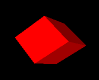

Cylinder

DrawCylinder()
   the x, y, and z coordinates of the center, the height, the radius of the
   top, the radius of the bottom. If one radius is smaller than the other a
   cone is formed.

Disk

DrawDisk()
   the x, y, and z coordinates of center, the radius of the inner circle,
   and the radius of the outer circle. By specifying an additional two
   angle values a partial disk is obtained.

Filled Polygon

FillPolygon()
   the x, y, and z coordinates of each vertex of the polygon.

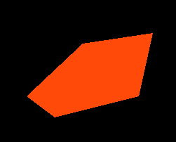

Line

DrawLine()
   the x, y, and z coordinates of each vertex of the line.

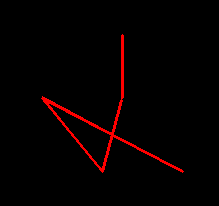

Polygon

DrawPolygon()
   the x, y, and z coordinates of each vertex of the polygon.

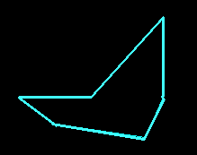

Point

DrawPoint()
   the x, y, and z coordinates of each individual point.

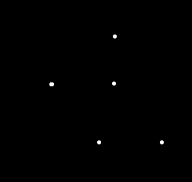

Segment

DrawSegment()
   the x, y, and z coordinates of each vertex of the line segments.

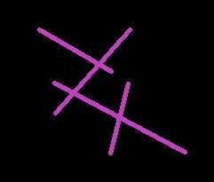

Sphere

DrawSphere()
   the x, y, and z coordinates of center and the radius of the sphere.

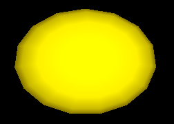

Torus

DrawTorus()
   the x, y, and z coordinates of the center, an inner radius and an outer
   radius.

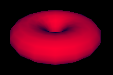

Several functions from the 2D graphics facilities have been extended for
the 3D graphics facilities. By doing this, learning to use the Unicon 3D
graphics facilities may be easier for users of the Unicon 2D graph ics
facilities. These functions are DrawPoint(), DrawLine(), DrawSegment(),
DrawPolygon() and FillPoly gon(), which draw a point, a line, a line
segment, an outline polygon or a filled polygon, respectively. Through
the use of the already present 2D functions, the number of functions
added for the 3D graphics facilities are kept to a minimum.

2.5 Transformations
~~~~~~~~~~~~~~~~~~~

Matrix multiplications are used to calculate transformations, such as
rotations, translations, and scaling, on objects and the field of view.
In order for the user to keep track of matrices and matrix
multiplications, functions to perform several operations are included in
Unicon’s 3D graphics facilities.

In many 3D graphics applications, several transformations are performed
on one object and several other transformations are performed on another
object. For this reason, it is desirable to use different matrices to
perform these calculations. OpenGL keeps track of the current matrix
with a stack of matrices, where the top of the stack is the current
matrix. The Unicon 3D graphics facilities make use of OpenGL’s
implementation of the matrix stack to implement transformations.

Several functions are provided to the Unicon user to manipulate the
matrix stack. The function PushMatrix() pushes a copy of the current
matrix onto the stack. By doing this the user can compose several
different transformations. The function IdentityMatrix() changes the
current matrix to the identity matrix. Finally, to discard the top
matrix and to return to the previous matrix, the function
PopMatrix()will pop the top matrix off the matrix stack.

As in OpenGL, there are two different matrix stacks, projection and
modelview, in the Unicon 3D graph ics facilities. The projection matrix
stack contains matrices that perform calculations on the field of view.
These calculations are based on the current eye attributes. If these eye
attributes are changed, then previous manipulations of the projection
matrix stack are no longer valid. The maximum depth of the projection
matrix stack is two. Trying to push more than two matrices onto the
projection matrix stack will generate a runtime error. The modelview
matrix stack contains matrices to perform calculations on objects within
the scene. Transformations formed using the matrix stack only effect the
objects that a programmer desires. The maximum depth of this stack is
thirty-two. So, pushing more than thirty two matrixes onto the modelview
matrix stack will generate an error. Furthermore, only one matrix stack
can be manipulated at any given time. The function MatrixMode() switches
between the two matrix stacks.

2.6 Lighting and Materials
~~~~~~~~~~~~~~~~~~~~~~~~~~

The use of lighting is an important step in making a 3D graphics scene
appear to be 3D. Adding lighting to a scene can be fairly complicated. A
light source can emit different types of light: ambient light, diffuse
light, and specular light. Ambient light is light that has been
scattered so much that is difficult to determine the source.
Backlighting in a room is an example of ambient light. Diffuse light
comes from one direction. This type of light mostly defines what color
the object appears to be. Finally, specular light not only comes from
one direction, but also tends to bounce off the objects in the scene.

Lighting has been implemented in the Unicon graphics facilities through
the use of context attributes. The use of context attributes reduces the
number of functions added to the Unicon 3D graphics facilities. For a 3D
scene implemented in Unicon, there are eight lights available. Using the
attributes light0 through light7 one can control the eight lights. Each
light is on or off and has the properties diffuse, ambient, specular,
and position.

A scene not only has several lighting properties, but the objects in
scene may have several material properties. The material properties are
ambient, diffuse, and specular, which are similar to the light
properties, emission, and shininess. If an object has an emission
property, it emits light of a specific color. Using combinations of
these material properties one can give an object the illusion of being
made of plastic or metal.

In the Unicon 2D graphics facilities, users use a rich naming scheme to
specify the current foreground color using the attribute fg. Colors can
be specified using a string name, a hexadecimal number, or red, green,
and blue components each between 0 and 65535. The 3D graphics facilities
have extended this idea to the lighting and material properties. For a
material property, the programmer can specify the material property by
stating the type of the material property and then the color that the
property should have. Similarly the values for each of the lights follow
the same pattern. Also, not only can a programmer specify a color in the
same ways as the 2D graphics facilities, but also a color can be given
by providing the red, green, and blue intensities between 0.0 and 1.0.
Examples of lighting and material properties can be found in section
3.3.

By extending the features of the 2D graphics facilities, adding and
changing properties of lights and material has been simplified.
Furthermore, the use of the foreground attribute greatly reduces the
number of lines of code needed for a scene. This design along with
several defaults, a user of the Unicon 3D graphics facilities can have
lighting in a 3D graphics application without much effort.

2.7 Textures
~~~~~~~~~~~~

Another important area of three-dimension computer graphics is textures.
Adding textures to a scene can give it a more realistic feel. In order
to implement textures in the Unicon 3D graphics facilities, several
aspects of texturing have to be taken into account. A texture image can
be viewed as a rectangular image that is “glued” onto objects in a
scene. The appearances of the textured objects in the scene depend on
several key pieces of information supplied by the programmer. These
include the texture image and what parts of the texture image are mapped
to what parts of an object.

| Since not all scenes require the use of textures, the attribute
  texmode is included in the Unicon 3D graphics facilities. By default,
  textures are turned off. In order to turn on texturing in a scene use
  the following line of code

.. code-block:: unicon

   WAttrib(W, "texmode=on")
Once textures are turned on and a texture image is given, the texture
image will be applied to subsequent objects in the scene. By using the
following line of code, textures will be disabled for all successive
objects.

.. code-block:: unicon

   WAttrib(W, "texmode=off")
   Texture images in OpenGL programs are images that have been encoded into
   an array. So if a programmer wants to use a .gif image file, the file
   must be converted into a format accepted by OpenGL. Often times this is
   a cumbersome process to obtain the desired result. For this reason, the
Unicon 3D graphics facilities provide several different formats to
specify a texture image. A texture image can be another Unicon window,
an image file, or a string. If the texture image is a string it must be
encoded in one of two language standard formats. Either it is in the
format

``"width,pallet,data"`` or ``" width,#,data"``

where pallet is one of the pallets described in the 2D graphics
facilities and data is a hexadecimal represen tation of an image. In the
first case the pallet will determine what colors appear in the texture
image. In the second case, the foreground color and background color
will be used. The ability to use another Unicon window as a texture
provides the programmer with greater flexibility for texture images. For
OpenGL, a texture image must be known before the start of the program.
The use of a window as a texture allows the programmer to create a
texture image dynamically.

On many 3D platforms, textures must have a height of 2\ :sup:`n` pixels
and width of 2\ :sup:`m` pixels where n and m are integers. If not, the
texture dimensions are automatically scaled down to the closest power of
2. Rescaling affects application performance and may cause visual
artifacts, so it is best to create textures with appropriate sizes in
the first place. Section 3.4 contains examples on how to use textures
specified in the different forms.

A programmer can give the texture in one of two ways, one can use
WAttrib("texture=...") or the function Texture(t). These methods do
differ in one important way, a window cannot be used as a texture with
WAttrib(). So a function call must be made to Texture() if a window is
to be used as a texture.

For textures, a programmer must specify how a texture is applied to
particular object. This is done by specifying texture coordinates and
vertices. Since a texture image can be viewed as a rectangular image,
texture coordinates are x and y coordinates of the texture image. So the
texture coordinate (0.0, 0.0) corre sponds to the lower left hand corner
of the texture image. The texture coordinates are mapped to the vertices
specified by the programmer. These vertices are usually the vertices of
an object in the scene. Together, the texture coordinates and the
vertices determine what the scene looks like after textures have been
applied.

The design of textures in the Unicon 3D graphics facilities aims to
simplify the process of mapping a texture onto an object by setting
defaults for texture coordinates. There are several ways to specify tex
ture coordinates. To use the defaults given by the Unicon 3D graphics
facilities, one can either use WAt trib("texcoord=auto") or
Texcoord("auto"). The defaults are dependent on the type of primitive
and are outlined in Table 2.

|  If the programmer wishes to use texture coordinates other than the
  defaults, these can be specified in several ways. One can use
  WAttrib("texcoord=s") where s is a comma separated string of real
  number values between 0.0 and 1.0. Each pair of values is to be taken
  as one texture coordinate; there must be an even number of decimal
  values or the assignment of texture coordinates will fail. Also one
  can assign texture coordinates by Texcoord(x1, y1, . . . ) where each
  x and y are real number values between 0.0 and 1.0. Finally one can
  use Texcoord(L) where L is a list of real number texture coordinates.
  The texture coordinates specified by the programmer are used
  differently depending on the type of primitive to be drawn. If the
  primitive is a point, line, line segment, polygon, or filled polygon,
  then a texture coordinate given is assigned to each vertex. If there
  are more texture coordinates than vertices, the unused texture
  coordinates are ignored. If there are more vertices than texture
  coordinates the application of a texture will fail. In order to use
  non default texture coordinates with cubes, tori, spheres, disks, and
  cylinders a programmer should approximate the desired mapping with
  filled polygons. These specifications are given in the following
  table.

| Table 2 – texture coordinates and primitives

Primitive

| Default Texture Coordinates
| (from [OpenGL00] chapter 6)

Effect of Non-default Texture Coordinates

Picture

Cube

The texture image is applied to each face of the cube.

None

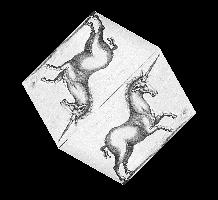

   :width: 150px

| Sphere
| Cylinder

The y texture coordinate ranges linearly from 0.0 to 1.0. On spheres
this is from z= -radius to z=radius; on cylinders, from z = 0 to z =
height. The x texture coordinate ranges None from 0.0 at the positive
y-axis to 0.25 at the positive x-axis, to 0.5 at the negative y-axis to
0.75 at the negative x-axis back to 1.0 at the positive y-axis.

None

| 
| 

| Filled Polygon
| Line
| Polygon
| Segment

The x and y texture coordinates are given by p1x0+p2y0+p3z0+p4w0

A texture coordinate is assigned to a vertex.

| 
| 
| 
| 

Torus

The x and y texture coordinates are given by p1x0+p2y0+p3z0+p4w0

None

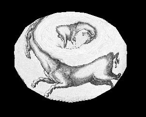

   :width: 150px

2.8 Transparency and Blending
~~~~~~~~~~~~~~~~~~~~~~~~~~~~~

Drawn 3D objects are normally fully opaque, obscuring anything drawn
behind them in a 3D scene. Trans parency adjectives modify colors used
in material surfaces, allowing them to render objects that are not fully
opaque. The transparency adjectives are given in the following table,
progressing from solid to near-invisible.

| Table 3 – transparency adjectives

Transparency name

percent visible

opaque

100

dull, a.k.a. subtranslucent

75

translucent

50

subtransparent

25

transparent

5

When it is set "on", the attribute texmode is used instead of the
current foreground color material specifi cation; the two are mutually
exclusive by default. Attribute texmode may instead be set to
"texmode=blend", a mode in which the current color is applied to the
texture as it is output. By such a technique, a reddish brick texture
could for example be blended with green or blue to provide bricks of
different colors.

3. Examples
===========

The following section provides examples and a further description of the
Unicon 3D graphics facilities.

3.1 Changing Context Attributes
~~~~~~~~~~~~~~~~~~~~~~~~~~~~~~~

As mentioned in the above design section, new context attributes have
been added to the Unicon 3D graphics facilities. The user can change
these attributes throughout a program. To change from an attribute, make
a call to WAttrib() with the window to be drawn on, the attributes to be
changed, and their new values. Multiple attributes can be changed with
one call to WAttrib(). This is illustrated in the following line of
code, where the user changes the eye position to (0.0, 0.0, 5.0) and the
eye direction to look at the positive z-axis on the window w. Since an
assignment to eyepos, eyedir, eyeup or eye redraws the screen, it is
important to note that the following will redraw the scene once.

.. code-block:: unicon

   WAttrib(w, "eyepos=0.0,0.0,5.0","eyedir=0.0,0.0,1.0")
The values of the attributes can also be read by using the function
   WAttrib(). By passing WAttrib() the window and the name of the attribute
   to be read, the user will obtain the value of the specified attributes.
For example, to obtain the value of the current eye position, call

.. code-block:: unicon

   WAttrib(w, "eyepos")
Multiple attributes can be read with one call to WAttrib(). This is
shown in the following line of code where the user reads the current
value of the eye direction and up direction.

.. code-block:: unicon

   every put(attrList, WAttrib(w, "eyedir", "eyeup")

.. _drawing-primitives-1:

3.2 Drawing Primitives
~~~~~~~~~~~~~~~~~~~~~~

The following is an example on how to use some of the functions to draw
primitives.

.. code-block:: unicon

   Fg(w, "ambient yellow")
   DrawDisk(w, 0.4, -0.5, -4.0, 0.0, 1.0, 0.0, 0.0, 1.0, 0.5, -5.0, 0.5, 1.0)
   Fg(w, "diffuse white")
   DrawDisk(w, 0.4, -0.5, -4.0, 0.0, 1.0, 0.0, 225.0,1.0, 0.5, -5.0, 0.5,1.0,0.0,125.0)
   Fg(w, "ambient pink")
   DrawCylinder(w, 0.0, 1.0, -5.0, 1.0, 0.5, 0.3)
   Fg(w, "specular navy")
   DrawDisk(w, -0.5, -0.5, -2.0, 0.5, 0.3)
   Fg(w, "emission green")
   DrawSphere(w, 0.5, 1.0, -3.0, 0.5)
   WAttrib(w, "light0=on, diffuse white")

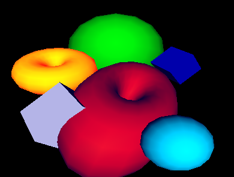

The function Fg(), specifies the material properties of an object. These
material properties affect the color and appearance of the primitives.
After a call to Fg(), all objects will be drawn with the material
properties until the material property is changed with another call to
Fg(). In this example, a cube with a diffuse green material is drawn
with sides of length 0.7. Then a sphere with a diffuse purple and
ambient blue material is drawn with radius 0.5 and center (0.4, -0.5,
-4.0). Next a diffuse yellow and ambient grey torus with center (-1.0,
0.4, -4.0), an inner radius of 0.4, and an outer radius of 0.5 is drawn.
Finally a filled polygon with a diffuse red material property and three
vertices, (0.25, -0.25, -1.0), (1.0, 0.25, -4.0) and (1.3, -0.4, -3.0)
is drawn.

3.3 Slices and Rings
~~~~~~~~~~~~~~~~~~~~

In many cases, it is useful to be able to control the level of detail
when drawing graphics primitives, for exam ple depending on how far away
and/or how large the primitive is. Slices and rings attributes serve
this purpose. Both attributes take integer vales greater than 0 and
denote how closely to approximate the abstract graphics shape when
rendering with simpler graphics primitives such as triangles or quads.
WAttrib("slices=10", "rings=10") for example sets them both to 10.
Greater values achieve smoother and more fine detailed shapes but are
more expensive to render, so these values should be picked with care.
These attributes can also be used to achieve some useful effects, such
as drawing a diamond using the the DrawSphere() function or drawing a
pyramid using the DrawCylinder() function. Slices and rings affect
DrawSphere(), DrawCylin der(), DrawTorus() and DrawDisk() functions. The
example and figure below illustrates the use of slices and rings.

.. code-block:: unicon

   procedure main()
      &window := open("slices & rings", "gl", "size=800,600") | stop("can't open window!")
      Fg("blue")
      WAttrib( "slices=25", "rings=25" )
      DrawSphere(-2.0, 2.0, 0, 0.5)
      WAttrib( "slices=4")
      DrawSphere(-1.0, 2.0, 0, 0.5)
      Rotate(45.0, 0, 1, 0)
      DrawSphere( 0.0, 2.0, 0, 0.5)
      Rotate(-45.0, 0, 1, 0)
      WAttrib( "slices=25", "rings=4")
      Fg("red")
      DrawSphere(-2.0, 0.5, 0, 0.5)
      WAttrib( "slices=4", "rings=4")
      DrawSphere(-1.0, 0.5, 0, 0.5)
      Rotate(45.0, 0, 1, 0)
      DrawSphere(0.0, 0.5, 0, 0.5)
      Rotate(-45.0, 0, 1, 0)
      WAttrib( "slices=25", "rings=25")
      Fg("green")
      DrawCylinder(-2.0, -1, 0, .6, 0.5, 0.01)
      WAttrib( "slices=4", "rings=16")
      DrawCylinder(-1, -1, 0, .6, 0.5, 0.01)
      Rotate(25.0, 0, 1, 0)
      DrawCylinder(0, -1, 0, .6, 0.5, 0.01)
      Rotate(-25.0, 0, 1, 0)
      Eye( 0 , 0.5, 5.2, -1,0.66,0, 0,1,0 )
      Refresh()
      Event()
   end

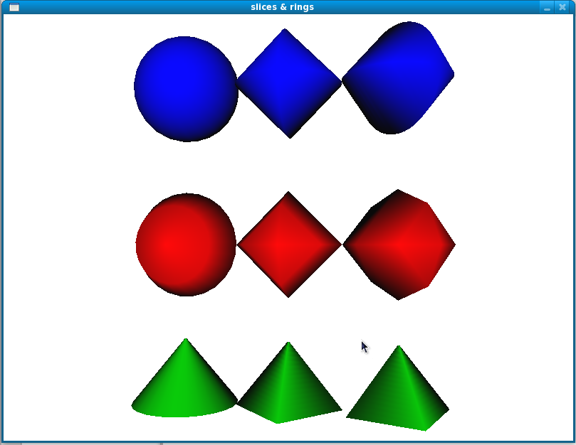

   :width: 300px

.. _lighting-and-materials-1:

3.4 Lighting and Materials
~~~~~~~~~~~~~~~~~~~~~~~~~~

There are a maximum of eight lights that can be used in each scene of
the Unicon 3D graphics facilities. The lights are control by the context
attributes light0 through light7. Each light has five properties that
can be changed throughout the program, ambient, diffuse, specular,
position, and on/off. The properties of a light can be changed by using
WAttrib() and one of light0 through light7. To turn on or off a light,
one can assign "on" or "off" to the light, followed by a comma and a
lighting value. A lighting value is a string which contains one or more
semi-colon separated lighting properties. A lighting property is of the
form

| 

color name

If one does not want to turn on or off a light, a lighting value is
specified. The following is a line of code which turns light1 on and
gives it diffuse yellow and ambient gold lighting properties.

.. code-block:: unicon

   WAttrib(w, "light1=on, diffuse yellow; ambient gold")
The following line of codes sets light0 to the default values for the
lighting properties.

.. code-block:: unicon

   WAttrib(w, "light0=diffuse white; ambient black; specular white; position 0.0, 1.0, 0.0")
The following example shows the difference between the different types
of lighting that can be used in a scene. Each window is the same scene
rendered using different lighting. The upper right scene has an ambient
blue-green light. The upper left scene was drawn using a diffuse
blue-green light. The lower right scene uses only a specular blue-green
light. The scene in the lower left uses all three types of lighting.

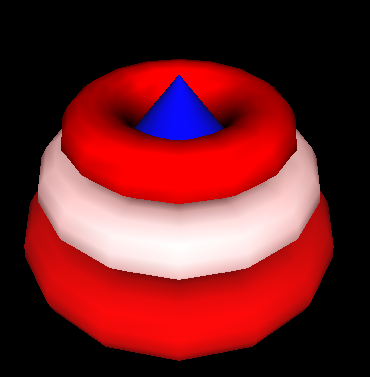

   :width: 300px

.. code-block:: unicon

      w := open("ambient.icn","gl","bg=black", "size=400,400")
      WAttrib(w, "light0=on, ambient blue-green", "fg=specular white")
      DrawCylinder(w, 0.0, -0.2, -3.5, 0.75, 0.5, 0.0)
      DrawTorus(w,0.0, -0.2, -3.5, 0.3, 0.7)
      DrawSphere(w,0.0, 0.59, -2.2, 0.3)
      x := open("diffuse.icn","gl", "bg=black", "size=400,400")
      WAttrib(x, "light0=on, diffuse blue-green", "fg=specular white")
      DrawCylinder(x, 0.0, -0.2, -3.5, 0.75, 0.5, 0.0)
      DrawTorus(x,0.0, -0.2, -3.5, 0.3, 0.7)
      DrawSphere(x, 0.0, 0.59, -2.2, 0.3)
      y := open("specular.icn","gl", "bg=black", "size=400,400")
      WAttrib(y, "light0=on, specular blue-green", "fg=specular white")
      DrawCylinder(y, 0.0, -0.2, -3.5, 0.75, 0.5, 0.0)
      DrawTorus(y, 0.0, -0.2, -3.5, 0.3, 0.7)
      DrawSphere(y, 0.0, 0.59, -2.2, 0.3)
      z := open("all.icn","gl", "bg=black", "size=400,400")
      WAttrib(z, "light0=on, diffuse blue-green; specular blue-green; _
                  ambient blue-green", "fg=specular white")
      DrawCylinder(z, 0.0, -0.2, -3.5, 0.75, 0.5, 0.0)
      DrawTorus(z, 0.0, -0.2, -3.5, 0.3, 0.7)
DrawSphere(z, 0.0, 0.59, -2.2, 0.3)
   Materials can be changed using Fg() or WAttrib() with the context
   attribute fg. A material value is a string containing one or more
   semi-colon separated material properties. Material properties are of the
   form

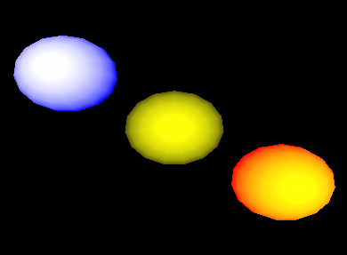

color name or "shininess n", where n is between 0 and 128.

| The default material property type is diffuse, so the call Fg("red")
  is equivalent to Fg("diffuse red"). For shininess, a value of 0
  spreads specular light broadly across an object and a value of 128
  focuses specular light at a single point. The following line of code
  changes the current material property to diffuse green and ambient
  orange.

.. code-block:: unicon

      WAttrib(w, "fg=diffuse green; ambient orange")

a The default values of the material properties are given in the
following example.

.. code-block:: unicon

      Fg(w, "diffuse light grey; ambient grey; _
             specular black; emission black; shininess 50")

The following is an example of several different material properties
used within one scene.

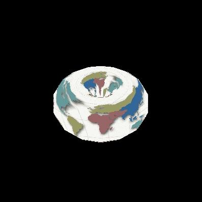

.. code-block:: unicon

      Fg(w, "diffuse blue")
      DrawCylinder(w, 0.0, -0.2, -3.5, 1.2, 1.0, 0.0)
      Fg(w, "diffuse red")
      DrawTorus(w, 0.0, -0.2, -3.5, 0.3, 1.0)
      Fg(w, "diffuse white; ambient red")
      DrawTorus(w, 0.0, 0.2, -3.5, 0.3, 0.9)
      Fg(w, "shininess 10; diffuse red; specular red; ambient black")
DrawTorus(w, 0.0, 0.55, -3.5, 0.3, 0.72)
   First a cylinder with a diffuse blue material is drawn. Then the bottom
   torus is drawn, which has a diffuse red material. Next the middle torus
   is draw with a diffuse white and ambient red property. Finally the top
   torus is drawn with a diffuse red, specular red and ambient property,
   and shininess of 10. Notice, that in order an object not to be drawn
   with a previous material property, that property must be reset to its
   default.

The following example shows the effects of emission color on an object.

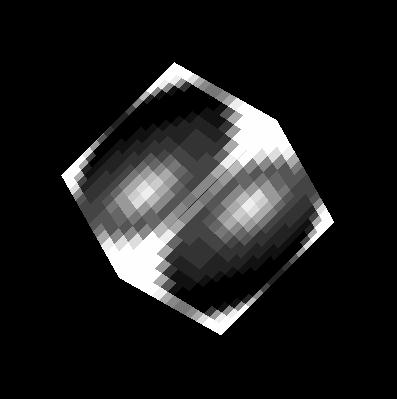

.. code-block:: unicon

      Fg(w, "emission blue; diffuse yellow")
      DrawSphere(w, -1.5, 1.0, -5.0, 0.7)
      Fg(w, "emission black")
      DrawSphere(w, 0.0, 0.0, -5.0, 0.7)
      Fg(w, "emission red")
DrawSphere(w, 1.5, -1.0, -5.0, 0.7)
   In the above example, there are three diffuse yellow spheres drawn. If
   an emission color of blue is applied to the sphere, the sphere appears
   white with a blue ring. If the emission color is red, the sphere remains
   yellow, but now has an orange-red ring. The middle sphere shows the
   effect of having no emission color. Note that in order to obtain the
   diffuse yellow sphere in the center, the emission color had to be change
   to black. It was not needed to change the diffuse material property.

.. _textures-1:

3.5 Textures
~~~~~~~~~~~~

This section contains several examples of the use of textures in a
scene. There are several ways to specify the texture image in the Unicon
3D graphics facilities: a file, an image string, or another Unicon
window. The following example shows how to use a file as a texture. A
.gif image of a map of the word is used to texture a torus. The texture
coordinates are the default coordinates as describe in 2.7.

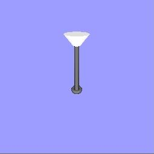

   :width: 250px

.. code-block:: unicon

      WAttrib(w, "texmode=on", "texture=map.gif")
DrawTorus(w, 0.0, 0.0, -3.0, 0.3, 0.4)
   Instead of using WAttrib(w, "texture=map.gif") to specify the .gif file,
   a call to Texture(w, "map.gif") could be used to obtain the same result.

The next example illustrates the use of an image string to specify a
texture image. The format of the string is described in section 2.7. The
string used for this example is taken from Graphics Programming in Icon
[Griswold98] page 156. This string is used as a texture on a cube using
the default texture coordinates.

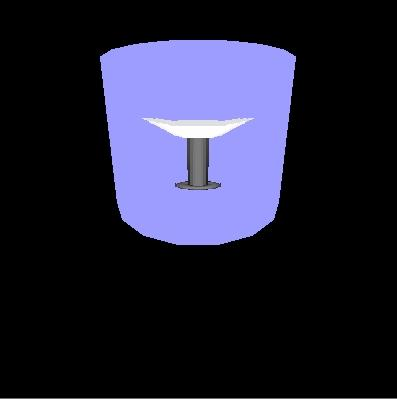

   :width: 250px

.. code-block:: unicon

      WAttrib(w, "texmode=on")
      sphere:= "16,g16, FFFFB98788AEFFFF" ||
               "FFD865554446AFFF FD856886544339FF E8579BA9643323AF"||
               "A569DECA7433215E 7569CDB86433211A 5579AA9643222108"||
               "4456776533221007 4444443332210007 4333333222100008"||
               "533322221100000A 822222111000003D D41111100000019F"||
               "FA200000000018EF FFA4000000028EFF FFFD9532248BFFFF"
      Texture(w, sphere)
DrawCube(w, 0.0, 0.0, -3.0, 1.2)
   The next example shows the use of another Unicon window as a texture. A
   simple scene of a lamp is drawn on the first window, which is opened in
   "gl" mode. This window is then captured and used as a texture on a
   cylinder. If a Unicon window opened in "g" mode as a texture the same
   method can be used. Note that in the following code the first window is
   opened with size 256 x 256. Texture images must have height and width
   that are powers of 2, or the system must rescale them. The default
   coordinates for cylinders are used.

.. code-block:: unicon

      w := open("win1","gl","bg=light blue","size=256,256")
      Fg(w, "emission pale grey")
      PushMatrix(w)
      Rotate(w, -5.0, 1.0, 0.0, 0.0)
      DrawCylinder(w, 0.0, 0.575, -2.0, 0.15, 0.05, 0.17)
      PopMatrix(w)
      Fg(w, "diffuse grey; emission black")
      PushMatrix(w)
      Rotate(w, -5.0, 1.0, 0.0, 0.0)
      DrawCylinder(w, 0.0, 0.0, -2.5, 0.7, 0.035, 0.035)
      PopMatrix(w)
      DrawTorus(w, 0.0, -0.22, -2.5, 0.03, 0.06)
      DrawTorus(w, 0.0, 0.6, -2.5, 0.05, 0.03)
      w2 := open("win2.icn","gl","bg=black","size=400,400")
      WAttrib(w2, "texmode=on")
      Texture(w2, w)
      Fg(w2, "diffuse purple; ambient blue")
DrawCylinder(w2, 0.0, 0.0, -3.5, 1.2, 0.7, 0.7)
   The next two examples illustrate the use of the default texture
   coordinates versus texture coordinates spec ified by the programmer. In
   both examples, a bi-level image is used as the texture image. The format
   for such a string is described in section 2.7. This image is taken from
   Graphics Programming in Icon [Griswold98] page 159. The first example
   uses the default texture coordinates for a filled polygon, which in this
   case is just a square with sides of length one. In this case the default
   texture coordinates are as follows. The coordinate (0.0, 0.0) of the
   texture image is mapped to the vertex (0.0, 0.0, -2.0) of the square,
   (0.0, 1.0) is mapped to (0.0, 1.0, -2.0), (1.0, 1.0) is mapped to (1.0,
   1.0, -2.0), and (1.0, 0.0) is mapped to (1.0, 0.0, -2.0).

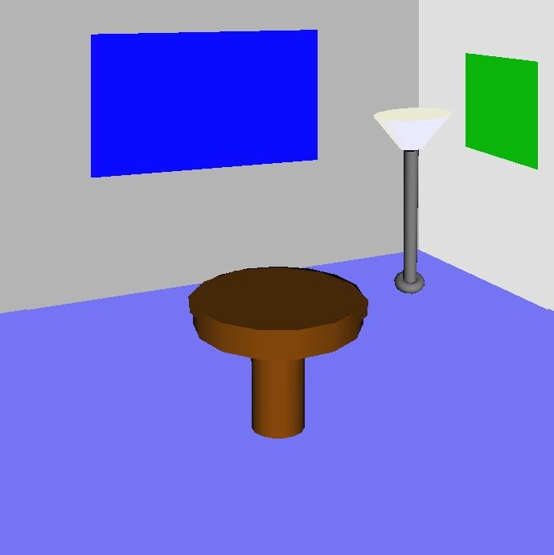

   :width: 250px

.. code-block:: unicon

      WAttrib(w, "fg=white", "bg=blue", "texmode=on", "texture=4,#8CA9")
      Fg(w, "diffuse purple; ambient blue")
FillPolygon(w, 0.0, 0.0, -2.0, 0.0, 1.0, -2.0, 1.0, 1.0, -2.0, 1.0, 0.0, -2.0)
   This example uses the same texture image and the same object to be
   textured, but instead uses the texture coordinates (0.0, 1.0), (1.0,
   1.0), (1.0, 1.0), and (1.0, 0.0). So the coordinate (0.0, 1.0) of the
   texture image is mapped to the vertex (0.0, 0.0, -2.0) of the square,
   (1.0, 1.0) is mapped to (0.0, 1.0, -2.0),(1.0, 1.0) is mapped to (1.0,
   1.0, -2.0), and (1.0, 0.0) is mapped to (1.0, 0.0, -2.0).

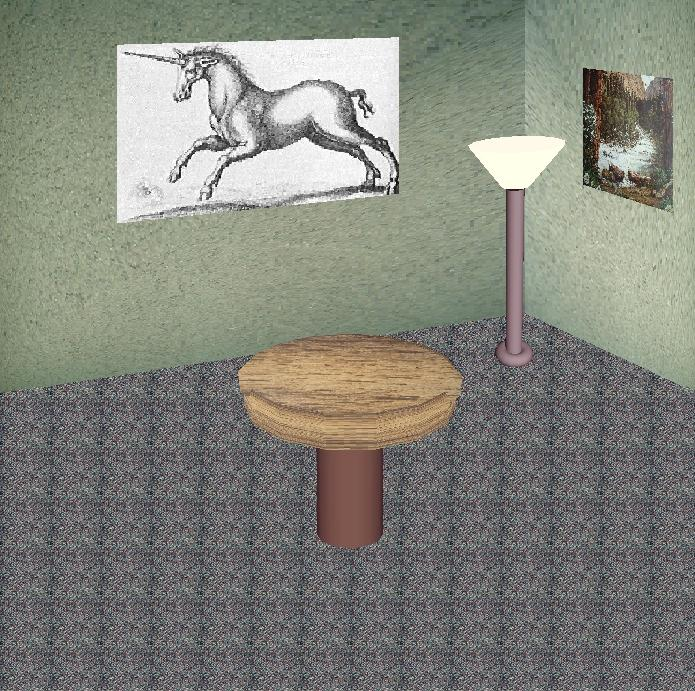

   :width: 250px

.. code-block:: unicon

       WAttrib(w, "fg=white", "bg=blue", "texmode=on",
                  "texcoord=0.0, 1.0, 1.0, 1.0, 1.0, 1.0, 1.0, 0.0", "texture=4,\#8CA9")
FillPolygon(w, 0.0, 0.0, -2.0, 0.0, 1.0, -2.0, 1.0, 1.0, -2.0, 1.0, 0.0, -2.0)
   Also instead of using WAttrib() with the attribute texcoord, the
   function Texcoord() could be used. So the line

.. code-block:: unicon

      WAttrib(w,"texcoord=0.0, 1.0, 1.0, 1.0, 1.0, 1.0,1.0, 0.0")

could be replaced by

.. code-block:: unicon

   Texcoord(w, 0.0, 1.0, 1.0, 1.0, 1.0, 1.0,1.0, 0.0)

3.6 A Larger Textures Example
~~~~~~~~~~~~~~~~~~~~~~~~~~~~~

The following is a more complicated example that uses many features of
the Unicon 3D graphics facilities described in the previous sections.
This example also illustrates the effect that adding texture to a scene
can have. The scene on the left is a scene drawn without any texturing.
The scene on the right contains texturing. The scene on the right is a
much more realistic scene than the one on the left.

All textures used in the textured scene, except for the unicorn, where
captured using a digital camera. These images were then converted into
.gif files and scaled to width and height of 2n. Directly using an image
file is one feature of the Unicon 3D graphics facilities that makes
adding textures simpler than using OpenGL.

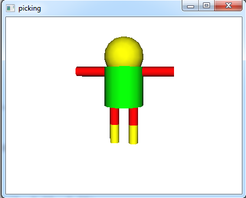

   :width: 200px

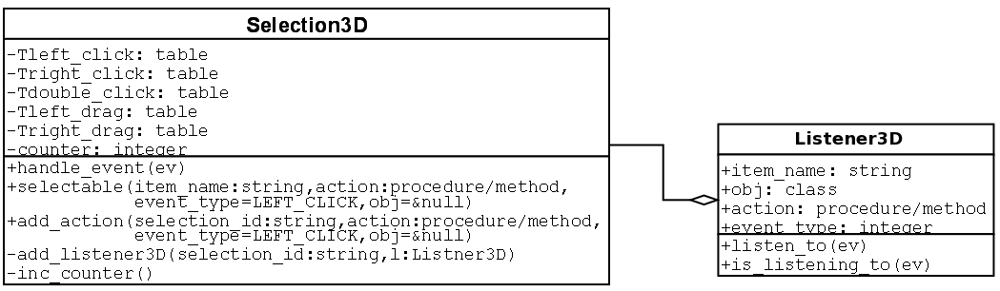

   :width: 200px

An untextured scene

A textured scene

.. code-block:: unicon

   procedure main()
      &window :=open("textured.icn","gl","bg=black","size=700,700")
      # Draw the floor of the room
      WAttrib("texmode=on", "texture=carpet.gif")
      FillPolygon(-7.0, -0.9, -14.0, -7.0, -7.0, -14.0,
      7.0, -7.0, -14.0, 7.0, -0.9, -14.0, 3.5, 0.8, -14.0)
      # Draw the right wall
      WAttrib("texture=wall1.gif", "texcoord=0.0, 1.0, 0.0, 0.0, 1.0, 0.0, 1.0, 1.0")
      FillPolygon(2.0, 4.0, -8.0, 8.3, 8.0, -16.0, 8.3, -1.2, -16.0, 2.0, 0.4, -8.0)
      # Draw the left wall
      WAttrib("texture=wall2.gif")
      FillPolygon(2.0, 4.0 ,-8.0, -9.0, 8.0, -16.0, -9.0,-1.2,-16.0, 2.0, 0.4, -8.0)
      # Draw a picture
      WAttrib("texture=poster.gif", "texcoord=0.0, 1.0, 0.0, 0.0, 1.0, 0.0, 1.0, 1.0")
      FillPolygon(1.0, 1.2, -3.0, 1.0, 0.7, -3.0, 1.2, 0.5, -2.6, 1.2, 1.0, -2.6)
      # Draw another picture
      WAttrib("texture=unicorn.gif", "texcoord=1.0, 0.0, 0.0, 0.0, 0.0, 1.0, 1.0, 1.0")
      FillPolygon(0.8, 2.0, -9.0, -3.0, 1.6, -9.0, 3.0, 3.9,-9.0, 0.8, 4.0, -9.0)
      # Draw the lamp
      WAttrib("texmode=off")
      PushMatrix()
      Translate(0.7, 0.20, -0.5)
      Fg("emission pale weak yellow")
      PushMatrix()
      Rotate(-5.0, 1.0, 0.0, 0.0)
      Rotate( 5.0, 0.0, 0.0, 1.0)
      DrawCylinder(-0.05, 0.570, -2.0, 0.15, 0.05, 0.17)
      PopMatrix()
      Fg("diffuse grey; emission black")
      PushMatrix()
      Rotate(-5.0, 1.0, 0.0, 0.0)
      Rotate( 6.0, 0.0, 0.0, 1.0)
      DrawCylinder(0.0, 0.0, -2.5, 0.7, 0.035, 0.035)
      PopMatrix()
      PushMatrix()
      Rotate(6.0, 0.0, 0.0, 1.0)
      DrawTorus(-0.02, -0.22, -2.5, 0.03, 0.05)
      PopMatrix()
      PopMatrix()
      # Draw the table
      WAttrib("texcoord=auto", "texmode=on", "texture=table.gif")
      PushMatrix()
      Rotate(-10.0, 1.0, 0.0,0.0)
      DrawCylinder(0.0, 0.2, -2.0, 0.1, 0.3, 0.3)
      PopMatrix()
      PushMatrix()
      Translate(0.0, -0.09, -1.8)
      Rotate(65.0, 1.0, 0.0, 0.0)
      DrawDisk(0.0, 0.0, 0.0, 0.0, 0.29)
      PopMatrix()
      WAttrib("texmode=off", "fg=diffuse weak brown")
      PushMatrix()
      Rotate(-20.0, 1.0, 0.0,0.0)
      DrawCylinder(0.0, 0.2, -2.2, 0.3, 0.1, 0.1)
      PopMatrix()
      while (e := Event()) ˜== "q" do {
         write(image(e), ": ", &x, ",", &y)
         }
   end

In order to apply textures to the scene, texturing must first be turned
on. Next, the texture to be applied is specified. Then the floor of the
scene is drawn, which is done by using a filled polygon. The default
texture coordinates are used to apply the carpet texture to the floor of
the room. The tiled appearance on the floor of the room is caused by the
use of the default texture coordinates. This can be avoided by using
user defined texture coordinates. This is what is done for the textures
that are applied to the two walls of the room and the pictures.

The lamp does not have any texturing applied to it, so it is necessary
to turn off texturing before drawing the lamp. Also for the lamp to be
centered properly in the room, transformations are used. Notice the use
of matrices to isolate the transformations of the lamp. Finally to draw
the table with a textured top and an untextured base, two cylinders and
a disk are used. Texturing is applied to a cylinder and the disk. Notice
the call

WAttrib(w, "texcoord=auto")
   This resets the texture coordinates to the defaults. Finally, texturing
   is turned off to draw the base of the table.

3.7 Animation
~~~~~~~~~~~~~

Graphics animation is performance sensitive, and Unicon is substantially
slower than lower level systems programming languages such as C and C++.
Nevertheless, it is possible to prototype simple 3D animations using
Unicon; applications with few moving objects can achieve smooth
animation with acceptable frame rates.

In OpenGL, animations are normally written to redraw the entire scene
each time any object has moved, or the user has changed point of view.
An application can repeatedly call EraseArea() followed by the
appropriate graphics primitives to achieve this effect, but the results
often appear to flicker. It is better to let OpenGL’s built-in double
buffering, and Unicon’s runtime system, do the redrawing. Unicon
maintains a display list of graphics operations to execute whenever the
screen must be redrawn; these operations are effectively everything
since the last EraseArea(). The display list for a window can be
obtained by calling WindowContents(). The elements of the list are
Unicon records and lists containing the string names and parameters of
graphics primitives. For example, a call to DrawSphere(w,x,y,z,r)
returns (and adds to the display list) a record gl_sphere("DrawSphere",
x, y, z, r). Instead of redrawing the entire scene in order to move an
object, you can modify its display list record and call Refresh(). The
following code fragment illustrates animation by causing a ball to slide
up and down. In order to “bounce” the program would need to incorporate
physics.

.. code-block:: unicon

      sphere := DrawSphere(w, x, y, z, r)
      increment := 0.2
      every i := 1 to 100 do {
         every j := 1 to 100 do {
            sphere.y +:= increment
            Refresh(w)
            }
         }

This technique gives animation rates of 100-200 frames per second in
simple tests on current midrange PC hardware, indicating that the system
will support smooth animation, at least for small numbers of objects.

3.8 Object Selection
~~~~~~~~~~~~~~~~~~~~

Many 3D applications allow the user to interact with, select, or
identify 3D objects in a scene by clicking on objects with the mouse. In
Unicon, a window attribute (pick) enables or disables 3D selection. When
pick=on, keyword &pick can be used to access the 3D selection results.
The function (WSection()) is used to name objects in the scene. The
steps required to use 3D selection in Unicon are summarized by the
following:

| • Enable the selection
| • Give selectable 3D objects unique string names
| • Collect selection results through the keyword &pick
|  Although this section uses the word “selection” freely to refer to 3D
  object selection, the Unicon language consistently uses “pick” instead
  of “select” for 3D objects. The reason for this is that “selection” is
  used in other ways in computing systems and user interfaces. In Unicon
  and in certain window systems, it refers to the mechanism used when
  data is copied and pasted between applications.

3.8.1 Controlling the selection state
~~~~~~~~~~~~~~~~~~~~~~~~~~~~~~~~~~~~~

Attribute "pick" turns on or off selection within portions of a rendered
scene. To turn on 3D selection at any point in the program, the
following statement should be inserted at that point:

.. code-block:: unicon

   WAttrib("pick=on")
To turn off the 3D selection, simply make another call to WAttrib():

.. code-block:: unicon

   WAttrib("pick=off")
To check the current 3D selection state (on or off), the function
   WAttrib can be called with the string parameter "pick" (i.e
   WAttrib("pick") ) and it will return a string value of "on" or "off"
   depending on the current 3D selection state. By default 3D selection is
   turned off. The program can turn on and off the 3D selection depending
   on the program requirements. For a better performance, selection should
   be turned off for all non-selectable objects in the scene.

3.8.2 Naming 3D objects
~~~~~~~~~~~~~~~~~~~~~~~

3D Objects are defined by their corresponding rendered primitives. The
function WSection() marks the beginning and the ending of a section that
holds a 3D object. A call to WSection() with a parameter string marks
the beginning of a 3D object with the string as its name. Another call
to WSection with no string parameter marks the end of the 3D objects.
All of the rendered graphics between a beginning WSection() and its
corresponding ending WSection are parts of the same object. To make it
selectable, a 3D object must have at least one graphical primitive. A
line or a sphere are examples of such primitives. The string name should
be unique to distinguish different objects from each other. Different
objects could have the same name if the same action would be taken no
matter which of these objects is picked. The following code fragment is
an example of named 3D objects. It simply draws a red rectangle and
gives it the name "redrect".

.. code-block:: unicon

   WSection("redrect") # beginning of a new object named redrect
   Fg("red")
   FillPolygon(0,0,0, 0,1,0, 1,1,0, 1,0,0)
   WSection()
   # end of the object redrect

In the example above WSection("redrect") marks the beginning of a new
object with the name redrect. Fg("red") doesn’t affect selection because
it doesn’t produce a rendered object. FillPolygon(0,0,0, 0,1,0, 1,1,0,
1,0,0) on the other hand does affect selection because it produces a
rendered object, and it actually represents the object named redrect.
WSection() marks the end of the object named redrect.

3.8.3 Retrieving picked objects
~~~~~~~~~~~~~~~~~~~~~~~~~~~~~~~

The keyword &pick generates the names of objects that were clicked on at
the last returned event, if they were associated with a name using
WSection(name). A given mouse click might correspond to multiple objects
that are rendered along the ray from the camera through the point
clicked. In addition, WSection() calls may be nested, in which case the
name reported by &pick will be a concatenation (separated by hyphens) of
the WSection() names enclosing the object clicked. The following code
fragment writes all of the objects names that were picked by the mouse
click:

.. code-block:: unicon

      every picked_object := &pick do
write(" picked object :", picked_object)
   If there were no selectable objects under the cursor at the time of the
   event, &pick just fails and produces no results. &pick gets its results
   from both left-clicks and right-clicks.

These ideas are illustrated in the following example, which draws a
crude humanoid figure. The rendering function turns "pick=on" and then
uses WSection() calls to identify different parts of the figure.

.. code-block:: unicon

   procedure drawman()
      h := 2.0
      WAttrib("pick=on")
      WSection("man")
      WSection("body")
      Fg("green")
      DrawCylinder(0, 0, 0, h, 1.0, 1.0)
      WSection()
      WSection("head")
      Fg("yellow")
      DrawSphere(0.0,h+0.5,0.0, 1.0)
      WSection()
      WSection("rightleg")
      WSection("upperrightleg")
      Fg("red")
      DrawCylinder(-0.5, -h/2, 0, h/2, 0.25, 0.25)
      WSection()
      WSection("lowerrightleg")
      Fg("yellow")
      DrawCylinder(-0.5, -h, 0, h/2, 0.25, 0.25)
      WSection()
      WSection()
      WSection("leftleg")
      WSection("upperleftleg")
      Fg("red")
      DrawCylinder(0.5, -h/2, 0, h/2, 0.25, 0.25)
      WSection()
      WSection("lowerleftleg")
      Fg("yellow")
      DrawCylinder(0.5, -h, 0, h/2, 0.25, 0.25)
      WSection()
      WSection()
      PushMatrix()
      Translate(0.5, h-0.25, 0.0)
      Rotate(-90, 0, 0, 1)
      WSection("leftarm")
      Fg("red")
      DrawCylinder(0, 0, 0, h, 0.25, 0.25)
      WSection()
      PopMatrix()
      PushMatrix()
      Translate(-0.5, h-0.25, 0.0)
      Rotate(90, 0, 0, 1)
      WSection("rightarm")
      Fg("red")
      DrawCylinder(0, 0, 0, h, 0.25, 0.25)
      WSection()
      PopMatrix()
      WSection()
   end

The event-handling code for &lpress looks in &pick to see what (if
anything) the user was selecting.

.. code-block:: unicon

   procedure main()
      &window := w := open("picking" , "gl", "size=400,300") |
                            stop(" failed to open 3d window! ")
      drawman()
      Eye(-2,1.8,-12, 0,0,0, 0,1,0 )
      Refresh(w)
      repeat {
      case e := Event(w) of {
         "q"|"\e" : { return }
         &lpress : {
            write(" mouse click" )
            every item := &pick do {
               write( "on part:", item)
               }
            }
         }
      }
   end

3.8.4 Higher level Interface for 3D Object Selection
~~~~~~~~~~~~~~~~~~~~~~~~~~~~~~~~~~~~~~~~~~~~~~~~~~~~

Using 3D selection directly through WSection() function and &pick
keyword is easy. The programmer should give unique names for objects
using WSection(), and then collect selected objects names by scanning
string names generated using &pick, and then take the appropriate action
based on the selected object. For small programs with very few
selectable objects this is a trivial task and maybe the easy and clean
way to do it, But once the program and the number of the selectable
objects gets larger, managing the selectable objects and the actions to
be taken based on object selection especially if the objects are
hierarchical could be challenging and cumbersome. When using selection,
from a high level and abstracted view the programmer defines a
selectable object and assigns an action to it to be taken when this
object is selected. It can be thought of as GUI objects, when you create
a button for example, you do not worry about the button name (except to
make it readable and meaningful), and you do not worry about how or when
this button was clicked. All of what you want is to take an action if
this button is clicked. This section discusses the introduction of a new
class to the Unicon language for this purpose. Managing 3D selection and
adding a high level abstracted layer for using 3D selection.

For better code organization a new class was introduced with the name
Selection3D. The class holds information about what objects are
selectable, what events should these objects respond to and what is the
action to be taken when an object is selected (received an event that it
should respond to). Any selectable object can respond to one or more
mouse events. A separate table for each one of these mouse events
(except for CLICK and DRAG, they simply reuses other events tables)
keeps all of the objects that can respond to that particular event. For
example there is a table of all objects that can respond to a LEFT_CLICK
event if any of these objects were selected. This table is called
Tleft_click. The mouse events that are recognized by this class and to
what table each of these events maps to are listed in Figure 2.

CLICK

→ Tleft_click and Tright_click

LEFT_CLICK

→ Tleft_click

RIGHT_CLICK

→ Tright_click

DOUBLE_CLICK

→ Tdouble_click

DRAG

→ Tleft_drag and Tright_drag

LEFT_DRAG

→ Tleft_drag

RIGHT_DRAG

→ Tright_drag

| Figure 2. Events that are recognized by the selection3D class and the
| mapping between these events and their corresponding objects tables

The Selection3D class uses another helper class to store information
about each selectable object, its name (given by the user), the action
associated with it, the class objects that holds the action if the
action is a method, and the event type (specified by the user). Figure 3
shows the two classes and their relationship

| 
| Figure 3. UML diagram for the classes used to manage/control 3D object
  selection

To make Selection3D class available to a program, the following
statement should be added at beginning of the source code.

::

   link selection3D

An instance of this class can be created simply by an assignment
statement. The following example line creates this instance and store it
in a variable called select3D:

::

   select3D := Selection3D()

The Selection3D class has three methods that can be called to manage the
3D selection in the program. The first method is selectable(), which is
used to register new 3D objects to make them selectable. This method
takes up to four parameters in the following order

| • A string name of the 3D object. The name does not affect the
  selection behavior in any way.
| • A procedure/method name to be called when this 3D object is selected
| • An optional event type which could be any of the event types shown
  in Figure 2. The default event type is LEFT_CLICK
| • The class object that has the method name (second parameter). This
  is only valid (and mandatory) if the second parameter is a method
  which is part of a class object.

The method selectable() returns a string value which is referred to as a
selection_id. A selection_id is a unique value that can then be passed
to WSection() to mark a new 3D object name. The following is an example
of such use

::

   select_id := select3D.selectable("red ball", on_red_ball)
WSection(select_id)
   In this example a 3D object named "red ball" was registered to be
   selectable. The procedure on_red_ball will be called if this 3D object
   is selected. No event type was passed in the call so this 3D object will
   respond to mouse left click. on_red_ball must be a procedure name (not a
   method) so nothing should be passed as a fourth parameter also. The
   example also shows how is the returned value select_id was passed to
   WSection().

The second method in Selection3D class is add_action(). This method
takes four parameters exactly like selectable() except for the first
parameter. Instead of taking a random string name, it takes a string
name that was returned and registered by selectable() to add another
action or response to another kind of event. In the example above the
following line of code can be added right after the first line to make
the red ball respond to mouse right click by calling the procedure
on_right_click():

::

   select3D.add_action(select_id, on_right_click, select3D.RIGHT_CLICK)

The third and the last method in the Selection3D class is
handle_event(). Normally this method should be part of the event
handling loop in the program. At least all types of mouse events in
Unicon should be passed to this method. This lets the Selection3D class
to collect events information and picked objects through &pick and take
the appropriate action. Failure to pass any kind of mouse events to the
Selection3D class might cause it not to produce the interned behavior.
i.e. 3D object selection would not work as you expect. A correct way to
use the method handle_event() is shown toward the end of the following
complete example

.. code-block:: unicon

   link selection3D
   global select3D
   procedure on_red_ball()
      write(" You picked the red ball!")
   end
   procedure on_blue_ball()
      write("You picked the blue ball")
   end
   procedure main()
      &window := open("3D selection in Unicon", "gl","size=500,500") |
      stop("can't open 3D window")
      select3D := Selection3D()
      # begin a new selectable section/object with the name "red ball"
      WAttrib("pick=on") #turn on 3D selection
      select_id := select3D.selectable("red ball", on_red_ball)
      WSection(select_id)
      Fg("red")
      DrawSphere(1, 0.5, 0, 0.5)
      WSection() # end of the red ball
      # Draw a nonselectable green ball
      Wattrib("pick=off") #turn off 3D selection
      Fg("green")
      DrawSphere(-1, 0.5, 0, 0.5)
      # begin a new selectable section/object with the name "blue ball"
      WAttrib("pick=on") #turn on 3D selection
      select_id := select3D.selectable("blue ball", on_blue_ball)
      WSection(select_id)
      Fg("blue")
      DrawSphere(0, -0.5, 0, 0.5)
      WSection() # end of the blue ball

      #setup the eye just to make sure where are looking exactly at the spheres
      Eye(0,0,4, 0,0,0, 0,1,0)
      Refresh()
      repeat {
         # enter an event loop to handle user events
         if ev := \Event() then {
            select3D.handle_event(ev)
            if ev ===("\e"|"q") then exit(0)
            }
         }
   end

4. Open Issues and Conclusions
==============================

The Unicon 3D graphics facilities provide many of the features of 3D
graphics programming. Several areas in which improvements and extensions
can be made have been discussed where appropriate in previous sections.
Besides those topics already mentioned throughout the paper, there are
several areas where work could still be done. These areas include
animation, composition, and simplification of the design of the matrix
stack.

The Unicon 3D graphics facilities do not contain special features to
simplify the process of animation. Future work may include the
examination of different ways to directly support animation in Unicon.
Composition is viewing several different pieces as one piece. For
example, say the user wants to imple ment a moving car. To do this, the
user would need to break the car into several pieces, possibly, four
tires, a car body, windows, and lights. To make the process of
simulating the moving car easier, one would like these individual pieces
to be one piece. Currently, a Unicon programmer can develop such
applications using the 3D graphics facilities. The question remains
whether composition should be added as a feature of the Unicon 3D
graphics facilities.

The design of matrices and transformation in the Unicon 3D graphics
facilities is similar to the design of OpenGL. For this reason, there is
no advantage gained over OpenGL in the area of transformations. It might
be necessary in the future to consider ways to simplify matrices and
transformation in Unicon. One improve ment to consider is a reduction in
the number of parameters needed for function like Translate(), Rotate()
and Scale(). The elimination of the need for two different matrix stacks
might be another simplification.

The current Unicon 3D graphics facilities have made an improvement over
OpenGL in terms of the number of lines of coded needed to implement a 3D
graphics application. Programmers that want to develop 3D graphics
applications but do not have the time to learn one of the standard
toolkits might find this project valuable. Although the Unicon 3D
graphics facilities provide the important feature of 3D graphics, there
are some limitations. One limitation might be the lack of some feature
in Unicon that are available in OpenGL. Another limitation might be the
use of default parameters that are used in some feature of the Unicon 3D
graphics facilities. These defaults reduce the flexibility of the
programmer and will be seen as a restriction by some. Future work on the
Unicon 3D graphics facilities might include the addition of attributes
or other mechanisms to remove those of these limits which prove to be
problems. The current Unicon 3D graphics facilities provide a basis in
which 3D graphics can be implemented in Unicon.

5. Functions and Attributes
===========================

The built-in functions attributes in the Unicon 3D graphics facilities
are described in this section. For all functions with a window argument
W, the parameter can be omitted. Also the use of “. . . ” indicates that
more arguments can be given. By doing this, the result is similar to
that of multiple function calls. The window argument should not be
specified again for this case.

5.1 New Functions
~~~~~~~~~~~~~~~~~

The functions in this section have been added specifically for the
Unicon 3D graphics facilities.

--------------

| DrawCube(file, real, real, real, real,. . . ): record
| draws a cube

DrawCube(W, x, y, z, l. . . ) draws a cube with sides of length l at the
position (x, y, z) on the window W. The display list element is
returned. This procedure fails if the context attribute, dim, is set to
2.

--------------

| DrawCylinder(file, real, real, real, real, real, real,. . . ): record
| draws a cylinder

DrawCylinder(W, x, y, z, h, r1, r2, . . . ) draws a cylinder with a top
of radius r1, a bottom with radius r2, and a height h. The disk is
centered at the point (x, y, z). The display list element is returned.
This procedure fails if the context attribute dim is set to 2.

--------------

| DrawDisk(file, real, real, real, real, real, real, real,. . . ):
  record
| draws a partial disk

DrawDisk(W, x, y, z, r1, r2, a1, a2, . . . ) draws a disk on the window
W centered at (x, y, z). The inner circle has radius r1 and the outer
circle has radius r2. The parameters a1 and a2 are optional. If they are
specified, a partial disk is drawn with a starting angle a1 and sweeping
angle a2. The display list element is returned.

--------------

| DrawSphere(file, real, real, real, real,. . . ): record
| draws a sphere

DrawSphere(W, x, y, z, r,. . . ) draws a sphere with radius r centered
at (x, y, z) on the window W. The display list element is returned. This
procedure fails if the context attribute dim is set to 2.

--------------

| DrawTorus(file, real, real, real, real, real,. . . ): record
| draw a torus

DrawTorus(W, x, y, z, r1, r2,. . . ) draws a torus with inner radius r1,
outsider radius r2, and centered at (x, y, z) on the window W. The
display list element is returned. This procedure fails if the context
attribute dim is set to 2.

--------------

| Eye(file, real, real, real, real, real,. . . ): record
| place camera

Eye(W, x, y, z, x2, y2, z2, x3,y3,z3) places the camera at position
(x1,y1,z1) looking at the point (x2,y2,z2). The direction (x3,y3,z3)
will be “up” in the rendered scene.

--------------

| IdentityMatrix(file): record
| load the identity matrix

IdentityMatrix(W) changes the current matrix to the identity matrix. The
display list element is returned.

--------------

| MatrixMode(file, string): record
| changes the matrix mode

MatrixMode(W, s) changes the matrix mode to s. The string s must be
either "projection" or "modelview", otherwise this procedure fails. The
display list element is returned.

--------------

| MulMatrix(file, x): list
| multiply transformation matrix

MulMatrix(W, L) multiply transformation matrix by the list L where \*L
is 16.

MulMatrix(W, x1, . . . , x16) multiply transformation matrix by the
numbers x1 ... x16.

In both cases above, the values represent a matrix of size 4x4 stored in
column format. The values should be exactly 16 otherwise the function
will fail.

--------------

| Normals(file, x): list
| set normals

Normals(W, L) sets the normals to use for subsequent rendered objects to
those given in list L.

Normals(W, x1,y1,z1, ..., xn,yn, zn) sets the normals to use for
subsequent rendered objects to x, y and z values. Each x, y, z triple
forms one normal coordinate that corresponds to one vertex.

In all cases the display list element is returned.

--------------

| PopMatrix(file): record
| pop a matrix from the matrix stack

PopMatrix(W) pops the top matrix from the matrix stack. The matrix stack
is determined by the current matrix mode, either "projection" or
"modelview". This procedure fails if there is only one matrix on the
matrix stack. The display list element is returned.

--------------

| PushMatrix(file): record
| push a matrix onto the matrix stack

PushMatrix(W) pushes a copy of the current matrix onto the matrix stack.
The current matrix mode determines what stack the new matrix is pushed
upon. This procedure fails if the matrix mode is "projection" and there
are already two matrices on the stack. If the matrix mode is "modelview"
and there are already thirty two matrices on the stack, then this
procedure will fail. The display list element is returned.

--------------

| Refresh(file):file
| redraw the window

Refresh(W) redraws the contents of the window. The window W is returned.

--------------

| Rotate(file, real, real, real, real,. . . ): record
| rotate objects

Rotate(W, a, x, y, z,. . . ) rotates objects affected by this
transformation by the angle a, in around the axis represented by the
vector formed of the (x, y, z) values. The display list element is
returned.

--------------

| Scale(file, real, real, real,. . . ): record
| scales objects

Scale(W, x, y, z,. . . ) scales object according to the given x, y and z
coordinates. The display list element is returned.

--------------

| Texcoord(file, X):list
| define texture coordinates

Texcoord(W, x1, y1, . . . , xn, yn) sets the texture coordinates to x1,
y1, . . . , xn, yn. Each x, y, pair forms one texture coordinate. Every
x must match to a y otherwise the assignment of texture coordinates will
fail.

Texcoord(W, L) sets the texture coordinates to those specified in the
list L.

Texcoord(W, s) sets the texture coordinates to those specified by s. The
string s must be "auto" otherwise the procedure will fail. In all cases
the display list element is returned.

--------------

| Texture(file, X): record
| apply a texture

Texture(W, s) creates a texture image that is applied to subsequent
objects on the window W. The string s specifies the texture image as a
filename, a string of the form width,pallet,data or width,#,data, where
pallet is a pallet from the Unicon 2D graphics facilities and data is
the hexadecimal representation of an image. The display list element is
returned.

Texture(W1, W2) creates a texture image that is applied to subsequent
objects on the window W1. The file W2 is another Unicon window. The
contents of W2 are used to create the texture image. The display list
element on W1 is returned.

Texture(W1, R) creates a texture image that is applied to subsequent
objects on the window W1. The Record R is another texture record that
will be used to create the new texture reusing R texture data. This is
useful to reapply the same texture on different places in the program.

--------------

| Translate(file, real, real, real,. . . ): record
| translate objects

Translate(W, x, y, z,. . . ) moves objects affected by this
transformation in the direction (x, y, z). The display list element is
returned.

--------------

| WindowContents(file):list
| produce contents of window

WindowContents(W) returns a Unicon list of display elements, which are
records or lists. Each element has a function name followed by the
parameters of the function, or an attribute followed by its value. The
display list is further described in section 3.6.

5.2 Extensions from the 2D Graphics Facilities
~~~~~~~~~~~~~~~~~~~~~~~~~~~~~~~~~~~~~~~~~~~~~~

Several functions from the Unicon 2D graphics facilities have been
modified for use in the 3D facilities. This section describes the
parameters and use of these functions.

--------------

| DrawLine(file, real, real, real, . . . ): list
| draw a line

DrawLine(W, x1, y1, z1, . . . ,xn, yn, zn) draws a line connecting the n
vertices specified by (x, y, z). If only one set of vertices is given,
then no line is drawn. If the attribute dim is set to 2, then
DrawLine(W, x1, y1,...,xn, yn) draws a line connecting the n vertices of
the form (x, y). If the attribute dim is set to 4, then DrawLine(W, x1,
y1,z1, w1... ,xn, yn,zn, wn) draws a line connecting the n vertices of
the form (x, y, z, w). The display list element is returned.

DrawLine(W, L) draws lines whose coordinates are passed as a list of
real values.

--------------

| DrawPoint(file, real, real, real, . . . ): list
| draw points

DrawPoint(W, x1, y1, z1, . . . ) for each set of vertices (x, y, z) a
point is drawn. If the attribute dim is set to 2, then DrawPoint(W, x1,
y1,...) draws points of the form (x, y). If the attribute dim is set to
4, then DrawPoint(W, x1,y1,z1,w1...) draws points of the form (x, y, z,
w). The display list element is returned.

DrawPoint(W, L) draws points whose coordinates are passed as a list of
real values.

--------------

| DrawPolygon(file, real, real, real, . . . ): list
| draw a polygon

DrawPolygon(W, x1, y1, z1, . . . , xn, yn, zn) draws an outline of a
polygon formed by connecting the n vertices of the form (x, y, z). If
the value of the context attribute dim is 2 then DrawPolygon(W, x1, y1,
. . . , xn, yn) draws an outline of a polygon using the n vertices of
the form (x, y). If dim is set to 4, then DrawPolygon(W, x1, y1, z1, w1
. . . , xn, yn, zn, wn) draws an outline of a polygon formed by
connecting the n vertices of the form (x, y, z, w). The display list
element is returned.

DrawPolygon(W, L) draws polygons/shapes whose coordinates are passed as
a list of real values.

This function can be used to draw shapes other than polygons, this
feature can be controlled by the attribute meshmode which is discussed
in the New Attributes section.

--------------

| DrawSegment(file, real, real, real, . . . ): list
| draw segments

| DrawSegment(W, x1, y1, z1, x2, y2, z2,. . . ) draws a line segment
  between a pair of vertices of the form (x, y, z). If the context
  attribute dim has value 2 then DrawSegment(W, x1, y1, x2, y2,. . . )
  draws a line segment between a pair of vertices of the form (x, y). If
  the context attribute dim has value 4 then DrawSegment(W, x1, y1, z1,
  w1, x2, y2, z2, w2,. . . ) draws a line segment between a pair of
  vertices of the form (x, y, z, w). If an odd number of vertices if
  given, then the last vertex is ignored. The display list element is
  returned.
| DrawSegment(W, L) draws line segments whose coordinates are passed as
  a list of real values.

--------------

| EraseArea():file
| clear the contents of the window

EraseArea(W) clears the contents of the window. Although the 2D
facilities allow for specifying a specific area, EraseArea() erases the
entire contents of a 3D window.

--------------

| Fg(file, string):string
| get/set foreground color

Fg(W, s) changes the material properties of subsequently drawn objects
to the material properties speci fied by s. The string s must be one or
more semi-colon separated material properties. A material property is of
the form

color name or "shininess n", where n is between 0 and 128.

If string s is omitted, the current values of the material properties
will be returned.

--------------

| FillPolygon(file, real, real, real, . . . ): list
| draw a filled polygon

| FillPolygon(W, x1, y1, z1, . . . , xn, yn, zn) draws a filled polygon
  formed from the n vertices of the form (x, y, z) and the current
  foreground color. If the context attribute dim is set to 2, then
  FillPolygon(W, x1, y1, . . . , xn, yn) draws a filled polygon formed
  from the n vertices of the form (x, y) and the current foreground
| color. If dim is set to 4, then FillPolygon(W, x1, y1, z1, w1 . . . ,
  xn, yn, zn, wn) draws a filled polygon formed from the n vertices of
  the form (x, y, z, w) and the current foreground color. The display
  list element is returned.
| FillPolygon(W, L) draws filled polygons/shapes whose coordinates are
  passed as a list of real values. This function can be used to draw
  shapes other than polygons, this feature can be controlled by the
  attribute meshmode which is discussed in the New Attributes section.

5.3 New Attributes
~~~~~~~~~~~~~~~~~~

This section describes the new context attributes that have been added
specifically for the 3D graphics facilities.

--------------

| dim
| dimensionality of graphic objects

| The functions DrawLine(), DrawPolygon(), DrawSegment(), DrawPoint(),
  and FillPolygon(), use the value of dim to determine how many
  coordinates each vertex has. If "dim = 2" then DrawTorus(), Draw
  Sphere(), DrawCube(), and DrawCylinder() cannot be used.
| Values: "2", "3", or "4"
| Default value: "3"

--------------

| eye
| point of view

| This attribute assigns the eyepos, eyedir, and eyeup attributes. See
  also the Eye() function.
| Default value: "(0.0, 0.0, 0.0, 0.0, 0.0, 0.0, 0.0, 1.0, 0.0)"

--------------

| eyedir
| eye direction

| The eye direction is the direction in which the eye is looking.
| Default value: "(0.0, 0.0, 0.0)"

--------------

| eyepos
| eye position

| The eye position is the where the eye is currently located.
| Default value: "(0.0, 0.0, 0.0)"

--------------

| eyeup
| up direction

| The eyeup attribute specifies what direction is up in the scene.
| Default value: "(0.0, 1.0, 0.0)"

--------------

| glrenderer
| 3D renderer

| Read only attribute that gives the specific hardware configuration
  (video card name) that is used to render
| 3D graphics.

--------------

| glvendor
| 3D vendor

Read only attribute that gives the vendor of the 3D graphics library
implementation.

--------------

| glversion
| 3D version

| Read only attribute that gives the 3D graphics library version number.

--------------

| light0...light7
| light source properties

There are eight lights in the Unicon 3D graphics facilities. Each light
can be assigned values to each of its properties on/off, diffuse,
ambient, specular, and position. The values of diffuse, ambient,
specular are a color specification. The position is given by a (x, y, z)
coordinate. The default values are as follows for the lights.

Light

On/Off

Diffuse

Ambient

Specular

Position

light0

On

white

black

white

(0.0, 0.0, 1.0)

| light1-
| light7

Off

black

black

black

(0.0,0.0,1.0)

--------------

| texcoord
| texture coordinates

| The attribute texcoord can be assigned the value "auto", or a string
  of texture coordinates. If texcoord has the value "auto", texture
  coordinates are determined by the Unicon 3D graphics facilities.
  Otherwise texture coordinates, which are pairs (x, y) with x and y are
  between 0.0 and 1.0, are obtained from attribute texture.
| Default: "auto".

--------------

| meshmode
| mesh mode type

| The meshmode attribute changes how the coordinates passed to
  DrawPolygon() and FillPolygon() will be interpreted. This attribute
  can take the following values: "points", "lines", "linestrip",
  "lineloop", "trian gles", "trianglefan", "trianglestrip", "quads",
  "quadstrip" and "polygon".
| Default: "polygon".

--------------

| normode
| enable/disable normals

If normode has the value "auto", then normals are automatically
generated for each drawn polygon so that the normal is perpendicular on
the polygon and pointing away from it. If normode has the value of "on"
then the user can supply custom normals using the Normals() function.
Otherwise normode has the value "off", which indicates objects are drawn
using a default preset normal. By default normode has the value "auto".

--------------

| rings
| sets the number of rings

| rings should be an integer value greater than 0. It controls the level
  of details for drawing spheres,
| cylinders and toruses by setting the number of rings used to draw
  those objects. By default slices has the
| value 15.

--------------

| slices
| sets the number of slices
| slices should be an integer value greater than 0. It controls the
  level of details for drawing spheres, cylinders, toruses and disks by
  setting the number of slices used to draw those objects. By default
  slices has the value 15.

--------------

| texmode
| enable/disable texturing

| If texmode has the value "on", then textures are mapped onto drawn
  objects. Otherwise texmode has the value "off", which indicates
  objects are drawn using the background color. By default texmode has
  the value "off".

--------------

| texture
| texture image

| The attribute texture is assigned a filename or a string of the
  following format.
| width,pallet,data or width,#,data
| where pallet is a pallet defined in the Unicon 2D graphics facilities
  and data is the hexadecimal representation of an image. The value
  assigned to texture is used to create a texture image which is applied
  to subsequent objects on the window.

5.4 Extensions from the 2D Graphics Attributes
~~~~~~~~~~~~~~~~~~~~~~~~~~~~~~~~~~~~~~~~~~~~~~

Several attributes have been extended to be used in the 3D graphics
facilities. The new meanings of these attributes are described in this
section.

--------------

| fg
| foreground color and material properties

| The string assigned to fg must be one or more semi-colon material
  properties. A material property is of the form

color name or "shininess n", where n is between 0 and 128.

--------------

| linewidth
| width of lines

| The line width in 3D windows is a real number in world coordinates.
| Default value: 1.0

References
==========

1. [Foley82] Foley, J.D; and A.Van Dam. Fundamentals of Interactive Computer Graphics. Reading, MA: Addison-Wesley Publishing Company, 1982.
2. [Griswold96] Griswold, Ralph E and Griswold, Madge T. The Icon Programming Language, Third Edition. San Jose, CA: Peer-To-Peer Communications, 1996.
3. [Griswold98] Griswold, Ralph E.; Jeffery, Clinton L.; and Townsend, Gregg M. Graphics Programming in Icon. San Jose, CA. Peer-To-Peer Communications, 1998.
4. [Jeffery03] Jeffery, Clinton; Mohamed, Shamim; Pereda, Ray; and Parlett, Robert. Programming with Unicon. Open book published from http://unicon.org
5. [JeffMart14] Jeffery, Clinton and Martinez, Naomi. The Implementation of Graphics in Unicon Version 12. Unicon Technical Report #5b, `http://unicon.org, <http://unicon.org/>`__ 2014.
6. [OpenGL99] OpenGL Architecture Review Board; Woo, Mason; Neider, Jackie; Davis, Tom; Shreiner, Dave. OpenGL Programming Guide: the Official Guide to Learning OpenGL, Third Edition. Reading, MA: Addison-Wesley Publishing Company, 1999.
7. [OpenGL00] OpenGL Architecture Review Board; Shreiner, Dave. OpenGL Programming Guide: the Official Reference Document to OpenGL, Third Edition. Upper Saddle Reading, MA: Addison-Wesley Pub lishing Company, 2000.
8. [Walker94] Walker, Kenneth; The Run-Time Implementation Language for Icon. Technical Report from http://www.cs.arizona.edu/icon/

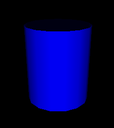
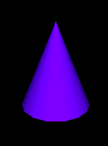
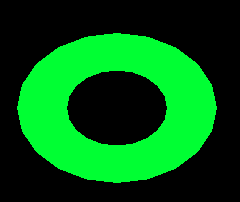
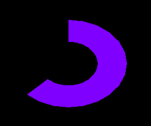
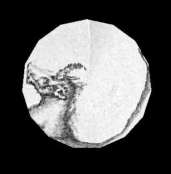

   :width: 150px
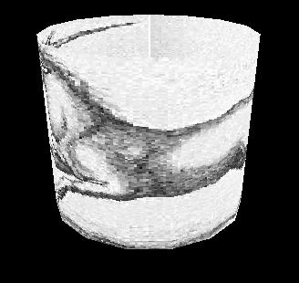

   :width: 150px
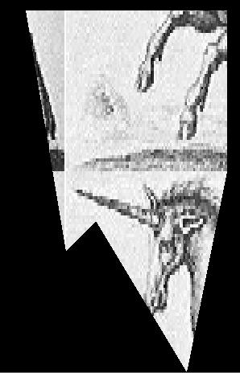

   :width: 150px
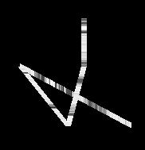

   :width: 150px
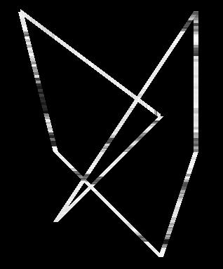

   :width: 150px
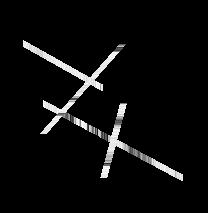

   :width: 150px
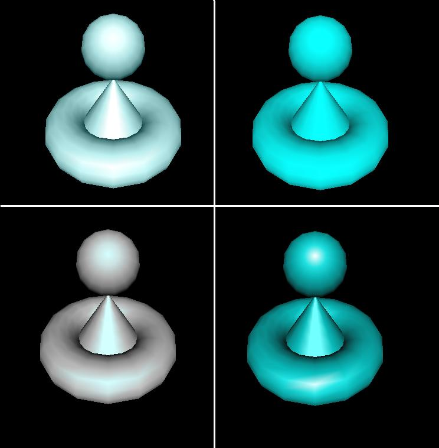
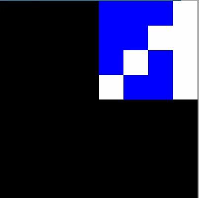
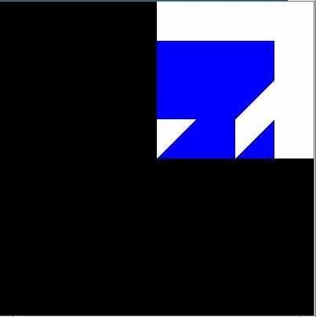

   :width: 300px
